Type: tickets
Status: ready-for-agent

# Tickets: 可信 Alert-to-Report 收口与 Replacement Clean Acceptance

依据 `acceptance-remediation-spec.md`，A10/A20/A30/A40 均已 sealed `failed_no_promote`。用户已授权 Q10 将环境资格移出 promotion ledger；Q10 后必须 F50，随后 Q50 可重复直到 passed，只有 passed Q50 才开放 A50。

本图取代旧 `A02 -> A03 -> A04` 的后续执行顺序，但不覆盖其历史记录。现有 format v1 evidence 只作为 Diagnostic Evidence Bundle，不能满足本图 blocker。

Work the **frontier**: any ticket whose blockers are all done. 每张票使用全新上下文，通过自己的公开 Interface、直接消费者和 fixed-point review 后才清除 blocker。

```mermaid
flowchart TD
  E10["E10 Format v2 Evidence"] --> E20["E20 Eligibility and Seal"]
  E10 --> U10["U10 Headless Console"]
  P10["P10 Alert-to-Diagnosis"] --> G10["G10 V01-V03"]
  E10 --> G10
  U10 --> G10
  G10 --> G20["G20 V04-R05-V05"]
  P20["P20 Change-to-Execution"] --> G20
  G20 --> G30["G30 V06-V07"]
  P30["P30 Recovery-to-Report"] --> G30
  G30 --> H10["H10 R01-R02"]
  H10 --> H20["H20 R03-R04"]
  H20 --> H30["H30 R06"]
  H30 --> J10["J10 V08"]
  J10 --> J20["J20 C01-C03"]
  E20 --> K10["K10 Conductor and Tool Artifact"]
  J20 --> K10
  K10 --> F10["F10 Freeze"]
  F10 --> A10["A10 Clean Acceptance"]
  A10 --> F20["F20 Replacement Freeze"]
  F20 --> A20["A20 Replacement Clean Acceptance"]
  A20 --> F30["F30 Final Replacement Freeze"]
  F30 --> A30["A30 Final Replacement Clean Acceptance"]
  A30 --> A40["A40 Same-Freeze Clean Acceptance"]
  A40 --> Q10["Q10 Environment Qualification v3"]
  Q10 --> F50["F50 Contract v3 Freeze"]
  F50 --> Q50["Q50 Environment Qualification"]
  Q50 --> A50["A50 Deployment and Product Acceptance"]
  A50 --> E30["E30 Failure Attribution and Deployment Handoff"]
  E30 --> F100["F100 Replacement Freeze"]
  F100 --> Q100["Q100 Qualification or Continuation Epoch"]
  Q100 --> A100["A100 Replacement Clean Acceptance"]
  A100 --> E60["E60 Single Continuation Authorization"]
  E60 --> F107["F107 Superseded Revision Freeze"]
  F107 --> F108["F108 Superseded Historical-Read Freeze"]
  F108 --> F109["F109 Sealed Source Read Freeze"]
  F109 --> A109["A109 Replacement Clean Acceptance"]
  A109 --> D109["D109 I05 Failure Attribution"]
  D109 --> E61["E61 I05 Resumability Fix"]
  E61 --> F110["F110 Replacement Freeze"]
  F110 --> A110["A110 Replacement Clean Acceptance"]
  A110 --> D110["D110 S01 Evaluator Attribution"]
  D110 --> E111["E111 Evaluator Correction"]
  E111 --> A111["A111 Evaluator Successor"]
  A111 --> D111["D111 S04 HITL Attribution"]
  D111 --> E112["E112 S04 Resumable HITL"]
  E112 --> F112["F112 Product and Tool Replacement Freeze"]
  F112 --> Q112["Q112 Environment Qualification"]
  Q112 --> A112["A112 Replacement Clean Acceptance"]
```

## Contract v3 segmented flow

- Fxx 冻结 candidate/tool/contract；Cluster 环境结果不改变 freeze validity。
- Qxx 是 ledger 外的可重复 Environment Qualification；每次使用新 qualification ID，failed record 只表示 `environment_not_ready`，不产生 Axx ledger 或 Promotion Decision。
- Qxx passed record绑定 exact freeze/product/tool/Cluster/access identity、facts、effect/cleanup proof 与 TTL，并由 Platform Operator 签名。
- Axx `init` 在任何目录写入前验证 qualification signature/checksum/TTL/identity/cleanup并把 qualification SHA绑定到 format v3 manifest。
- P01/P02 保留为 ledger 内快速 local identity/self-check gates；I01 是第一个 live deployment frontier。I/S 是 Deployment Qualification，V/R/C 是 Product Acceptance。
- 默认进度输出只保留 `frontier`、product/tool hash、P01/P02 与当前 gate 结果；完整绿色日志留在 artifact，失败或用户明确要求时再展开。

## Contract v4 deployment handoff refinement

- Gate Result、Failure Attribution 与 Deployment Disposition 分离；unknown attribution 为 `inconclusive`，不得猜测为 Product Failure。
- Acceptance Tool Failure 仍使 source ledger no-promote，但不自动删除 `aiops-system`。
- 只有 signed/checksummed Deployment Continuation Epoch 证明 Product/Cluster identity 未变、每个已发 mutation 唯一核对、无 Unknown Outcome/不可逆未知副作用且环境未污染时，才允许 `retain_existing`。
- I01 支持互斥的 `clean_install|adopt_existing`；adoption 是 read-only，新 ledger 不继承旧 gate，I02 与全部产品 gate照常执行。
- Product Failure、identity drift、pending/unprovable effect 或环境污染都强制 `rebuild_required`。

## Contract v4 single continuation authorization

- Deployment Continuation format v2 的 `create` 同时冻结 exact reusable-gate plan 与全部 operation accounting，Platform Operator 只签署一次。Canonical gate revision/evidence format 保持 v4，以允许只读打开 sealed v4 source ledger。
- 删除独立 Gate Reuse record/checksum/attestation 路径；旧 F104/F106 artifacts 保持 immutable/superseded，不兼容、不用于 init 或 promotion。
- Canonical DAG 不变；`apply` 只在 signed plan 命中 current frontier 时创建当前 ledger 的唯一 terminal attempt，不重放 effect。
- P02、I01、I05、S03-S06、V/R/C、fresh account、HITL、eligibility 和 Promotion Decision 仍不可复用。

## E60 合并 Continuation 与 Gate Reuse 授权

**What to build:** Platform Operator 用一份 signed Deployment Continuation 同时授权 retain-existing disposition 和 exact reusable-gate plan；删除独立 Gate Reuse 签名。

**Blocked by:** A103 sealed no-promote/F106 diagnostic facts complete；`gate-reuse-contract.md` single-signature refinement accepted。

**Status:** done

**Module record:** Deployment Continuation Module 拥有 signed aggregate record；Gate Reuse Module 只保留 plan policy/validation 与无 effect frontier import。公开 Interface 为 `DeploymentContinuation.create/inspect/attest`、`freeze_reuse_plan`与 `reuse_gate`。定向 selector 为 `tests/test_pilot_acceptance_{deployment_continuation,gate_reuse}.py`，直接 consumers 为 CLI 与 DAG simulation。

**Implementation record:** Canonical gate revision/evidence format 保持 v4，Deployment Continuation record 升为 format v2。Deployment Continuation owner 由 799 行增至 800 行；Gate Reuse owner 由 713 行降至 387 行；CLI 由 600 行降至 545 行；定向 Gate Reuse 测试由 557 行降至 405 行。Acceptance workspace 342 tests passed，Python compile 与 task-scoped diff check passed。Spec review PASS；Standards review 只指出 fixed point 已存在的 Evidence/Gate Reuse 查询转发，本票未修改、未夹带重构。

- [x] Continuation record/statement 绑定 exact reusable gates、artifact hashes 与 operation IDs。
- [x] CLI 删除 `gate-reuse create|inspect|attest`，`continuation create` 接收 plan，`gate-reuse apply` 只读 signed Continuation。
- [x] 旧 Gate Reuse bundle 无双读/迁移/兼容路径。
- [x] tamper、wrong source/target、missing operation、unsigned/expired continuation 全部 fail closed。
- [x] 定向/direct/static/DAG/workspace 验证与 fixed-point Standards/Spec review 完成。

## F107 冻结错误的 Contract v5 Replacement Artifacts

**What to build:** E60 首次 freeze 产物；Continuation create 在写目录/effect 前证明 v5 Tool 无法打开 sealed v4 source ledger。

**Blocked by:** E60 done 且 fixed-point Standards/Spec review PASS。

**Status:** superseded

**Disposition:** `dist/f107-v0.1.0` 保持 immutable，不用于 Continuation、init 或 promotion。Product SHA 不变；问题仅为错误升级 canonical gate revision。

## F108 冻结 Continuation format v2 Replacement Artifacts

**What to build:** 保持 ledger format/gate revision v4，以 Deployment Continuation format v2 和 unchanged Product 生成全新 checksummed freeze。

**Blocked by:** F107 pre-effect failure 已定位；owner/direct/static/DAG/review 重新通过。

**Module record:** sealed v4 historical-source loading 归 Acceptance Evidence Module；公开
Interface 为 `AcceptanceEvidence.open/create/status`，当前 `evidence.py` 800 行且本修复后
不得增长；`tests/test_pilot_acceptance_evidence.py` 已超过 500 行但仍只承载该 Module 的
公开 Interface tests，定向 selector 保持该文件，直接 consumers 为 Deployment
Continuation 与 Gate Reuse。

**Status:** superseded

**Disposition:** `dist/f108-v0.1.0` 保持 immutable，不用于 Continuation、init 或
promotion。Pre-effect 检查证明 sealed v4 A103 source 内嵌 historical Continuation v1，
当前 loader 错误按 v2 新授权重验；未创建 Continuation、新 ledger 或外部 effect。

## A108 使用单次授权继续 Clean Acceptance

**What to build:** 以 F108、F106 diagnostic/public reconciliation 和 exact gate plan 创建一份 signed Continuation；创建全新 ledger，按 canonical frontier reuse/execute，最终仍执行完整 `evaluate -> decide -> seal`。

**Blocked by:** F108 done；Platform Operator 签署唯一 Continuation statement。

**Status:** superseded_not_started

## F109 冻结支持 sealed v4 Historical Source Read 的 Replacement Artifacts

**What to build:** 保持 Product、canonical gate/evidence v4 与 Continuation v2，允许
`AcceptanceEvidence.open` 只读验证 final-checksummed sealed v4 source 的 historical
Continuation v1；新 init/reuse/promotion 仍严格拒绝 v1。

**Blocked by:** F108 pre-effect failure 已最小复现；真实 A103 status、owner/direct/static/
DAG 与安全/Standards review 全部通过。

**Status:** done

**Freeze record:** `dist/f109-v0.1.0`；reviewed commit
`734ceda6103928fa3f41cc37f8b2b63d21a81894`。Product SHA
`32d8e8fa5ee47f359ed5215ad4abc3a6f88c51cf89206497fc2aa96625682613`，
Tool SHA `3e294b90d499cc41d25dbb3d9175b3b837183911b2fae2ca3d5a3ee96f7c19ba`，
contract/evidence v4，final `SHA256SUMS` SHA
`0b33fc81705e1e73616755a47ec0670d3c66fceba91cad1eb859d77cc17d3a6d`；
345 项 workspace、85 项 focused review 与独立 freeze 复验通过，`live_evidence=false`。

## A109 使用单次授权继续 Clean Acceptance

**What to build:** 以 F109、D104 diagnostic/public reconciliation 与 exact gate plan 创建
一份 signed Continuation v2；签署后才创建全新 ledger，最终仍执行完整
`evaluate -> decide -> seal`。

**Blocked by:** F109 done；Platform Operator 签署唯一 Continuation statement。

**Status:** failed_no_promote

**Pre-signature record:** 唯一 unsigned Continuation 为
`/root/aiops/acceptance/continuation-F109/continuation-F109`，record SHA
`c12ce905857ff3ff08705344616e932489edae79759917eca345ac1f84f3910d`；绑定
7 项 reconciliation 与 exact gates `P01,I02,I03,I04,S01,S02`，于
`2026-07-21T04:10:34.057319Z` 过期。签名前未创建新 ledger 或 apply reuse。

**Execution record:** Platform Operator `mao` 已签署同一 record，bundle SHA
`fcd477f7b82b7cff99e811b2a86ad4f9c97bb8f93c0b6d12ed6da4c926686f9d`，
fingerprint `SHA256:682VIq7J1wbCaAw6Mq/U54eYQQpao01Q/+PFQBJQu2s`。全新 ledger
`/root/aiops/acceptance/v0.1.0-a109-clean-20260720` 已绑定该 bundle；P01 直接按同一
签名 plan 无 effect reuse 为 passed，未创建独立 Gate Reuse attestation。P02 fresh
admission self-check passed；I01 采用现有部署并以 `zero_apply=true` passed；I02、I03
按签名 plan reuse passed，I04 reuse 为 `not_applicable`。I05 完成真实浏览器首次登录后，
`mao/platform_administrator` 已签署当前 run attestation；但恢复中无法证明中断操作的
exact terminal outcome，唯一 attempt 以 `interrupted_outcome_unprovable` failed，且
`effect_replayed=false`、failure attribution `inconclusive`。未重试 I05，S01 及后续 gates
均未执行。Deterministic evaluate 得到 `ineligible`；`mao/release_owner` 以专用 key 指纹
`SHA256:wEZuelKtRQQHcFtayzxFDrX77bwd2BQMJBJniG4OXEc` 签署 `no_promote`，随后 seal 并删除
`/dev/shm/aiops-a109-credentials`。Final `SHA256SUMS` SHA256 为
`7ddd56a6cb51e4f64cda4b799d3d3abe074d093921123b14f90effbe4312db7b`；逐项 checksum
验证通过，ledger 无可写文件且 status 为 `sealed`。

## D109 归因 A109 I05 中断结果

**What to build:** 以 sealed A109、I05 operation journal 和公开 Gateway audit/projection
形成 immutable Diagnostic Evidence Bundle；证明失败发生在 Console mutation durable intent
之前，未重放 effect，并将 failure attribution 从 `inconclusive` 可靠诊断为 Acceptance Tool
Failure。Diagnostic 不修改 A109 gate、eligibility、decision 或 seal。

**Blocked by:** A109 `failed_no_promote` 且 final checksum 已验证。

**Status:** done

**Diagnostic record:** `/root/aiops/diagnostics/D109-I05-resume-policy` 已 immutable
conclude 为 `tool_failure`；A109 I05 仅有 gate execution operation，没有 Console mutation
identity 或 reconciliation，terminal artifact 明确 `effect_replayed=false`。Frozen F109 Tool
事实证明 I05 在 attestation 前打开 gate 且未注册 resume command；operation accounting
complete，无 recovered operation。Conclusion SHA
`240b877e43f15282ef6bf2c19cbc4334e2d2185cca9975045a245094d4d9fcb8`。

## E61 修复 I05 HITL 前置检查与中断恢复

**What to build:** I05 在创建 open gate 前验证当前 run 的 Platform Administrator attestation；
真实进程中断后，仅在 Console mutation request identity 已 durable 绑定时，通过 actor-scoped
公开 admin audit 唯一核对 exact User object/revision，再以只读登录与 browser probe 完成同一
gate。intent 前中断、零/多条匹配、identity drift 或非 success audit 必须 fail closed，且
不得再次提交 User mutation。

**Blocked by:** D109 root cause 与 operation accounting 完整。

**Status:** done

**Module record:** `aiops/acceptance/runtime.py` 任务开始时 556 行，所属 Acceptance Runtime
Module，公开 Interface 为 `AcceptanceRuntime.advance/resume`，定向 selector 为
`tests/test_pilot_acceptance_cli.py`；本票不得增加新的 runtime layer。I05 行为归 Web Gate
Module，公开 Interface 为 `WebGateRunner.run_i05/resume_i05`，定向 selector 为
`tests/test_pilot_acceptance_web.py`；Browser mutation correlation 继续复用既有
`reconcile_unique_browser_operation`，不新增 endpoint、store 或第二套 operation journal。
`aiops/acceptance/web_gates.py` 任务开始时 314 行，本票因完整 I05 resume 能力达到 566 行；
仍只承载 Public Access/First Login Web Gate 单一职责，低于 800 行且有独立 selector，确认
保持本 Module 不为行数制造浅层拆分。

**Verification record:** 行为提交 `4c6719f`，D15 intent/time-window blocker 修复提交
`2fb6904`。I05 owner/runtime/browser/conductor selectors 30 项、Acceptance Module 与 Pilot
package 352 项通过；Python compile、reviewed-range diff check 与相关源码 cleanliness 通过。
相对 F109 fixed point `734ceda` 的最终 Standards/Spec review 为 PASS/PASS；无
trust-boundary、secret、replay、模块或文件体量 blocker。

## F110 冻结 I05 修复后的 Replacement Artifacts

**What to build:** Product、canonical gate/evidence v4 与 Continuation v2 保持不变；重新运行
owner/direct/static/DAG 与 Standards/Spec review 后，用现有 freeze CLI 生成一次 checksummed
Product/Acceptance Tool/admission/freeze record。Product SHA 可保持不变，Tool 与 final checksum
必须绑定 E61 的 reviewed source。

**Blocked by:** E61 done；全部离线门禁与 fixed-point 双审 PASS。

**Status:** done

**Freeze record:** `dist/f110-v0.1.0`；reviewed commit
`2fb690462d1c4eed821c8b9c593e7e4d5e13194e`。Product SHA
`32d8e8fa5ee47f359ed5215ad4abc3a6f88c51cf89206497fc2aa96625682613`，
Tool SHA `82f7f71837a200d0cb1d111f20acae6c927a1fe9ccc22f2940e0f6f1ed8f0e75`，
contract/evidence v4，final `SHA256SUMS` SHA
`82a5aec63f7671e3d200e66e85e7acb7159deeb732d6e7afbcbb28eaa220bc00`；
352 项 admission workspace、最终双审与独立 checksum/Tool inspection 通过，
`live_evidence=false`。

## A110 完成 Replacement Clean Acceptance

**What to build:** 以 sealed A109、D109、F110 和一份 Platform Operator signed Continuation
创建全新 ledger；从 P01 开始按 canonical frontier 推进。Reuse 只限同一签名 plan 明确列出的
P01、I02、I03、I04、S01、S02；P02、I01、I05、S03-S06、V/R/C、账号、HITL、eligibility
与 Promotion Decision 全部使用 A110 实时事实，最终执行 `evaluate -> decide -> seal`。

**Blocked by:** F110 done；D109 immutable；Platform Operator 签署唯一 Continuation statement。

**Status:** done

**Pre-signature record:** 唯一 unsigned Continuation 位于
`/root/aiops/acceptance/continuation-F110/continuation-F110`，record SHA
`bd72f0e74365fbd9828c06fe1493d46c43b2fcf2ec4dfe4be79708863a18222b`；绑定
F110 Product/Tool、健康 unchanged Cluster、server-generation-only manifest diff、D109
`tool_failure` 与 inherited 7 项 mutation reconciliation。Exact reusable gates 为
`P01,I02,I03,I04`；A109 未到达 S01/S02，因此二者不在 plan、A110 必须 fresh execute。
Record 于 `2026-07-21T06:26:44.789316Z` 过期；签名前不创建 A110 ledger 或 apply reuse。

**Execution record:** Platform Operator `mao` 已签署同一 Continuation，bundle SHA
`0f43c0c3ed3328ed2f85afa7242d4ad9ca0b59bc0ad3057122c2b2dd1612252e`，
fingerprint `SHA256:wEZuelKtRQQHcFtayzxFDrX77bwd2BQMJBJniG4OXEc`。全新 ledger
`/root/aiops/acceptance/v0.1.0-a110-clean-20260720` 已绑定该 bundle，并使用独立 config、
`a110-ordinary/a110-sre` 账号与 tmpfs credential store。P01 reuse passed；P02 fresh passed；
I01 adopt_existing passed 且 `zero_apply=true`；I02/I03 reuse passed，I04 reuse 为
`not_applicable`；I05 fresh passed。S01 因旧 evaluator 强制要求 retained owner state 中
Model/Notification/Connector 全部为 `absent/not_ready` 而失败，实际公开状态为 contract-valid
的 Model `present/not_ready` 与 Notification `skipped`。Release Owner `mao` 签署
`no_promote` 后已 seal，final `SHA256SUMS` SHA 为
`b7bf8c87c2fa86d0c50eeceadfe8d3132b76dfb7f3dbc8eda9343fca6d961a79`；逐项 checksum、
只读权限与 credential store 删除均验证通过。

## D110 诊断 A110 S01 evaluator failure

**What to build:** 使用 sealed A110、公开 Platform Status/audit 与 Product readiness contract
判定 S01 是 Product Failure、环境污染还是纯 evaluator/tool failure；不得修改 A110 或重放
Notification setup-decision effect。

**Status:** done

**Diagnostic record:** `/root/aiops/diagnostics/D110-S01-evaluator` 已 conclude 为
`tool_failure`；conclusion SHA
`6db0147ff4bd3b2520ccef16fa729c4693dca9a210510a966599f513dad46371`。A110 S01 只有
gate execution identity，无外部 operation/reconciliation；当前公开状态与唯一
`acceptance-s01-notification-skip` success audit 证明 Product contract 合法且无需重放 effect。
A110 frozen tool 在 assertion 前未持久化 `platform-initial.json`，因此 sealed source 无法离线
复算，只能使用轻量 successor fresh 读取 S01。

## E111 支持纯 Evaluator Correction 与轻量 successor

**What to build:** S01 接受 retained owner state，并在 Notification 已 skipped 时只读核对
唯一公开 audit，不重复 PUT；assertion 前持久化 normalized initial status。未 evaluate/seal 的
run 可保留 failed fact、追加绑定 source artifact、D110 与旧/新 tool SHA 的 correction 后继续。
Sealed source 只允许 checksummed evaluator successor，自动绑定 source seal、未变 Product/
Cluster 与 exact safe predecessor artifacts，不要求 Continuation/Gate Reuse 授权签名。

**Status:** done

**Verification record:** 新增 `evaluator-correction-v1` 与 `evaluator_successor_v1`，原普通
Continuation 的签名校验保持不变；定向 Evidence/Promotion/Conductor/CLI/Continuation/
Gate Reuse tests 通过，Acceptance/package workspace 共 `359 passed`，Python compile 与
800-line 门禁通过。全仓 diff check 仅命中用户原有
`docs/research/openobserve-replacement-evaluation.md` 两处尾随空格；本任务 scoped diff clean。
后续 fail-closed 复核又将 successor 从 `--deployment-continuation` 分离为独立
`--evaluator-successor` precondition，明确拒绝 `product_failure`，并保持 I01 仅只读核验、
不产生 Deployment Disposition。

## A111 继续 S01 后验收

**What to build:** 保持 F110 Product/部署不变，使用 E111 lightweight tool 与 D110 successor；
自动复用 P01/I02/I03/I04，P02 fresh self-check、I01 read-only adoption，I05 因 A110 seal 已按
旧策略删除随机 credential 而使用新 scoped test accounts。随后 fresh S01 并继续全部 gate。

**Status:** failed_no_promote

**Execution record:** Tool SHA
`b50a6e866cce99a21368c4624833155a70e2864272fa0eac9c087c966375c9b5`；successor bundle SHA
`45bf37a5519d67e2e9544e5376c4aa58b5d5479853efec53cd638fbd81977d57`。Ledger
`/root/aiops/acceptance/v0.1.0-a111-clean-20260720` 已完成 P01 reuse、P02 fresh、I01
`zero_apply` adoption、I02/I03 reuse、I04 `not_applicable` reuse、I05、修正后的 S01、S02
与 S03。S04 已形成 `sent` receipt，但 Acceptance Runtime 在真实发送后调用非 TTY
`input()` 取得 Platform Administrator receipt attestation，`EOFError` 被 broad failure path
记为唯一 terminal `failed`；未重试或补签，后续 gate 未执行。Deterministic evaluate 得到
`ineligible`，`mao/release_owner` 签署 `no_promote` 后 seal，final `SHA256SUMS` SHA256 为
`904614983c2cbe1be0bf056c571f56649397fd7e79ee8eb489eb0e42bbc329e0`；逐项 checksum、
永久只读与 `/dev/shm/aiops-a111-credentials` 删除均验证通过。

## D111 归因 A111 S04 HITL 中断结果

**What to build:** 以 sealed A111、S04 operation journal、receipt 与公开 Notification facts
形成 immutable Diagnostic Evidence Bundle；区分真实 Provider outcome、HITL 缺失与工具编排
失败，完整核对全部 mutation，不修改 A111 或重发 Delivery。

**Status:** done

**Diagnostic record:** `/root/aiops/diagnostics/D111-S04-hitl-provider` 已 immutable
conclude 为 `product_failure`；Conclusion SHA
`b2865e1c2d3b3082cac3df3947a6af1a1c099002900b555375cc9e616ee2048e`。A111 四项
Notification mutation identity 均已在 source journal 绑定且无重放；EOF 确认暴露 Tool
HITL sequencing defect。独立只读 live projection 同时证明 exact Delivery 持续为 `sent`，
但 `provider_identity` 缺失；这违反当前 Notification Delivery contract，因此不能以 unchanged
Product continuation 进入下一 run，必须 replacement Product artifact 与 clean deployment。

## E112 将 S04 receipt HITL 改为可恢复的独立动作

**What to build:** `advance(S04)` 只完成 invalid dead-letter、real sent Delivery 与 bounded
`receipt-review.json`，保持同一 gate open；Platform Administrator 用独立 `attest` 绑定 exact
receipt SHA；`resume(S04)` 重验同一 receipt 与签名后才启用 Destination、选择 Pilot Route。
任何 resume 都不得重发 invalid/real test Delivery，缺签名、artifact drift 或不可证明的中断
必须 fail closed。

**Blocked by:** A111 sealed no-promote；D111 operation accounting 与 attribution complete。

**Status:** done

**Module record:** S04 行为属于 Notification Gate Module，公开 Interface 为
`NotificationGateRunner.run_s04/resume_s04`，定向 selector 为
`tests/test_pilot_acceptance_integrations.py -k s04`；Acceptance Runtime Module 公开 Interface
保持 `AcceptanceRuntime.advance/resume`，`aiops/acceptance/runtime.py` 任务开始时 563 行，
定向 selector 为 `tests/test_pilot_acceptance_cli.py`；CLI 只装配独立 `advance/attest/resume`，
`scripts/run_pilot_acceptance.py` 任务开始时 593 行，同一 CLI selector 覆盖。本票不新增
pending 状态表、通用 GateRunner、第二 DAG、交互 wrapper 或兼容路径。

**Verification record:** `NotificationGateRunner.run_s04` 只持久化 dead-letter、exact sent
receipt 与四项 mutation 后保持 open；`resume_s04` 在任何 mutation 前验证 receipt SHA 签名、
provider/attempt identity、Destination revision 与 exact operation boundary，再绑定 activate/route
operation。缺签名保持 open，post-HITL failure terminalize 且第二次 resume 不会重发 test
Delivery。Runtime 注册 S04 resume，不再在 advance 内调用 `_interactive_attest`。定向
Integration/CLI 19 项、Conductor/DAG/Promotion 62 项与 Acceptance/package workspace 361 项
通过；Python compile、scoped diff check 与 800-line gate 通过。Standards/Spec 独立 review
PASS；review 指出的 provider identity、重复 resume/post-HITL failure 与 Runtime advance gaps
已补回归。

## F112 冻结 S04 修复后的 Product 与 Tool Replacement Artifacts

**What to build:** 使用包含当前 Notification `sent -> provider_identity` 持久化 contract 的新
published image digests，以及 E112 reviewed Acceptance Tool，完成 owner/direct/static/DAG/
review 后冻结全新 checksummed Product/Tool artifacts。Canonical gate/evidence v4 不变；不得
把 A111 的缺 identity Delivery 解释为可复用成功。

**Blocked by:** E112、D111 done；新 OCI images 由既有 release workflow 发布 immutable
digests；fixed-point Standards/Spec review PASS。

**Status:** done

**Execution record:** F112 frozen artifacts 位于 `dist/f112-v0.1.0`，绑定 reviewed commit
`476ba2df17ca28f0848b6a39335cbd9bba71b1ed`；Product SHA256 为
`b683fd2d9653b5ce514aec516393305b29bb626d135d6892b60da2a89e1301d6`，Acceptance Tool
SHA256 为 `9615b0b9bf19839fe31ad1633a2fc9dbacfb1b50625008728f2a3d4f552bbe2a`。

## Q112 执行 Replacement Environment Qualification

**What to build:** 清理旧 A111 deployment 后，以 F112 exact Product/Tool 创建新的
clean-install Environment Qualification；只有 passed、signed、checksummed、未过期且 cleanup
完整的 record 才可创建 A112。

**Blocked by:** F112 done；旧 candidate cleanup 已由公开/Kubernetes facts证明。

**Status:** done

**Execution record:** Q112 保留为 clean-baseline failed record，暴露旧 release 的 10 个
cluster-scoped RBAC 残留；精确清理后 Q113 `Q113-20260720T105246Z` 完成两节点 exact image
pull、容量、CNI、NodePort、clock 与 cleanup 检查，并由 `mao/platform_operator` 签名。

## A112 继续 S04 后的 Clean Acceptance

**What to build:** 使用 F112 与 Q112 创建全新 clean-install ledger，不复用 A111 gate、账号、
HITL、eligibility 或 decision；S04 严格执行 `advance -> attest -> resume`，最终完成完整 DAG、
Promotion Decision 与 seal。

**Blocked by:** F112 done；Q112 fresh signed qualification。

**Status:** failed_pending_no_promote

**Execution record:** A112 ledger `/root/aiops/acceptance/v0.1.0-a112-clean-20260720`
使用 F112/Q113 clean install，P01-I05 与 S01-S03 通过。S04 `advance` 真实 Delivery 仅发送一次，
receipt `f1f9b21d047eeae4ad2e3e7ccce69c511b0f42f0f211a6b54111ee6fe8e8d682`
由 `mao/platform_administrator` 确认；`resume_s04` 完成 activate/route 后因未写 operation
reconciliation，被共享 ledger guard 以 `interrupted gate lacks proved terminal public facts`
拒绝并 terminalize 为 failed/inconclusive。Credential store 已删除；evaluate 为 ineligible，
等待 release owner `no_promote` 后 seal。

## E113 修复 S04 Resume Operation Reconciliation

**What to build:** `NotificationGateRunner.resume_s04` 使用 public Delivery、Destination、Route
与 Platform facts 对账全部 durable operation；进程在 activate/select 或 final record 前中断时，
重启只 reconcile 已绑定 effect，不重发 Notification test、activation 或 route selection。

**Blocked by:** A112 terminal S04 failure；不得修改或继续 A112。

**Status:** done

**Module record:** 所属 Notification Gate Module；公开 Interface 为
`NotificationGateRunner.run_s04/resume_s04`，共享 `AcceptanceEvidence.record_gate` guard 保持不变。
测试文件 `tests/test_pilot_acceptance_integrations.py` 超过 500 行但仍内聚于真实 provider
integration seam；定向 selector 为 `pytest -q tests/test_pilot_acceptance_integrations.py -k s04`。
回归模拟 final record 前 `KeyboardInterrupt` 后重启 resume，并断言所有 operation 均有 succeeded
reconciliation、第二次 resume 不新增任何 `:s04-` mutation request。

**Verification record:** S04 定向 8 项与 Acceptance/package workspace 370 项通过；Python
compile、scoped diff check、文件体量门禁通过。回归覆盖普通 reopened ledger、activate 成功后、
select-route 成功后与 final record 前中断，六个 mutation request ID 均唯一且全 operation 具有
succeeded reconciliation。最终 Standards/Spec 独立 review 均 PASS、无 blocker。

## E114 修复 Cluster Mutation 公开 Revision Identity

**What to build:** A113/V01 已通过公开 audit 证明
`PATCH /api/v1/admin/clusters/{cluster_id}` 产品 mutation 成功，但 Cluster 响应未投影
已持久化的 `updated_at`，使严格 Browser Mutation Binding 无法证明 object/revision
identity。Connector Enrollment Module 应在现有 Cluster 公开投影中返回 `updated_at`，
同步 OpenAPI 与 generated Console types；不修改 Browser Mutation Binding guard，不继续或
重放 A113/V01。

**Blocked by:** A113/V01 mandatory Product failure；A113 保持 ineligible，后续只能新 Product
freeze、新 deployment 与新 Clean Acceptance Run。

**Status:** done

**Module record:** 所属 Connector Enrollment Module，公开 Interface 为
`ConnectorEnrollments.update_cluster` 及 HTTP `PATCH /api/v1/admin/clusters/{cluster_id}`；
Cluster OpenAPI schema 是 Console 与 Browser Adapter 的直接 contract。任务开始时
`apps/aiops_k8s_gateway/connector_enrollments.py` 776 行、
`tests/test_gateway_v1_connectors_contract.py` 561 行，二者都仅承载 Connector Enrollment/
Cluster contract 的内聚职责，本任务不新增其他业务能力，且生产文件完成时不得
超过 800 行。定向 selector 为
`pytest -q tests/test_gateway_v1_connectors_contract.py -k connector_enrollment_controls_cluster_presence_and_runtime`；
直接 consumer 为 `tests/test_pilot_acceptance_browser_mutations.py -k updated_at` 与 Console OpenAPI
type generation/static check。

**Verification record:** Connector contract 与 Browser Mutation Binding 定向/全文件共 9 项
通过；精确回归使用 `PATCH /api/v1/admin/clusters/pilot-cluster` 与
`cluster.cluster_id + cluster.updated_at` 证明现有严格 object/revision guard 可接受产品公开
响应，guard 未修改。OpenAPI JSON、generated Console type、TypeScript 和 Vite production
build 通过，仅有既有 544.87 kB chunk-size warning；生产文件完成时 777 行。
最终 Standards/Spec 独立 review 均 PASS、无 blocker。

## F115 冻结 Cluster Revision Identity Product Artifacts

**What to build:** 使用 E114 reviewed Product source 发布新 Gateway 与 Console immutable
images，只更新 Pilot overlay 中这两个 digest；重跑 owner/direct/static/DAG admission 与
fixed-point Standards/Spec review 后，在全新 `dist/f115-v0.1.0` 一次性冻结 Product、
Acceptance Tool、signed admission、freeze record 与 final checksums。Product failure 不得生成
Deployment Continuation，A113 部署不得 adopt/reuse。

**Blocked by:** E114 done；A113 sealed `no_promote`；D114 diagnosed `product_failure`；
Gateway/Console image workflow 均成功且 registry digest 独立解析一致。

**Status:** done

**Module record:** Acceptance Artifact Freeze Module 继续公开
`build_admission_statement/build_freeze_record/verify_freeze_record/write_final_checksums/
verify_final_checksums`，assembly 复用 `scripts/freeze_pilot_release.py`，不新增 wrapper、
freeze owner 或 contract revision。Fixed point 为 E114 提交
`0443af34b46488780e8aac8753d8154bc5198d43`。Gateway workflow run `29798324469`、
Console workflow run `29798359620` 均 success；将仅更新
`aiops-gateway@sha256:ec5cefab00375177c9d5447f4bba12db935b56c3273ed2daa469584747d564bc`
与
`aiops-console@sha256:b66b04ac3cc30524640ba72e20f6a74e79bea78a69fbfcef3215e1ecf59ede1d`。
其余 service source 与 overlay digest 保持不变。定向/owner selector 为
`tests/test_gateway_v1_connectors_contract.py`、`tests/test_pilot_acceptance_*.py`、
`tests/test_pilot_package.py`；直接 consumer 为 generated OpenAPI Console type、Console build 与
`tests/test_pilot_acceptance_dag_simulation.py`。

**Verification record:** reviewed commit 为
`ffc8b2c82a42d71836ead18d17f9f401830535dd`、tree
`8446d9c8958ac3a632af5764547336478839b385`。Acceptance/Package/Cluster owner 373 项、
direct consumers 49 项、post-digest selection 65 项、DAG 34 项通过；Python/OpenAPI/
generated Console type/TypeScript/Vite build/diff/relevant-source cleanliness 通过，仅有既有
544.87 kB chunk warning。Standards 与 pre-freeze Spec source admission review 均 PASS。
Final artifacts 在全新 `dist/f115-v0.1.0` 一次性生成：Product SHA256
`140b4e1e852390018608756cebc2e60324800d536df6d4200e7e60d71554c0ff`，Acceptance Tool
SHA256 `b7f6685b3c0265cba26bac6387f2e5870de49a4031bfe2f968ceb2051f6d5f13`，
admission SHA256 `f46989120614b71ee2e00f9fd2ca176766d9f96f984636645fc9a8ca89faeca3`，
freeze record SHA256 `690a4dfc5f4d2a686a3b59b3ea6510c69cb2a521e69946a69e54aff75e2b5311`，
final `SHA256SUMS` SHA256
`204b7c99825840297252150418e866e2c20c47a74fbfa76202df5c35177fb097`。独立进程复验所有
checksum、fixed point、OpenAPI identities、两个新 image digest、excluded WIP 与
`live_evidence=false` 均 PASS；无 continuation/adoption。

## D115 诊断 A115 S03 Model Input Failure

**What to build:** 使用 sealed A115、公开 Model Status/admin audit 与外部获准输入的结构事实，
核对 S03 全部 operation、排除 Unknown Outcome，并区分 Product/provider failure 与 Acceptance
Tool 输入处理错误；不得重试 S03、读取产品私有数据库或记录 secret plaintext。

**Status:** done

**Diagnostic record:** A115 已由 `mao/release_owner` 签署 `no_promote`、seal，全部 checksum
通过且 `/dev/shm/aiops-a115-credentials` 已删除。独立 bundle
`/root/aiops/diagnostics/D115-S03-model-input-import/D115-S03-model-input-import`
conclude 为 `tool_failure`。四个 ledger-bound operation 分别唯一匹配公开 admin audit `24..27`
且均为 success；最终公开 revision 与 `s03-real-test` operation 精确一致，状态
`failed/not_ready`、reason `authentication_failed`，无 Unknown Outcome。获准输入是包含
`api_key/endpoint/endpoint_scope/model/timeout_seconds` 的 JSON object，run store 在 seal 前与
完整 source bytes 相等，而 Runtime 需要 scalar API key；公开 config 的四个非敏感字段与 source
完全一致。因此 Product 与 deployment 无需修改或重建。

## E116 修复 Model Provider JSON Credential Import

**What to build:** `RunCredentialStore.import_secret` 在 name 为 `model-api-key` 且外部 mode-0600
source 是 Model Provider JSON object 时，只把非空 scalar `api_key` 写入 tmpfs store；非
JSON-object-shaped raw key 输入保持兼容。Malformed/object-field mismatch 必须在任何 store
write 前 fail closed；不得把
secret 放入 argv、environment、日志或 evidence。通用 Notification/raw import 行为不变。

**Blocked by:** D115 done；不得修改、重开或重试 A115。

**Status:** done

**Module record:** 所属 Acceptance Credential Source Module；公开 Interface 为
`RunCredentialStore.import_secret/read`，定向 selector 为
`pytest -q tests/test_pilot_acceptance_credentials.py`，直接 CLI consumer selector 为
`pytest -q tests/test_pilot_acceptance_cli.py`。`aiops/acceptance/credentials.py` 任务开始时 270
行、定向测试 152 行，均低于 500/800 门禁；603 行入口脚本只继续参数分发，不修改。

**Verification record:** Credential owner 5 项、直接 CLI consumer 9 项、Acceptance/Package
workspace 372 项通过；Python compile 与本任务 scoped diff-check 通过。使用真实获准输入的离线
tmpfs smoke 证明 stored value 精确等于 JSON scalar `api_key`、不等于完整 source document，随后
临时 store 已删除且未访问 provider/network。独立 Standards/Contract/secret-boundary review
复核 JSON/object-shaped raw 边界、bool 排除、write-before-validate、post-read size guard 与 atomic
no-overwrite link 后 PASS；最终文件 300/199 行，均低于 500/800 门禁。全仓 diff-check 仅命中用户
原有 `docs/research/openobserve-replacement-evaluation.md` 两处尾随空格，本任务未修改该文件。

## F116 冻结 Model Input 修复后的 Replacement Tool

**What to build:** Product、deployment、canonical DAG/evidence v4 保持不变；E116 owner/direct/
static/DAG 与 Standards/Spec review 通过后，复用现有 freeze CLI 在全新目录生成一次新 Tool、
signed admission、freeze record 与 final checksums。

**Blocked by:** E116 done；fixed-point reviews PASS。

**Status:** done

**Freeze record:** `dist/f116-v0.1.0`；fixed point
`b7e7d8dced19026ad15ed42aeb06c5bf1ccd4e36`，reviewed commit
`4fa1545ce0ec29ef5b8531e25f1c7b0d448ef897`、tree
`4fbae2446315d5fe9e7e2566b89b74f5679bca5a`。Owner 372 项、direct 36 项、DAG 34 项、
Python/OpenAPI/reviewed-range/relevant-source static checks 与 Standards/Spec 双审均 PASS。
Final artifacts 在全新目录一次生成并独立复验：Product SHA256
`140b4e1e852390018608756cebc2e60324800d536df6d4200e7e60d71554c0ff`，与 F115 archive
字节完全一致；Tool SHA256 `93fdfb1708d24722f56a5212e105c47c2ea8b9d00cd3fabd027e85411fdd42be`，
admission SHA256 `e42f3297b031c7e7853a9d517f226550d28ef7092f75a1486dee2ebd8f515830`，
source inventory SHA256 `24ae440e0a963cb95e85663525a04240564827da2be97eaf94859d0b86ac513c`，
freeze record SHA256 `48d356dbfc0cff126c1a2d51fe7f750ac5e085196ba9c31ade50f767a1a24d78`，
final `SHA256SUMS` SHA256 `5251c3e7031225e3a394ed5d4f21326103074652be0ff030e43cc88a41fd90d7`。
Final/product/tool 内部 checksum、Contract/evidence v4、8 项 excluded WIP 与
`live_evidence=false` 均验证通过；未执行 Cluster/provider/Notification live effect。

## A116 继续 S03 后完整 Clean Acceptance

**What to build:** 使用 sealed A115、D115、F116 和一次 Platform Operator signed Continuation
创建全新 ledger；同一签名同时绑定全部 operation reconciliation 与 exact gate reuse plan。
P01/P02、I01 adoption、fresh account/HITL 和 Promotion Decision 按 Contract 实时执行或明确计划
复用；S03 使用正确提取的 scalar key fresh 执行，之后一次一个 frontier 完成 S04-C03，最后
`evaluate -> decide -> seal` 并清理 credential store。

**Blocked by:** F116 done；Continuation signed且未过期；外部 Model/Notification source 可用。

**Status:** pending

**Pre-signature record:** 唯一 unsigned bundle 位于
`/root/aiops/acceptance/continuation-F116/continuation-F116`，record SHA256
`c0bca8003b0b4f45e4756515105df658a34350ceec3b8390f982ee2d3779205d`，bundle SHA256
`2e52f8f3e2038a3e987433de1fb460616dd85449b57afd613416c992d19cc087`，于
`2026-07-22T05:21:23.685529Z` 过期。Record 证明 exact F115 Product/Cluster 部署健康、
`retain_existing`、environment 未污染；一次 statement 同时绑定 5 个 ledger operation 的唯一
公开 reconciliation 与 exact reusable gates `P01/I02/I03/I04/S02`，不再要求独立 Gate Reuse
签名。签名前不得创建 A116 ledger。

## E30 建立 Failure Attribution 与 Deployment Handoff

**What to build:** Maintainer 可以在 Acceptance Runner 缺陷终止 source ledger 后，用独立诊断与公开 reconciliation facts 生成 Deployment Continuation Epoch；replacement run 在不继承旧证据的前提下安全采用 exact existing deployment。

**Blocked by:** A50 Deployment and Product Acceptance（A80/F90 只作为历史设计证据，不迁移、不修改）。

**Status:** done

**Module record:** Deployment Continuation Module owns diagnostic attribution,
replacement-freeze identity validation, reconciliation and signed continuation epochs;
its public Interface is `create_diagnostic_bundle`, `conclude_diagnostic_bundle`,
`replacement_identity`,
`deployment_precondition` and `DeploymentContinuation.create/inspect/attest`.
`aiops/acceptance/deployment_continuation.py` was 499 lines before the E30 refinement
and is 612 lines after the reviewed implementation. Targeted selector is
`tests/test_pilot_acceptance_deployment_continuation.py`; direct consumers are
`tests/test_pilot_acceptance_{evidence,cli,cluster}.py`.

**Implementation record:** 固定点 `46e04e8` 后由 `77f0f85`、`8e887cd`、
`dfb080c`、`2264a78`、`ab71a53` 实现并收口。受影响 Module 与直接 consumers
共 `319 passed`；Python compile 与 `git diff --check` 通过；相对固定点的最终
Standards/Spec 双轴复审为 PASS/PASS。未执行 Cluster mutation、cleanup、部署、
provider 调用、Notification Delivery 或 live acceptance；A80/F90 历史证据未修改。

- [x] Failed gate 独立记录 `product_failure|tool_failure|environment_failure|inconclusive`；generic failure 默认 inconclusive。
- [x] Deployment Continuation Epoch checksummed 绑定 source acceptance/failed gate、diagnostic、旧/新 tool、Product/Cluster identity、完整 reconciliation 与 retain/rebuild disposition。
- [x] Environment Qualification/ledger init 接受互斥的 clean-install qualification 或 exact signed continuation epoch。
- [x] I01 adoption 只读验证 exact manifest/config/image/NodePort/health，证明 zero apply；I02 和后续 gate 不跳过。
- [x] 定向测试覆盖 tool failure retain、product/identity/unknown/irreversible/contamination rebuild、tamper、旧 gate 不继承和 fresh test-account contract。
- [x] 完成 owner/direct consumer/static/DAG simulation 与 fixed-point Standards/Spec review 后才执行 F100。

## F100 冻结 Contract v4 Replacement Artifacts

**What to build:** 在全新目录一次性冻结 exact Product、Contract v4 Acceptance
Tool、signed admission、source inventory、freeze record 与 checksums；绑定 evidence
format v4、`pilot-clean-acceptance-v4`、Product/API/Console/image/config/default
identity。A80/F90 只作为 immutable history，不继承 ledger、gate、attempt、credential
或 evidence。Freeze 保持 `live_evidence=false`，不接触 Cluster 或 provider。

**Blocked by:** E30 done；owner/direct consumer/static/DAG 与 fixed-point
Standards/Spec review 全部通过。

**Status:** done

**Implementation record:** reviewed commit `f08b269` / tree `075687d` 相对固定点
`46e04e8` 的六项 admission 全部 passed；唯一 freeze 为
`dist/f100-v0.1.0`。Product SHA
`32d8e8fa5ee47f359ed5215ad4abc3a6f88c51cf89206497fc2aa96625682613`，
Acceptance Tool SHA
`a124111dbff7d553156c49617f6eb81d1cbd7e985a797f3eac4c2cca4bf1df93`，
contract `pilot-clean-acceptance-v4` / evidence format `4`，admission fingerprint
`SHA256:XGVHaf5Jxg2eHZTOamAgonHEpqUxgcEMSdtqOAe7xDs`。Freeze 自检与最终
`SHA256SUMS` 独立复验通过，记录 10 项 excluded WIP，`live_evidence=false`；
未执行 Cluster/provider/Notification/live acceptance。

- [x] admission reports 精确覆盖 `owner_tests|direct_consumers|static_checks|dag_simulation|standards_review|spec_review`，全部绑定同一 reviewed commit 与 review fixed point。
- [x] 只构建一个全新 F100 目录；独立复验 release/tool/admission/freeze identities、签名与最终 `SHA256SUMS`。
- [x] 任一 relevant source、manifest、image、config/default、artifact 或 admission drift 都使 F100 invalid，不原地修补。
- [x] 记录 Product/Tool SHA、contract revision、evidence format、签名 fingerprint 与 excluded WIP；不生成 live evidence。

## Q100 执行 Contract v4 Environment Qualification

**What to build:** 当前 A80 deployment 已删除，不能创建 `retain_existing`
Continuation Epoch；因此仅用 F100 exact artifacts 创建全新 clean-install Environment
Qualification。失败 record immutable 且不创建 A100 ledger；只有未过期、checksum/
signature/cleanup/identity 全一致的 passed record 才解除 A100 blocker。

**Blocked by:** F100 done；Cluster allowlist cleanup、节点/containerd 代理与基础设施准备完成。

**Status:** done

**Execution record:** `Q100-20260719T053112Z-24h` 对 F100 exact identity 的
clean-install preflight 为 `passed`：Cluster identity
`d806a5794ca2b8a9f110951712d08e3a284d2216a716f326c0f3bc67b27a6039`，
两节点共 26 次 exact image pull、32Gi PVC、NetworkPolicy 与 NodePort 30088
检查通过，cleanup `deleted/namespace_absent=true`；record 于
`2026-07-20T05:31:23Z` 过期。Platform Operator
`platform-operator@kubernetes-admin@cluster.local` 已在用户确认后签署，fingerprint
`SHA256:+UxjZIM2ZlUb3KaRwRZD70KDm0i4toqaZs3mEvcYEXg`，signed bundle SHA
`6c179ac7f2a136d016c7833e7d8abbaa0982f6fb59d3fd9b73555446fbcf6496`。
较早的 `Q100-20260719T052937Z` 仅 1h TTL，保持 immutable/unused，不作为候选。

- [x] 使用新 qualification ID；effect 前持久化 intent，中断只 reconcile/cleanup，不重放未知 effect。
- [x] record 绑定 F100 Product/Tool/contract、Cluster/access identity、TTL、facts、effect 与 cleanup proof。
- [x] Platform Operator 只在核对 bounded/redacted evidence 后真人签署；automation 不替代 attestation。
- [x] failed/expired/unsigned/identity-drifted record 不得转 passed、不得创建 A100 ledger。

## A100 执行 Contract v4 Replacement Clean Acceptance

**What to build:** 用 F100 exact artifacts 与 Q100 fresh passed qualification 创建
全新 v4 ledger，从 P01 开始按唯一 DAG 逐 gate 执行；I01 为唯一首次 live deployment
frontier，随后完整重跑 I02 与 I/S/V/R/C。不得继承 A80 的 gate/evidence/account。

**Blocked by:** F100 done；Q100 fresh signed/checksummed passed 且 init identity 完全匹配。

**Status:** failed_no_promote

**Execution record:** 新 ledger
`/root/aiops/acceptance/v0.1.0-a100-clean-20260719` 以 F100 exact artifacts 与
signed Q100 创建，deployment mode `clean_install`。P01/P02/I01/I02/I03/I05/S01/S02
各唯一 attempt `passed`，I04 为 `not_applicable`；S03 的真实 Model credential
被 Provider 以 authentication failure 拒绝，唯一 attempt terminal `failed`。
独立诊断确认 4 个固定 request ID 均存在公开 audit，最终 Model revision 为
`failed/not_ready`，没有未知或不可逆副作用；同时发现 Acceptance Runner 未预绑定
这些 mutation 且忽略 unexpected terminal failure。Release owner `timeless` 已签署
`no_promote`，ledger checksum 全部验证通过并清除所有写权限；deployment 保留，
等待 E40 replacement tool 与 signed continuation epoch，不 reopen A100。

- [x] init 写 ledger 前验证 Q100；使用新 acceptance ID、workdir 与 run-scoped tmpfs credential store。
- [ ] 一次 invocation 只推进一个 frontier；最多一个 open gate、每 gate 最多一个 terminal attempt；effect 前 durable intent。
- [ ] mandatory failure 立即 terminal/ineligible；tool failure 不自动 cleanup，Product Failure/identity drift/Unknown Outcome/污染才 rebuild。
- [ ] HITL attestation、Notification receipt、destructive review、report publication 与 release-owner decision 必须由相应真人完成。
- [ ] 只有完整 DAG `evaluate -> decide -> seal` 可产生 promotion evidence；failed/sealed ledger 禁止 retry、reopen 或 mutation replay。

## E40 收口 A100 S03、Continuation 与永久 Seal

**What to build:** 修正 A100 暴露的三个 Acceptance Runner 根因：S03 在每个
Model mutation 前 durable 绑定固定 request ID，并在 exact revision 到达非预期
terminal state 时立即失败；Deployment Continuation 接受已核对、未污染的
`environment_failure`，并允许 Diagnostic Evidence Bundle 显式补全旧工具漏记的
operation identities；最终 seal 在 checksum 后把 ledger 文件设为 `0444`、目录设为
`0555` 并验证权限。不得修改 Product artifact、A100 ledger bytes 或 live product state。

**Blocked by:** A100 已 signed `no_promote`、sealed、checksum 验证且 diagnostic facts
可通过公开 projection 核对；用户已授权保留 deployment 并执行 replacement cycle。

**Status:** done

**Module record:** Model Gate Module 公开 Interface 为 `ModelGateRunner.run_s03`，
当前 `aiops/acceptance/model_gate.py` 193 行，定向 selector 为
`tests/test_pilot_acceptance_integrations.py`。Deployment Continuation Module 公开
Interface 为 `create_diagnostic_bundle`、`conclude_diagnostic_bundle`、
`DeploymentContinuation.create/inspect/attest`，当前
任务开始时 `aiops/acceptance/deployment_continuation.py` 796 行，定向 selector 为
`tests/test_pilot_acceptance_deployment_continuation.py`，直接 CLI consumer 为
`tests/test_pilot_acceptance_cli.py`；它通过 Evidence Module 已有的
`passed_artifact` Interface 读取 source P01 artifact inventory 中的原始 manifest 与
image-list 基线，不修改当前
800 行的 `aiops/acceptance/evidence.py`，该 Interface 的 selector 为
`tests/test_pilot_acceptance_evidence.py`。只读 Kubernetes I/O 归新建的 Deployment
Observation Adapter，公开 Interface 为 `observe_existing_deployment`，复用
`ClusterInstallRunner.observe_existing` 与 `PackageInstallRunner.prepare_release`，定向
selectors 为 `tests/test_pilot_acceptance_deployment_continuation.py`、
`tests/test_pilot_acceptance_cluster.py` 和 `tests/test_pilot_acceptance_package.py`。
Deployment Qualification Module 的公开 Interface 为
`ClusterInstallRunner.observe_existing`；`aiops/acceptance/cluster_install.py` 任务开始时
468 行、完成时 508 行，仍只内聚 I01/I02 部署资格核验，定向 selector 为
`tests/test_pilot_acceptance_cluster.py`。
Promotion owner 的公开 Interface 为
`AcceptanceEvidence.seal`，当前 `aiops/acceptance/promotion.py` 357 行，定向 selector
为 `tests/test_pilot_acceptance_promotion.py`，直接 simulation consumer 为
`tests/test_pilot_acceptance_dag_simulation.py`。

- [x] S03 四个 mutation 在 Adapter dispatch 前绑定固定 identity；unexpected terminal state 立即 failed，不等待完整 deadline。
- [x] Diagnostic conclusion 显式冻结 source-ledger 与 recovered operation identity 的完整并集；每项 continuation reconciliation 唯一、公开且无未知/不可逆副作用。
- [x] `environment_failure` 仅在 Product/deployment/Cluster identity 未变且环境未污染时可 `retain_existing`；Product Failure、inconclusive、drift、不可核对或污染仍 rebuild。
- [x] Seal 后文件 `0444`、目录 `0555`；permission hardening 不改变 ledger bytes 或 checksum。
- [x] owner/direct consumer/static/DAG 与 fixed-point Standards/Spec review 全绿后，才创建 replacement freeze 与新 continuation epoch。
- [x] Deployment Identity 保留 `kubectl diff -k` 真实 exit code 与输出 hash；仅 exact no-diff 或严格 server-owned `metadata.generation: N -> N+1` 可复用部署，其他变化 fail closed。

## E50 实现 Gate 级证据复用

**What to build:** 新 ledger 可在 signed Deployment Continuation 明确授权时，按唯一
frontier 导入 source sealed ledger 中 identity/effect/artifact 均未受影响的 opt-in gate；
其他 gate 正常执行。不得 reopen source、继承 eligibility/HITL、重放 effect 或建立第二 DAG。

**Blocked by:** E40 done；`gate-reuse-contract.md` accepted；A100/F102 保持 immutable。

**Status:** done

**Implementation record:** Gate Reuse Module；公开 Interface 为
`GateReuseEpoch.create/inspect/attestation_statement/attach_attestation` 与 `reuse_gate`，
定向 selector 为 `tests/test_pilot_acceptance_gate_reuse.py`，直接 CLI consumer 为
`tests/test_pilot_acceptance_cli.py`，共享 ledger consumer 为
`tests/test_pilot_acceptance_evidence.py`，完整图验证为
`tests/test_pilot_acceptance_dag_simulation.py`。任务开始时
`aiops/acceptance/gate_reuse.py` 26 行、`aiops/acceptance/evidence.py` 792 行；后者只增加
Gate Reuse owner 的窄公开查询 Seam，不承载新业务能力。CLI 入口
`scripts/run_pilot_acceptance.py` 开始时 512 行，修改只增加参数解析和 Module 调用分发，
不放入复用 policy、identity、effect 或 evidence 决策。完成时 Gate Reuse owner 701 行、
Evidence 795 行、CLI 600 行；owner/direct/static/DAG workspace 共 342 tests passed，
Python compileall 与 task-scoped diff check 通过，fixed-point Standards/Spec review 均 PASS。

- [x] Canonical gate owner 显式拥有 fail-closed reuse policy；未列出的 gate 默认不可复用。
- [x] Continuation 冻结 source gate execution/artifact 与相关 operation reconciliation。
- [x] `reuse` 每次只推进一个 frontier，复制并重验 artifact，写 source seal/provenance，零 effect。
- [x] tamper、wrong source、wrong gate、missing operation、identity drift、unsigned/expired Continuation 全部拒绝。
- [x] owner/direct consumer/static/DAG 与 fixed-point Standards/Spec review 全绿。

## F103 冻结支持 Gate reuse 的 Replacement Tool

**What to build:** 以 unchanged Product 与 E50 reviewed commit 生成全新 checksummed
Product/Acceptance Tool/admission freeze；F101/F102 不复用、不修改。

**Blocked by:** E50 done 且 fixed-point review PASS。

**Status:** done

**Freeze record:** `dist/f103-v0.1.0`；reviewed commit
`f9e3d8c3a6c490b96f5c5e236ef95413716b6c54`、tree
`1ef6e7548905c068319340191bfb80d398703889`。Product SHA
`32d8e8fa5ee47f359ed5215ad4abc3a6f88c51cf89206497fc2aa96625682613`
与 A100 exact match；新 Acceptance Tool SHA
`a9a5238c38622fb798666fce380b282f7752eb5d617588b0ee23a928937a45f5`。
六项 admission checks 全部绑定 exact reviewed commit；outer/product checksums 与 freeze
record 均验证通过，F101/F102 未修改。

- [x] Product SHA 与 A100 exact match；Tool SHA 必须更新。
- [x] admission 绑定 E50 owner/direct/static/DAG 与双审报告。

## A103 以最小重跑计划继续 Clean Acceptance

**What to build:** 创建补全 operation accounting 的新 Diagnostic bundle 与 signed
Continuation，在新 ledger 中逐 gate reuse/execute，最终仍走完整 eligibility/decision/seal。

**Blocked by:** F103 done；新 Diagnostic conclusion；Platform Operator 签署 exact Continuation。

**Status:** in_progress

**Preflight record:** 新 Diagnostic
`/root/aiops/diagnostics/D103-S03-gate-reuse` 已 immutable conclude；source-bound I05、
四项 recovered S03 operation 与 recovered S01
`acceptance-s01-notification-skip` 共六项公开 audit fact 已唯一核对。Continuation
`/root/aiops/acceptance/continuation-F103` 已绑定 F103 Tool、健康 Cluster、server-generation-only
manifest diff 与完整 reconciliation，并由 Platform Operator `mao` 签署；record SHA
`b6a122c93e0c3af9a8e6e7b34425a02da99340ba7908c985e191ddaf5506f1af`，bundle SHA
`c6b6a4ea5521a0fd940fadf0306dd705ec6c67513b3411265abe0cb52fcfc5c6`。

**Correction checkpoint:** 首次创建 Gate Reuse Epoch 在写目录和产生外部 effect 前稳定失败，
暴露 E50 把 source ledger 的直接 operation inventory 错误要求为 signed Continuation 完整
inventory，并把 `reconciled_effects` 错误要求为旧 gate journal exact-bound。Gate Reuse Module
继续拥有修复，公开 Interface 不变，定向 selector 仍为
`tests/test_pilot_acceptance_gate_reuse.py`；任务开始时 owner 701 行、定向测试 490 行，修复后
分别为 713 行和 557 行，未新增业务能力、字段、兼容层或第二 DAG。回归覆盖 source
`inconclusive` 经 diagnostic 得到 retainable
attribution、recovered S01 operation、epoch create 与新 ledger apply；owner/direct/continuation/DAG
共 90 tests passed，Python compileall 通过。代码变化使 F103 Tool identity 不再是后续执行工具，
因此 F103 freeze 与 signed Continuation 保持 immutable/superseded，必须重新 freeze 并签署
replacement Continuation 后才能创建 Gate Reuse Epoch；不沿用旧签名。

**Replacement checkpoint:** 修复提交 `de95458` 经 343 项 acceptance workspace 测试、静态
检查与 Standards/Spec 双审 PASS 后冻结 `dist/f104-v0.1.0`；Product SHA 保持
`32d8e8fa5ee47f359ed5215ad4abc3a6f88c51cf89206497fc2aa96625682613`，Tool SHA 更新为
`748786bddf2a1c73ead1fcc5c4b5372ff288728855ce4ee3bf61af3d59a191c8`。Unsigned replacement
Continuation 位于 `/root/aiops/acceptance/continuation-F104/continuation-F104`，record SHA
`e0a6f7f86dc745ea0a6a8a602cbea6fa172525483b290b2e3abf9c7d5d08c395`，已由 Platform Operator
`mao` 签署，bundle SHA 为 `1c6d65663ee43fe248823fe1bc82bc88f896fd96f1e13c478e08ea25171b9fb0`。
Unsigned Gate Reuse Epoch 位于 `/root/aiops/acceptance/gate-reuse-F104`，record SHA
`c5db7aab21cb76174c1d8420d27bce687491e76d111f2ee3ee4a35582e41880b`；精确授权计划为
P01、I02-I04、S01、S02，签署前不得 apply 或创建新 ledger。

- [ ] reuse P01；execute P02/I01；按 signed plan 处理 I02-I04；execute I05；按 signed plan 处理 S01/S02；execute S03 及后续 frontier。
- [ ] 复用 gate 不继承旧 account、HITL、eligibility 或 promotion decision。

## E10 建立 format v2 Acceptance Evidence

**What to build:** Platform Operator 可以创建并验证一个只属于 exact product/tool/Cluster identity 的 Clean Acceptance ledger；它只开放唯一 frontier，effect 前保存 durable intent，并在失败或中断时 fail closed。

**Blocked by:** None — can start immediately.

**Status:** done

**Implementation record:** Acceptance Evidence Module；公开 Interface 为 `AcceptanceEvidence`。任务开始时 `aiops/acceptance/evidence.py` 为 635 行，完成时 799 行；定向 selector 为 `tests/test_pilot_acceptance_evidence.py`，直接 consumers 为 `tests/test_pilot_acceptance_{package,cluster,web,platform_status,integrations,run_one}.py`。离线验证通过定向/consumer tests、Python 静态编译，以及相对 E10 前固定点的 Standards/Spec 双轴复审（PASS/PASS）；未执行任何 Cluster、provider、Notification Delivery、部署或 live acceptance。

- [x] Evidence format 冻结 Pilot Release Bundle SHA、acceptance-tool SHA、gate contract revision、Cluster identity 和 access profile；任一 identity drift 使 run ineligible。
- [x] Acceptance Evidence Module 单独拥有完整 DAG，包括 `V04 -> R05 -> V05`、`V07 -> R01 -> R02 -> R03 -> R04 -> R06 -> V08` 和 conditional I04。
- [x] 同时最多一个 open gate；每个 gate 最多一个 terminal attempt；外部 effect 前必须 durable 绑定 request/operation identity。
- [x] `status` 从 ledger fact 派生 active/open、active/ready、ineligible、eligible 或 sealed，不持久化第二套 run state machine。
- [x] 任一 mandatory gate failed 后禁止后续 gate；继续排障只能创建引用原 run 的独立 Diagnostic Evidence Bundle。
- [x] format v1 明确返回 `unsupported_evidence_format`，不 migration、不双读、不推断历史 frontier。
- [x] Artifact 只接受 bounded/redacted regular file，写入与 hash index 原子一致；tamper、duplicate path、越界 path 和 identity mismatch fail closed。
- [x] 公开 Interface 定向测试覆盖完整 DAG、durable intent、中断 reconciliation、duplicate effect 拒绝、failure terminal 和旧格式拒绝。

## E20 交付 Eligibility、Promotion Decision 与 Seal

**What to build:** Release owner 在 C03 后得到确定性的 eligibility，签署与之相容的 Promotion Decision，并把完整证据永久 seal；P/I/S 中途不再产生 accepted/finalized 结论。

**Blocked by:** E10 建立 format v2 Acceptance Evidence.

**Status:** done

**Implementation record:** Acceptance Evidence Module 内由 `evidence.py`、`promotion.py`、`human_attestation.py` 与 `evidence_files.py` 共同拥有 eligibility、签名事实与 seal invariant；公开 Interface 为 `AcceptanceEvidence.evaluate/seal` 和独立 `PromotionDecision` action。任务开始时 `aiops/acceptance/evidence.py` 为 799 行，完成时 795 行；新增 `promotion.py` 为 353 行。定向 selectors 为 `tests/test_pilot_acceptance_evidence.py`、`tests/test_pilot_acceptance_promotion.py`，提交内直接 consumers 为 `tests/test_pilot_acceptance_{package,cluster,web,platform_status,integrations,run_one,adapters}.py`。隔离提交态共 58 个 owner/consumer tests 通过；当前脏工作区另有未提交的 `test_pilot_acceptance_run_one_recovery.py` consumer，合计 63 tests 也通过。Python 静态编译及 E20 精确文件集 `diff --check` 通过；相对固定点 `a1228d0` 的 Standards/Spec fixed-point review 为 PASS/PASS。全工作区 `diff --check` 仍仅报告任务开始前、未纳入 E20 的 `docs/research/openobserve-replacement-evaluation.md` 尾随空格；未修改该用户 WIP。未执行部署、Cluster preflight、真实 provider probe、Notification Delivery 或任何 live acceptance。

- [x] 删除 A01 等中途 finalize/checkpoint seal；中途只允许 read-only status/verify。
- [x] `evaluate` 重验完整 mandatory DAG、conditional I04、acceptance identity、artifact hash 和每个必需 role attestation，输出 `eligible|ineligible` 与 bounded reasons。
- [x] Release owner 签署独立 `promote|no_promote`；ineligible ledger 拒绝 `promote`，eligible 不触发自动发布或部署。
- [x] `seal` 验证 eligibility、decision 和签名一致，生成覆盖 manifest、eligibility、attestations 与 decision 的最终 checksum，并拒绝 seal 后任何写入。
- [x] 同一自然人可签署多个实际角色，但每份 statement 必须绑定 exact actor role、gate、candidate 和 conclusion。
- [x] 定向测试覆盖 incomplete matrix、retained failure、错误/缺失签名、ineligible promote、artifact mutation、重复 decision 和 seal 后写入。

## P10 补齐 Alert-to-Diagnosis 公开关联

**What to build:** SRE 只通过公开产品 projection 就能证明真实 Alertmanager request、Alert Signal、Incident、accepted Diagnosis、frozen Model revision 和 fresh Evidence 属于同一 controlled run。

**Blocked by:** None — can start immediately.

**Status:** done

**Implementation record:** Alert ingress/Signal correlation 归属 Incident Module，公开 Interface 为 `IncidentService.ingest/workbench`；Evidence Gate 归属 Evidence Decision Module，公开 Interface 为 `record_diagnosis_facts/project`；Diagnosis Kubernetes payload 与同步 read workflow 分别由 `gateway_read_payload`、`run_diagnosis_read` 拥有，HTTP Adapter 只做鉴权、输入验证和序列化。P10 开始时 `incident.py` 为 798 行、完成时 800 行；`service_main.py` 与 `tests/test_diagnosis_service.py` 均为 546 行，`tests/test_gateway_diagnosis_delivery.py` 完成时 712 行；定向 selectors 为 `tests/test_gateway_{alertmanager_webhook,diagnosis_delivery,diagnosis_k8s_read,v1_incident_contract}.py` 与 `tests/test_diagnosis_service.py`。隔离提交态 37 个 owner/HTTP/OpenAPI tests 与 37 个提交内 Incident/Change/Diagnosis/Acceptance 直接 consumers 通过；包含未提交 recovery consumer 的当前脏工作区另有 42 个直接 consumer tests 通过。Python 静态编译、OpenAPI JSON 校验、generated Console contract build 与 commit `diff-tree --check` 通过；相对固定点 `8b71ef7` 的 Standards/Spec fixed-point review 为 PASS/PASS。未执行部署、Cluster preflight、真实 provider probe、Notification Delivery 或任何 live acceptance。

- [x] Alertmanager ingress 生成或保留 bounded request identity，并由 Incident owner 持久关联 firing/recovered Alert Signal。
- [x] Workbench 投影 accepted Diagnosis result 的 exact frozen Model revision，不使用当前配置 revision 代替历史事实。
- [x] Diagnosis Kubernetes read 只经 Gateway authorization 与 Connector Command；timeout、failed、truncated 和 invalid JSON 都返回 bounded public outcome。
- [x] Evidence Gate 只接受 exact verification scope、fresh Prometheus/Loki/Kubernetes Evidence Step 和完整 reference；Human Input 与 legacy alias 不补 gate。
- [x] Legacy Evidence alias 只保留既定 T24 退出条件，不扩展兼容范围。
- [x] owner、HTTP/OpenAPI、Workbench 和直接消费者测试覆盖 correlation success、request/revision mismatch、stale evidence 与 Connector read failure。

## P20 补齐 Change-to-Execution 公开关联

**What to build:** V04 的 immutable Kubernetes Change 可以先被无 Authority User安全拒绝，再由有 Authority User审批并只执行一次；expired、stale、Notification 与 post-check 都由 owning Module 提供可信事实。

**Blocked by:** None — can start immediately.

**Status:** done

**Implementation record:** Change Request Module 公开 `ChangeRequests.retry/project_for_actor`，Approval Module 公开 `KubernetesPhaseApprovals.expired_retry_eligible_in/access_for_projection/approve/audit_history`，在同一 Gateway-owned transaction 内完成 expired + unapproved eligibility 与 reopen intent；Notification outbox 的 `enqueue_change_event` 绑定 exact `revision_id`。Connector Command Result Module 由 `submit_result` 验证 typed `execution`，Execution Progress Module 由 `validate_declared_execution_result/result_outcome/project_steps_in` 校验 declared target/post-check 并投影 rollback binding；Acceptance Runner 仅消费公开 typed result，未纳入 direct API retry WIP。500+ 手写文件及完成时行数：`aiops/acceptance/run_one.py` 796、`change_requests.py` 772、`kubernetes_change_executions.py` 793、`kubernetes_phase_approvals.py` 751、`command_worker.py` 625、`tests/test_gateway_kubernetes_change_executions.py` 676、`tests/test_gateway_kubernetes_phase_approvals.py` 799、`tests/test_gateway_kubernetes_plan_execution.py` 671、`tests/test_pilot_acceptance_run_one.py` 548；定向 selectors 为 `tests/test_gateway_{change_request_retry,kubernetes_phase_approvals,kubernetes_change_executions,kubernetes_plan_execution,connector_commands,notification_requests,v1_change_requests_contract,v1_change_center_contract,v1_kubernetes_phase_approvals_contract}.py`、`tests/test_connector_{command_worker,kubernetes_change_execution}.py`、`tests/test_kubernetes_change_contract.py`、`tests/test_k08_canonical_restart_flow.py` 与 `tests/test_pilot_acceptance_run_one.py`。detached 提交态 95 个 Python owner/direct-consumer tests 与 23 个 Console tests 通过；Python compile、OpenAPI JSON、Console build 和 `diff-tree --check` 通过；相对固定点 `93dbebe` 的 Standards/Spec fixed-point review 为 PASS/PASS（Spec reviewer 另跑 53 项定向测试通过）。未执行部署、Cluster preflight、真实 provider probe、Notification Delivery 或任何 live acceptance。

- [x] 仅 expired 且尚无 Approval 的 dry-run Phase 可通过公开 retry 回到 planning 并生成新 immutable revision。
- [x] Change Request 通过 Approval owner 的窄 Interface 判断 retry eligibility，不读取 Approval 私有 SQL。
- [x] Approved、started、terminal 或已存在 Approval 的 Phase 不能通过 expired retry 重开。
- [x] Awaiting-approval Notification identity 包含 immutable plan revision，旧 revision 不吞掉新事件。
- [x] 无 Authority User 在 exact diff read、Approval 和 Execution Grant 处 fail closed，并留下不泄露 diff 的 audit。
- [x] Connector execution projection 公开 declared typed post-check；不要求 Acceptance Runner 解析私有 stdout convention。
- [x] owner、HTTP/OpenAPI、Console 和直接消费者测试覆盖 expired、unauthorized、single execution、stale、revision event 和 typed post-check。

## P30 补齐 Recovery-to-Report 公开关联

**What to build:** SRE 可通过公开 projection 把真实 recovery、resolved webhook、Recovery Observation、Incident resolution、immutable Report、Notification Request 和 provider Delivery 关联成一条不可变链。

**Blocked by:** None — can start immediately.

**Status:** done

**Implementation record:** Incident Recovery Lifecycle Module 由 `start_recovery_if_ready/cancel_recovery/resolve_due_recoveries/project_recovery` 拥有 Recovery Observation 状态与 exact resolved webhook identity；行为保持迁移独立提交 `0a1be4c`，随后 P30 行为提交收紧为 active Incident、全部当前 Signal recovered 且每条 Signal 均有 webhook identity，并以 `stabilizes_at` 作为唯一 resolution timestamp。Incident Report Module 通过 `IncidentReports.list/get/update/publish` 生成 frozen facts 并由数据库 trigger 保证 publication 不可更新或删除。Notification Request/Delivery Result Module 通过 `notification_request` 与 `NotificationStore.list_delivery_results/get_delivery_results/redeliver` 在公共 HTTP projection 一致公开 request、request ID、Destination revision 和 provider identity；Report publication 与 resolved Delivery 通过 actor-scoped projection 的 exact Incident identity 关联，S04 evidence 后续只按公开 Destination revision 关联，产品不依赖 acceptance aggregate。500+ 手写文件及完成时行数：`apps/aiops_k8s_gateway/incident.py` 717、`notification_service/requests.py` 794、`tests/test_notification_destination_readiness.py` 782、`tests/test_notification_service.py` 578；定向 selectors 为 `tests/test_gateway_{incident_reports,incidents,notification_requests,v1_notification_contract,v1_report_contract,v1_report_library_contract}.py`、`tests/test_notification_{destination_readiness,noise_controls,service}.py` 与 Console `src/reports/report-page.test.tsx`。提交态 66 个 Python owner/direct-consumer tests 与 2 个 Console tests 通过；Python compile、OpenAPI JSON、Console production build 和 `diff-tree --check` 通过；相对固定点 `b85870b` 的 Standards/Spec fixed-point review 为 PASS/PASS，并由独立 invariant 审查确认无可达 blocker。未执行部署、Cluster preflight、真实 provider probe、Notification Delivery 或任何 live acceptance。

- [x] Recovered Alert Signal 保留 exact resolved webhook request identity；全部当前 Signal recovered 才创建 Recovery Observation。
- [x] Recovery Observation、Alert Signal 和 Incident timestamps 可证明完整 300 秒 stabilization，提前 resolution fail closed。
- [x] Report v1 从 frozen Incident/Investigation/decision/action/recovery facts 生成，发布后 content/version 不可更新或删除。
- [x] Notification Delivery 在 list、by-event 和 redelivery projection 中一致公开 Notification Request identity、typed Request、exact Destination revision 和 provider identity。
- [x] `incident.resolved` subject、Report publication、Delivery 和 S04 exact Destination evidence 可通过公开 actor-scoped projection 关联。
- [x] owner、HTTP/OpenAPI、Console 和直接消费者测试覆盖正常链路、短 stabilization、错误 revision、缺 request/provider identity 与 provider false-success。

## U10 交付无头 Console 与 Credential Boundary

**What to build:** Platform Operator 不需要重复输入动态密码；Acceptance Runner 在严格 secret boundary 内驱动真实无头 Console，并在所有 Authority/HITL 点停下等待真实 User 检查与签署。

**Blocked by:** E10 建立 format v2 Acceptance Evidence.

**Status:** done

**Implementation record:** Credential Source Module 由 `KubernetesBootstrapCredentialSource.read` 与 `RunCredentialStore.create/open/generate_user_password/import_secret/read/require/cleanup/cleanup_if_terminal` 拥有：bootstrap password 每次从 exact `aiops-system/aiops-runtime-secret` 读取并验证 Secret UID/resourceVersion，不复制到 store；User password 使用 `secrets.token_urlsafe` 生成一次；integration input 必须是 evidence/workspace 外的 mode-0600 regular file，run store 必须位于 tmpfs，目录 0700、文件 0600，symlink/TOCTOU、credential loss、failed/sealed cleanup 均 fail closed。Browser Adapter 复用真实 Console 脚本与每次全新 non-persistent role context；`BrowserMutationBinding` 通过 loopback callback 在 `route.continue()` 前调用 Acceptance Evidence Interface 绑定 `X-Request-ID`，响应只在 request ID 相同且同时具有 object/revision identity 时写入 terminal public fact，4xx/5xx 为 failed，resume 只接受一个 bounded actor-scoped match。现有 S04/S05 callback、V04 bounded review artifact、V05/V07 `require_verified_attestation` 与 Promotion Decision external signature seam 继续拥有 HITL；Browser Adapter 不暴露 sign/approve，后续 V08/C03/K10 只复用该 seam，不在 U10 提前实现 gate runner。无 500+ 手写文件；完成时 `adapters.py` 313、`browser_mutations.py` 240、`credentials.py` 270 行。定向 selectors 为 `tests/test_pilot_acceptance_{credentials,browser_mutations,browser_real,adapters,u10_contract}.py`，直接 consumers 为 `tests/test_pilot_acceptance_{web,platform_status,integrations,evidence,promotion,run_one}.py`。主工作树 21 个 U10 tests（含真实 headless Playwright fixture）通过；detached 提交态 59 个 owner/direct-consumer tests 通过，1 个 real-browser test 因 detached checkout 无 `node_modules` 明确 skip；Node script syntax、Python compile、OpenAPI JSON 与 `diff-tree --check` 通过；相对固定点 `c468863` 的 Standards/Spec fixed-point review 为 PASS/PASS。未执行部署、Cluster preflight、真实 provider probe、Notification Delivery 或任何 live acceptance。

- [x] Bootstrap password 按需从 exact Kubernetes Secret 读取；acceptance-created User password 使用 CSPRNG 生成一次。
- [x] Console User password 与 Model/Notification secret 只进入 evidence/workspace 外的 mode-0600 input 和 run-scoped tmpfs store；目录 0700、文件 0600。
- [x] 每个 gate 使用独立 role browser context 重新登录；cookie/profile 不持久化；credential loss 使 gate failed，不 reset password 继续。
- [x] Headless Browser Adapter 只通过真实 Console UI完成产品 mutation，不绕过 UI 直调业务 mutation。
- [x] Browser Adapter 在发送 mutation 前拦截并 durable 绑定 client request identity，随后绑定 response object/revision；中断时只接受唯一公开 audit/projection match。
- [x] S04、S05、V04、V05、V07/V08、C03 和 Promotion Decision 输出 bounded/no-secret evidence 并暂停，自动化不能生成 attestation 或自行批准。
- [x] Password、secret、session、cookie 不进入 CLI 参数、environment、PTY、普通配置、日志、截图、trace、audit 或 evidence；failed/sealed run 删除 tmpfs store。
- [x] Credential Source、Browser Adapter、masked screenshot、role isolation、HITL pause、correlation recovery 和 secret non-disclosure 有公开 Interface 测试。

## G10 交付 V01-V03 First Run

**What to build:** Platform Operator/SRE 通过真实 Console 与 fixture 完成第一段 Alert-to-Diagnosis，得到 exact run、Alert、Incident、Investigation、Model revision 和 fresh Evidence chain。

**Blocked by:** E10 建立 format v2 Acceptance Evidence; P10 补齐 Alert-to-Diagnosis 公开关联; U10 交付无头 Console 与 Credential Boundary.

**Status:** done

**Implementation record:** First Run Module 由 `VerificationTriggerGateRunner.run_v01/resume_v01`、`RunOneGateRunner.run_v02/resume_v02/run_v03` 与 `run_one_decisions` 的纯判定 Interface 拥有；`KubernetesTelemetryProbe.probe_v02` 是 Prometheus/Loki/Alertmanager Adapter。V01 在任何 trigger dispatch 前拒绝既有 fixed Job，durable 绑定 fixture 与 Job operation identity，只用 `kubectl create -k` 创建一次，并从 exact Job UID、startTime、terminal status 与唯一 controller-UID 日志事件完成或中断 reconciliation；Console provisioning 仍经 U10 Browser Adapter。V02 将 exact Job startTime 固化为 deadline intent，以 Acceptance Runner monotonic clock 分别限制 120 秒 telemetry 和 180 秒 public convergence，及时持久化 telemetry success，随后只通过 actor-scoped Incident/Workbench projection 绑定 exact run-derived label identity、Alert fingerprint、firing webhook request、Incident 和 Investigation；中断只读取已持久化 telemetry 与原 deadline 内 product timestamps，不重新 probe。V03 只接受 requested Incident、exact completed Investigation、accepted frozen Model revision 与当前 verified revision 一致，以及 ID 非空唯一、全部可解析、succeeded、fresh、exact scope 且 source 恰为 Prometheus/Loki/Kubernetes 的 Evidence chain。行为不变的 V01-V03 decision extraction 已先独立提交，旧 V01 实现同一行为提交中删除，无 wrapper/双路径。500+ 文件确认：`aiops/acceptance/run_one.py` 属 First Run Module，公开 Interface 为上述 gate methods，任务起始/提交态完成为 796/679 行；`tests/test_pilot_acceptance_run_one.py` 属该 Module 的公开 Interface tests，任务起始/提交态完成为 548/741 行；定向 selectors 为 `tests/test_pilot_acceptance_{run_one,first_run,run_one_decisions,adapters}.py`，直接 consumers 为 `tests/test_pilot_acceptance_{evidence,browser_mutations,u10_contract}.py`、`tests/test_verification_fixture.py`、`tests/test_gateway_{v1_incident_contract,incidents}.py`。detached 提交态 owner tests 35 个、direct-consumer tests 38 个通过；目标 Python compile 与 `diff-tree --check` 通过。相对固定点 `9178309` 的 Standards/Spec fixed-point review 经关闭记录 blocker 后为 PASS/PASS。未执行部署、Cluster preflight、真实 provider probe、Notification Delivery 或任何 live acceptance。

- [x] V01 通过 Console 创建 Team、Service、Binding、Authority，通过 fixed verification overlay 触发唯一 Job controller run identity。
- [x] V02 用 Acceptance Runner monotonic clock 分别执行 120 秒 telemetry 与 180 秒 Alert Signal/Incident deadline，并绑定 webhook request identity。
- [x] V03 绑定 accepted Diagnosis 的 frozen Model revision、exact Investigation 和 fresh Prometheus/Loki/Kubernetes Evidence。
- [x] 每个 gate 只消费公开 product/Kubernetes/backend facts，不访问 product database 或私有 repository。
- [x] Timed open gate 中断后只有能证明原 deadline 内 terminal 的 reconciliation 才可完成，否则 failed。
- [x] First Run Module 公开 Interface 测试覆盖正常路径、deadline、错误 fingerprint/run、Model revision drift、stale/missing Evidence 和中断。

## G20 交付 V04-R05-V05 Governed Change

**What to build:** SRE 通过无头 Console 创建 exact Change Request，无 Authority User 在 R05 被安全拒绝，随后 authorized User 检查并批准只执行一次的 Kubernetes Change。

**Blocked by:** G10 交付 V01-V03 First Run; P20 补齐 Change-to-Execution 公开关联.

**Status:** done

**Implementation record:** Governed Change 属 First Run Module，公开 Interface 为 `GovernedChangeGateRunner.run_v04/resume_v04/run_r05/run_v05/resume_v05`；行为不变迁移先由 `ea53eaf` 将 V04/V05 从 `run_one.py` 搬入 owning Module 并删除旧实现，随后行为提交接入 `PlaywrightV01Console.create_v04/verify_r05/execute_v05`。V04 在 durable intent 后只经真实 Console 创建或公开 retry，绑定 replacement revision、live UID/resourceVersion precondition、API Server dry-run hash、exact patch/post-check 与 rollback concrete loss；V05 在签名 attestation 后只经 Console fresh-auth Approval 与 execution start，绑定 exact revision/Approval/single-use Grant/Command，并只接受同一 execution 的单 forward typed terminal post-check。R05 每次使用 fresh non-persistent no-Authority context，同源读取 exact diff 并发出 Approval/Grant denial probe；两条 POST 在 dispatch 前绑定 request identity，三条拒绝均要求唯一 request/response identity、`404/not_found` 和 bounded no-leak payload，现有 public phase-execution projection 被归一化为 phase-scoped Grant inventory，前后必须同为空；Gateway contract 同时验证 denial audit identity 及零 Approval/Execution/Grant。Execution projection/OpenAPI/Console generated schema 同步新增 `revision_id`。500+ 文件确认：新 `aiops/acceptance/governed_change.py` 属 Governed Change gate Module，公开 Interface 如上，完成时 800 行；新 `tests/test_pilot_acceptance_governed_change.py` 属其公开 Interface tests，559 行；`tests/test_gateway_v1_kubernetes_phase_approvals_contract.py` 属 Approval/Execution HTTP contract tests，完成时 523 行；定向 selectors 为上述三文件、`tests/test_pilot_acceptance_{run_one,adapters,browser_mutations}.py` 与 `tests/test_gateway_{change_request_retry,kubernetes_plan_execution,kubernetes_change_executions}.py`，直接 consumers 为 `tests/test_gateway_v1_{change_center,change_requests}_contract.py`、`tests/test_pilot_acceptance_{web,u10_contract}.py` 及 Console API/Change Center tests。detached 提交态 owner/product contract 68 项、直接消费者 10 项通过；主工作树 Console 25 项通过并完成 build，Python compile、三个 Node script syntax、OpenAPI JSON 与 `diff-tree --check` 通过。相对固定点 `39ea6ae` 的 Standards/Spec fixed-point review 为 PASS/PASS。未执行部署、Cluster preflight、真实 provider probe、Notification Delivery 或任何 live acceptance。

- [x] V04 从 V03 Recommendation 经 Console 创建 Change Request，绑定 latest non-expired immutable revision、live preconditions、API Server dry-run diff、post-check 和 rollback status。
- [x] Expired unapproved Phase 只通过产品公开 retry恢复；不允许 Acceptance Runner 私改状态或隐藏旧 expired revision。
- [x] R05 使用独立无 Authority User browser context，证明 exact diff read、Approval 和 Grant 均拒绝且 grant inventory 不变。
- [x] V05 在 bounded/no-secret exact diff summary 和签名确认后通过 Console Approval；Gateway 产生 exact Authority/Approval/single-use Grant/Command chain。
- [x] Connector 只执行一次 mutation，并由可信 terminal result 与 typed post-check证明；duplicate、automatic retry、rebase 或 untrusted effect 均阻塞。
- [x] First Run Module 和直接产品 contract 测试覆盖 V04-R05-V05 frontier、HITL pause、expired retry、unauthorized denial、single execution、stale 与 interruption reconciliation。

## G30 交付 V06-V07 Recovery and Report

**What to build:** 第一轮 mutation 后，SRE 证明真实 workload recovery、完整 stabilization、Incident resolution、Report v1 publication 和 resolved Notification Delivery。

**Blocked by:** G20 交付 V04-R05-V05 Governed Change; P30 补齐 Recovery-to-Report 公开关联.

**Status:** done

**Implementation record:** Recovery and Report 属 First Run Module，由 `RecoveryReportGateRunner.run_v06/resume_v06/run_v07/resume_v07` 拥有并由 `RunOneGateRunner` 组合。V06 在 durable intent 中绑定 exact terminal V05 artifact、Change completion、原始 UTC deadline、run/Incident/Investigation/fingerprint；初次 polling 只使用 Acceptance Runner monotonic deadline，resume 不读取或重启 monotonic budget，只允许一次公开 read reconciliation，且只有产品 UTC facts 能证明原 deadline 内完成才通过。metric/log sample 均不得早于 V05 completion，resolved webhook、相同 fingerprint、Recovery Observation、Prometheus/Alertmanager cleared、至少 300 秒 stabilization 与 Incident resolution 必须形成同一链。V07 先写 bounded `report-review.json` 并等待 SRE attestation 绑定其 SHA，再由 fresh Console context 以 durable request identity 完成 exact Report PATCH/publish；中断只从唯一公开 publication facts reconciliation，不 replay mutation。immutable Report v1、typed `incident.resolved` Request/subject/request ID/provider identity、exact S04 receipt SHA/attestation/Destination revision/Delivery attempt chain 与零 redelivery 必须一致，failed、dead-letter、suppressed 或 correlation drift 立即失败。500+ 手写文件确认：新 `aiops/acceptance/recovery_report.py` 属 First Run Recovery/Report Gate Module，公开 Interface 如上，完成时 734 行；新 `tests/test_pilot_acceptance_recovery_report.py` 属该 Module 的公开 Interface tests，完成时 631 行；`tests/test_pilot_acceptance_adapters.py` 属 Acceptance Adapter contract tests，任务开始/完成均为 535 行。定向 selectors 为 `tests/test_pilot_acceptance_{recovery_report,run_one,integrations,adapters}.py`；产品直接 consumers 为 `tests/test_gateway_{incident_reports,incidents,notification_requests,v1_notification_contract,v1_report_contract,v1_report_library_contract}.py` 与 `tests/test_notification_{destination_readiness,noise_controls,service}.py`；acceptance consumers 为 `tests/test_pilot_acceptance_{evidence,promotion,web,u10_contract}.py`，Console consumers 为 `src/api/client.test.ts` 与 `src/reports/report-page.test.tsx`。主工作树与 detached 提交态 owner 43 项、产品 contract 66 项、acceptance consumer 30 项通过，Console 10 项通过并完成 production build；Python compile、四个 Node script syntax、OpenAPI JSON 与 `diff-tree --check` 通过。相对固定点 `299e081` 的 Standards/Spec fixed-point review 为 PASS/PASS。未执行部署、Cluster preflight、真实 provider probe、Notification Delivery 或任何 live acceptance。

- [x] V06 同时绑定 recovery metric/log、resolved webhook request、相同 Alert fingerprint、Recovery Observation 和至少 300 秒 stabilization。
- [x] Prometheus/Alertmanager 不再 firing/active，且 Incident/Recovery resolved timestamp 不早于 stabilizes_at。
- [x] V07 在 bounded/no-secret Report summary 获 User 确认后经 Console 发布 immutable Report v1。
- [x] Resolved Delivery 必须关联 typed Notification Request、Incident subject、request ID、provider identity 和 S04 hash-verified exact Destination revision/attestation。
- [x] Product failure、dead-letter、suppressed、错误 revision 或缺 provider correlation 直接 failed，不轮询成假成功。
- [x] First Run Module 测试覆盖 recovery timing、Report immutable、S04 artifact tamper、Delivery terminal failure、HITL 和中断恢复。

## H10 交付 R01-R02 Stateful Recovery

**What to build:** Platform Operator 逐个 crash/rollout AIOps workload并 reapply 同一 candidate，证明 durable owner state、configuration、governance、journal、Delivery 和 observability retention。

**Blocked by:** G30 交付 V06-V07 Recovery and Report.

**Status:** done

**Implementation record:** Stateful Recovery 属 Recovery Gate Module，由 `RecoveryGateRunner.run_r01/resume_r01/run_r02/resume_r02` 公开 Interface 拥有；Kubernetes/Public/retention 外部能力由 `KubernetesRecoveryAdapter`、`GatewayRecoveryProbe` 与 `KubectlRetentionTelemetry` Adapter 接入，P01/R02 的 candidate tree identity 共同使用 Release Inventory Module 的 `build_release_inventory/inventory_artifact_sha256`。R01 matrix 固定为 Gateway、Diagnosis、Connector、Notification、Prometheus、Loki，R02 matrix 固定为 11 个 Deployment 加 Alloy DaemonSet，逐 owner Ready 后才继续并最终 fixed reapply 同一 candidate；所有 effect 在 dispatch 前绑定 durable operation ID，中断仅 reconcile exact identity，无法证明即失败。HITL 绑定 `platform_operator` attestation 与 review SHA；Pod marker 使用 resourceVersion conditional annotate，删除使用 UID/resourceVersion precondition。before/during/per-owner after/final snapshot 校验 PVC、protected resources、configuration/product revision、Incident/governance/Connector journal/Delivery/Report、固定 V06 metric/log identity、controller UID/image digest 与 public readiness；明确不声称 HA 或跨版本 upgrade。500+ 手写文件确认：`aiops/acceptance/evidence.py` 属 Acceptance Evidence Module，公开 Interface 为 `passed_artifact/passed_artifact_json`，任务开始 795 行、当前 800 行，selector 为 `tests/test_pilot_acceptance_evidence.py`；新 `aiops/acceptance/recovery.py` 属 Stateful Recovery Gate Module，公开 Interface 如上，当前 721 行；新 `aiops/acceptance/recovery_adapters.py` 属 Stateful Recovery Adapter Module，公开 Interface 如上，当前 692 行；新 `tests/test_pilot_acceptance_recovery.py` 属 Stateful Recovery 的公开 Interface/Adapter tests，当前 800 行。定向 selectors 为 `tests/test_pilot_acceptance_{recovery,recovery_telemetry,release_inventory}.py`；直接 acceptance consumers 为 `tests/test_pilot_acceptance_{evidence,package,promotion,cluster,adapters,recovery_report,run_one}.py`；产品 contract consumers 为 `tests/test_gateway_{incidents,incident_reports,v1_kubernetes_phase_approvals_contract,v1_notification_contract,v1_platform_status_contract}.py` 与 `tests/test_notification_service.py`。本票只执行 fake-backed offline verification，未执行部署、Cluster preflight、真实 provider probe、Notification Delivery 或任何 live acceptance。

**Verification record:** 主工作树与 detached 提交态的 owner 26 项、acceptance direct consumers 72 项、产品 contract consumers 42 项通过；Python compile、OpenAPI JSON、`diff --check` 与文件体量检查通过。相对固定点 `1a3406b` 的 Standards/Spec fixed-point review 为 PASS/PASS。

- [x] R01 只删除 exact current Gateway、Diagnosis、Connector、Notification、Prometheus、Loki Pod，每次等待 owner Available/Ready 后才继续。
- [x] R01 before/during/after evidence 证明 PVC UID、configuration revision、Incident/governance history、journal、Delivery、metrics/log retention。
- [x] R02 只对 candidate Deployment/Alloy 执行固定 annotation rollout，逐个收敛后 reapply同一 bundle。
- [x] R02 证明 image digest、Secret identity、credential 和 durable state 不漂移；不声称 HA 或跨版本 upgrade。
- [x] Recovery Gate Module 只接受 frozen structured target/effect，并在操作前取得 Platform Operator 确认和 durable operation identity。
- [x] 定向测试覆盖精确顺序、owner readiness、partial failure、state loss、digest drift、reapply failure 和 interruption reconciliation。

## H20 交付 R03-R04 Dependency Degradation

**What to build:** Platform Operator 分别停用 Connector 与 Loki，证明依赖能力 truthful unavailable、受影响操作 fail closed，并以同一 candidate 恢复且不伪造 Evidence。

**Blocked by:** H10 交付 R01-R02 Stateful Recovery.

**Status:** done

**Implementation record:** Dependency Degradation 属 Recovery Gate Module，公开 Interface 为 `DependencyDegradationGateRunner.run_r03/resume_r03/run_r04/resume_r04`；Kubernetes、Gateway/Console、Connector poll 与 Loki 外部能力分别由 `KubernetesRecoveryAdapter`、`GatewayDependencyProbe`、`ConnectorPollGatewayProbe` 与 `KubectlLokiDependencyProbe` Adapter 接入，共用 `RecoveryJournal` durable effect seam。R03 在 exact Change preparation 后第二次暂停，只有 SRE attestation 绑定 `approval-review.json` 才经真实 Console 表单 Approval；Connector/Loki disruption、same-candidate reapply 与恢复验证严格串行，公开 probe interruption 无法证明即 failed，Kubernetes effect 只 reconcile exact operation、不 replay。500+ 手写文件起始/完成行数：`aiops/acceptance/adapters.py` 427/516、`aiops/acceptance/recovery.py` 721/634、`aiops/acceptance/recovery_adapters.py` 692/790、`tests/test_pilot_acceptance_recovery.py` 800/772；新增 `aiops/acceptance/dependency_degradation.py` 0/675、新增 `tests/test_pilot_acceptance_dependency_degradation.py` 0/527，均未超过 800。定向 selectors 为 `tests/test_pilot_acceptance_dependency_{degradation,loki,probes,browser}.py`、`tests/test_pilot_acceptance_{recovery,recovery_telemetry,release_inventory,browser_mutations}.py`；直接 consumers 为 H10 Acceptance consumers、Connector product owner/HTTP contracts 与 Console Change Request contract/build。

**Verification record:** H20 owner/Browser mutation tests 42 项、H10 owner 与 Connector product/HTTP contracts 66 项、Acceptance 直接 consumers 85 项、Console Change Request contract tests 12 项通过；Python compile、Node syntax、OpenAPI JSON、Console TypeScript/Vite build 与精确文件集 `diff --check` 通过。相对固定点 `a173ebb` 的 Standards/Spec review 在补齐 Module record 后达到 PASS/PASS。本票全程仅执行 fake-backed offline verification，未执行部署、Cluster preflight、真实 provider probe、Notification Delivery 或任何 live acceptance。

- [x] R03 将 exact Connector workload scale-to-zero 后，availability 降级且新 live Evidence、dry-run、Grant、dispatch 均拒绝。
- [x] R03 reapply 同一 candidate 后 heartbeat 和 read verification 恢复 ready，不依赖数据库 patch 或 credential rotation。
- [x] R04 将 exact Loki workload scale-to-zero 后，Platform Status 降级，MCP 返回 bounded unavailable，且不能形成 verified log Evidence。
- [x] R04 恢复后第一轮 retained log 与新 probe log 都可真实查询，不注入 fake log。
- [x] R03 完全恢复后才允许 R04；不能并行制造两个 unavailable owner。
- [x] Recovery Gate Module 测试覆盖 before/during/after projection、blocked operations、truthful error、same-candidate recovery 和顺序约束。

## H30 交付 R06 Stale Change

**What to build:** SRE 创建并审批一个 verification metadata Change 后，Platform Operator 制造 exact resourceVersion drift，Connector 返回 Stale Change 且 AIOps 零 mutation、零 retry。

**Blocked by:** H20 交付 R03-R04 Dependency Degradation.

**Status:** done

**Module record:** Stale Change 属 Recovery Gate Module，公开 Interface 为 `StaleChangeGateRunner.run_r06/resume_r06`；只新增 fixed `KubectlStaleChangeAdapter` I/O seam，并复用 `RecoveryJournal`、`PlaywrightV01Console`、现有 actor-scoped Phase Approval/Execution projection 与 Connector stale precondition。Phase Execution projection 由既有 `kubernetes_execution_progress` owner 公开 execution-scoped `grant_count/command_count`，不新增 acceptance endpoint/table。500+ 手写文件起始/完成行数：`aiops/acceptance/adapters.py` 516/604、`apps/aiops_k8s_gateway/kubernetes_change_executions.py` 799/800、`tests/test_gateway_kubernetes_change_executions.py` 715/772、`tests/test_gateway_kubernetes_plan_execution.py` 671/675、`tests/test_gateway_v1_change_requests_contract.py` 496/500、`tests/test_gateway_v1_kubernetes_phase_approvals_contract.py` 527/529；新增 `aiops/acceptance/stale_change.py` 0/691，均未超过 800。定向 selectors 为 `tests/test_pilot_acceptance_stale_change{,_adapters}.py`、`tests/test_gateway_kubernetes_{change_executions,plan_execution}.py`、`tests/test_connector_kubernetes_change_execution.py` 与直接 HTTP/Console consumers。

**Verification record:** H30 owner、Adapter、Connector、Plan Execution 与直接 Gateway HTTP contract tests 63 项通过，Console Change contract tests 15 项通过；Python compile、Node syntax、OpenAPI JSON/生成类型、Console TypeScript/Vite build 与精确文件集 `diff --check` 通过。相对固定点 `af8b2b7` 的 Standards/Spec review 达到 PASS/PASS。本票全程只执行 fake-backed offline verification，未执行部署、Cluster preflight、真实 provider probe、Notification Delivery 或任何 live acceptance。

- [x] User 经 Console 创建并审阅 exact metadata Change，审批前事实、dry-run diff 和 hash 可关联。
- [x] Recovery Gate Module 只对 exact verification object 执行 fixed-format out-of-band metadata drift，不改变 pod template。
- [x] Operator drift 与 approved change 的 UID/resourceVersion、before/after 和 Kubernetes identity 有完整 evidence。
- [x] Connector 返回 `stale`，Gateway 不签发替代 Grant、不 rebase、不 retry，也不把 Operator effect 归因给 AIOps。
- [x] R06 完成前不存在 active mutation、Unknown Outcome 或 unfinished rollback。
- [x] 定向测试覆盖 exact drift、wrong-target rejection、stale result、zero mutation/grant retry 和 interruption。

## J10 交付 V08 第二轮治理链

**What to build:** Recovery gates 后，SRE 用新 Job controller identity reopen 同一 Incident，并完成完全独立的第二轮 Investigation、Change、Approval、execution、Report v2 和 resolved Delivery。

**Blocked by:** H30 交付 R06 Stale Change.

**Status:** done

**Module record:** 第二轮治理链属 Rerun and Cleanup Module，本票公开 Interface 为 `RerunGateRunner.run_v08/resume_v08`；新 Job trigger/delete I/O 由 fixed Rerun Adapter 接入，Console mutation 复用 `PlaywrightV01Console`/`BrowserMutationBinding`，并复用 `RecoveryJournal`、现有 Run One decisions、actor-scoped Incident/Investigation/Change/Execution/Report/Notification projections。V08 在唯一 `GATE_SEQUENCE` 内维护分阶段 durable operation、Destination revision 变化时的 Platform Administrator receipt HITL，以及 exact governance/Report publication 两个 SRE HITL；不建立第二 DAG、第二 Clean Acceptance Run、acceptance product endpoint/table 或旧 effect replay。500+ 手写文件起始/完成行数：`aiops/acceptance/adapters.py` 604/715、`tests/test_pilot_acceptance_adapters.py` 535/648；新增 `aiops/acceptance/rerun.py` 574、`aiops/acceptance/rerun_adapters.py` 759、`tests/test_pilot_acceptance_rerun.py` 339、`tests/test_pilot_acceptance_rerun_adapters.py` 304，均未超过 800。定向 selectors 为 `tests/test_pilot_acceptance_rerun{,_adapters}.py` 与 `tests/test_pilot_acceptance_adapters.py`；直接 consumers 为 Incident/Investigation、Kubernetes Change Execution、Incident Report、Notification Delivery 的 owner/HTTP contracts 与 Console Workbench/Change/Report contracts。

**Verification record:** 最终提交态 Rerun owner/Adapter tests 31 项通过；受影响 Acceptance consumers 104 项、Incident/Change/Report/Notification owner 与 HTTP contracts 86 项通过，resolution/Notification identity 收紧后的直接 consumers 40 项复验通过；Console Workbench/Change/Report contracts 27 项通过并完成 TypeScript/Vite production build。Python compile、Node syntax、OpenAPI JSON、精确 diff check 与文件体量检查通过。相对固定点 `1142d18` 的第三轮 Standards/Spec fixed-point review 达到 PASS/PASS。本票全程只执行 fake-backed offline verification，未执行部署、Cluster preflight、真实 provider probe、Notification Delivery 或任何 live acceptance。

- [x] 新 verification run 在既定 reopen window 内关联同一 Incident，创建新 Investigation，不复用 V01-V07 run identity。
- [x] 第二轮重复 V02-V07 的真实 signal、Diagnosis、Evidence、Change、R05 authorization、Approval、execution、recovery 和 Notification semantics。
- [x] 第二轮不复用旧 Evidence、plan revision、Approval、Grant、Command 或 execution result。
- [x] Report v2 经 Console确认并发布，Report v1 hash/content 保持不变。
- [x] 第二条 resolved Delivery 绑定同一已验证 Destination revision；revision 变化则先重新完成 S04 receipt evidence。
- [x] Rerun and Cleanup Module 测试覆盖 same Incident/new chain、错误新 Incident、旧 identity reuse、v1 mutation 和 second Delivery failure。

## J20 交付 C01-C03 Cleanup and Evidence

**What to build:** Platform Operator 只删除 verification fixture，随后所有角色通过公开 projection确认两轮治理历史完整，并为最终 eligibility 准备完整 manifest 和 attestations。

**Blocked by:** J10 交付 V08 第二轮治理链.

**Status:** done

**Module record:** C01-C03 归属 Rerun and Cleanup Module，公开 Interface 为 `CleanupGateRunner.run_c01/resume_c01/run_c02/resume_c02/run_c03/resume_c03`；C01 fixed Kubernetes I/O 与 C02 Gateway public reads 分别由窄 Adapter 接入，durable effect 复用 `RecoveryJournal`，C03 artifact index 由 Acceptance Evidence owner 的最小只读 Interface 提供。Resource Catalog tombstone availability 行为仍归 `ResourceCatalog.list_for_actor` owner，HTTP/OpenAPI/Console 只同步 contract。500+ 手写文件起始/完成行数：`aiops/acceptance/evidence.py` 800/798、`apps/aiops_k8s_gateway/resource_catalog.py` 652/652；新增 `aiops/acceptance/cleanup.py` 440、`aiops/acceptance/cleanup_adapters.py` 308、`tests/test_pilot_acceptance_cleanup.py` 253、`tests/test_pilot_acceptance_cleanup_adapters.py` 172，均未超过 800。定向 selectors 为 `tests/test_pilot_acceptance_cleanup{,_adapters}.py`、`tests/test_pilot_acceptance_evidence.py`、`tests/test_gateway_resource_catalog.py` 与 `tests/test_gateway_v1_resource_catalog_contract.py`；直接 consumers 为 verification fixture、Incident/Report/Change/Notification public contracts、Acceptance promotion/evidence consumers 与 Console Resource Workspace contracts。

**Verification record:** 行为提交 `4b52f77`；J20 owner selectors 32 项、acceptance/verification fixture consumers 48 项、Incident/Report/Change/Notification public contracts 33 项、Console Resource Workspace/API contracts 10 项通过。Python compile、OpenAPI JSON/schema regeneration、精确 staged diff check、文件体量检查与 TypeScript/Vite production build 通过；build 仅有既有 chunk-size warning。相对固定点 `56ecc0d` 的 Standards/Spec 双轴 review 达到 PASS/PASS。本票全程只执行 fake-backed offline verification，未执行部署、Cluster preflight、真实 provider probe、Notification Delivery 或任何 live acceptance。

- [x] C01 依次删除 verification run/base，fixture namespace消失且 `aiops-system` 不受影响。
- [x] C02 只通过公开 actor-scoped projection读取两轮 Incident/Investigation/Evidence/Change/Approval/Grant/Command/outcome/Recovery/Report/Delivery。
- [x] Resource Catalog 将已删除 Deployment Target 投影 unavailable，不伪装资源仍在线。
- [x] C03 生成完整 artifact index；bounded/no-secret manifest summary 由 Platform Operator、Platform Administrator 和 SRE 按实际角色检查并签署。
- [x] Cleanup 不访问 SQLite、不删除治理历史、不修改 published Report 或 terminal Delivery。
- [x] Rerun and Cleanup Module 测试覆盖 fixture-only delete、产品误删保护、public history、unavailable target、缺 gate/role 和 secret exposure。

## K10 交付单 gate Conductor 与 Acceptance Tool Artifact

**What to build:** Platform Operator 使用一个冻结的 Acceptance Runner artifact，以 `status/advance/resume/evaluate/decide/seal` 驱动完整 DAG；A10/P02 只验证 F10 admission evidence，不在 live window重跑仓库测试。

**Blocked by:** E20 交付 Eligibility、Promotion Decision 与 Seal; J20 交付 C01-C03 Cleanup and Evidence.

**Status:** done

**Module record:** 单 gate dispatch 归 Acceptance Conductor Module，公开 Interface 为 `AcceptanceConductor.status/advance/resume`；它只读取 `AcceptanceEvidence.status/gate_attempt_count`，按 current frontier/open gate 调用 concrete command，并以 advance `+1`、resume `+0` attempt delta 保证单 gate，不拥有第二 sequence、plugin Interface、factory 或 run-all。Concrete `AcceptanceRuntime` 只装配现有 P/I/S、First Run、Recovery、Rerun and Cleanup GateRunner/Adapter，治理 identity 全部从前序 immutable artifacts 推导，secret 只从 tmpfs `RunCredentialStore` 或 exact Kubernetes Secret 读取。Acceptance Tool Artifact Module 公开 `build_acceptance_tool/inspect_acceptance_tool/self_check`，使用 stdlib deterministic archive/checksum 固定 tool source、evidence format、`GATE_CONTRACT_REVISION` 与 signed/hashed F10 admission report；`PackageInstallRunner.run_p02` 只验证 ledger 中 exact product/tool/contract identity并运行最小 self-check，不再运行 repository suite/build。CLI 只装配 `status/advance/resume/evaluate/decide/seal`、credential source 与独立签名动作；Cluster identity I/O/哈希由 `KubernetesClusterIdentitySource` Adapter拥有。500+ 手写文件起始/完成行数：`aiops/acceptance/evidence.py` 798/800、`scripts/run_pilot_acceptance.py` 402/319、`aiops/acceptance/package_install.py` 314/239；新增 `aiops/acceptance/runtime.py` 556，其余新增生产/测试文件均低于 800。定向 selectors 为 `tests/test_pilot_acceptance_conductor.py`、`tests/test_pilot_acceptance_tool_artifact.py`、`tests/test_pilot_acceptance_cli.py`、`tests/test_pilot_acceptance_dag_simulation.py` 与 `tests/test_pilot_acceptance_package.py`；直接 consumers 为 Evidence/Promotion、Credential Source 及现有 P/I/S/V/R/C GateRunner contracts。

**Verification record:** 行为提交 `f70ccc1`，review blocker 修复提交 `c63724d`。最终 K10 owner/CLI/artifact/P02/full-DAG selectors 52 项、Evidence/Promotion/Credential 与全部直接 P/I/S/V/R/C GateRunner consumers 222 项通过；完整 DAG simulation 覆盖 success、31 个 gate逐点 failure、interruption/resume、duplicate effect、tamper、wrong signature、ineligible promote 与 old format rejection。Python compile、CLI surface、deterministic artifact、固定点 diff check和文件体量检查通过。相对固定点 `86017ab` 的第二轮 Standards/Spec review 达到 PASS/PASS。本票全程只执行 fake-backed offline verification，未执行部署、Cluster preflight、真实 provider probe、Notification Delivery 或任何 live acceptance。

- [x] Conductor 只从 Acceptance Evidence Interface 读取 current frontier并分发到现有 P/I/S、First Run、Recovery、Rerun and Cleanup Module。
- [x] 每次 `advance` 最多执行一个 gate；`resume` 只处理 open gate；不提供 `run-all`、第二套 sequence、plugin Interface 或 factory。
- [x] CLI status read-only，且进程/PTY状态不能覆盖 ledger frontier。
- [x] Acceptance-tool artifact 固定 tool source、evidence format、gate contract revision、测试 admission report 和 self-check identity。
- [x] P02 验证 F10 report 与 product/tool artifact identity、contract revision 完全匹配，只运行最小 tool self-check，并声明 fake-backed evidence 不计 live gate。
- [x] 完整 DAG contract simulation 通过现有测试替身/in-memory Adapter覆盖 success、每个 gate failure、interruption/resume、duplicate effect、tamper、wrong signature、ineligible promote 和 old format rejection。
- [x] CLI、Conductor、artifact packaging、P02 admission 和全 DAG simulation 可通过各自公开 selector独立运行。

## F10 一次性收口并冻结两个 Artifact

**What to build:** Release maintainer 在不接触真实 Cluster/provider 的前提下，审清全部 WIP、关闭所有 Standards/Spec blocker，并一次性冻结可进入 A10 live run 的 product/tool artifacts。

**Blocked by:** K10 交付单 gate Conductor 与 Acceptance Tool Artifact.

**Status:** done

**Module record:** F10 冻结归 Acceptance Artifact Freeze Module，公开 Interface 为 `relevant_source_inventory/assert_relevant_sources_clean/build_admission_statement/inspect_release_bundle/build_freeze_record/verify_freeze_record/write_final_checksums/verify_final_checksums`；该 Module 只组合现有 Pilot Release Bundle 与 Acceptance Tool Artifact builder，将 pre-F10 fixed point、reviewed HEAD/tree、product/tool SHA、OpenAPI 生产方与 Console consumer hash、immutable image/ConfigMap/default revision、test/DAG/review report 及 relevant source inventory 绑定到一个可验证 freeze record，不建立新 release state machine、provider seam 或 live probe。离线 assembly 入口拒绝非空输出目录、dirty relevant inputs、symlink/非普通 artifact 和 archive/checksum/inventory drift，使用本地 `kubectl kustomize` 与 pinned-digest 结构验证，不访问 registry；10 个无关用户文档/研究 WIP 保留原样并以 excluded inventory 记录，不纳入 product/tool archive。Signed admission 内含六类详细 report 及 hash，tool self-check 只验证 exact product/tool/contract/source identity；external freeze record 再绑定 tool SHA，final checksum 排除自身以避免哈希环。Freeze record 明示 source、manifest、image、default、admission 或 artifact 任一变化都使 A10 admission 失效。定向 selectors 为 `tests/test_pilot_acceptance_freeze.py`、`tests/test_pilot_package.py` 与 `tests/test_pilot_acceptance_tool_artifact.py`；直接 consumers 为 `tests/test_pilot_acceptance_package.py`、`tests/test_pilot_acceptance_cli.py` 与 `tests/test_pilot_acceptance_dag_simulation.py`。现有 `aiops/acceptance/tool_artifact.py` 从 271 行增至 341 行；新 `aiops/acceptance/freeze.py` 360 行、`scripts/freeze_pilot_release.py` 145 行、`tests/test_pilot_acceptance_freeze.py` 181 行，均低于 500/800 门禁。

**Verification record:** 边界记录提交 `11b16f5`，行为提交 `18ee858`，trust-boundary review blocker 修复提交 `3760be0`。最终提交态 F10 owner tests 15 项、P01/P02/CLI 直接 consumers 10 项、完整 DAG simulation 34 项通过；Python compile、OpenAPI/Console schema 字节一致、Console TypeScript/Vite production build、diff check、CLI surface 和文件体量检查通过，仅有既有 Vite chunk-size warning。相对固定点 `e7c0b99` 的第二轮 Standards/Spec review 达到 PASS/PASS 后，最终 artifacts 仅构建一次并独立复验：`dist/f10-v0.1.0/product/aiops-pilot-v0.1.0.tar.gz` SHA256 `32d8e8fa5ee47f359ed5215ad4abc3a6f88c51cf89206497fc2aa96625682613`，`acceptance-tool-v1.tar.gz` SHA256 `7eecf03176c152a31fba3c5583de2928ea4cc480b9de35dfc38750c32012bbcd`，final `SHA256SUMS` 精确覆盖 product checksum/archive、tool、signed admission 和 freeze record。本票未执行 Kubernetes apply、Cluster preflight、真实 provider probe、Notification Delivery 或任何 live acceptance/rehearsal，且最终 `live_evidence=false`。

- [x] 当前工作树全部保留并按本 spec审计；有效实现迁入 owning Module，旧实现同变更删除，不 reset、不双写/双读、不自动视为完成。
- [x] 行为不变迁移与行为变化分开提交；每个 500+ 行文件记录所属 Module、公开 Interface 和定向 selector，新增文件不超过 800 行。
- [x] 依次通过受影响 owner tests、直接 contract consumers、受影响 workspace静态检查和完整 DAG simulation。
- [x] 以固定点运行 Standards/Spec 双轴 review，关闭所有 blocker 后才构建 final artifacts。
- [x] Pilot Release Bundle、acceptance-tool artifact、OpenAPI/Console contract revision、image digest、test/review report 和 checksum 完全一致。
- [x] Freeze record 声明其后任何 source、manifest、image、default 或 artifact变化都会撤销 A10 blocker 完成。
- [x] 本票禁止 Kubernetes apply、Cluster preflight、真实 provider probe、Notification Delivery 和任何 live acceptance rehearsal。

## A10 执行唯一 Clean Acceptance Run

**What to build:** 新 Platform Operator 在 exact clean non-production Cluster 上使用 F10 的 immutable product/tool artifacts，连续完成唯一 P01-C03 path，并由发布负责人签署最终 Promotion Decision。

**Blocked by:** F10 一次性收口并冻结两个 Artifact.

**Status:** failed_no_promote

**Execution record:** 唯一 A10 ledger 为 `/root/aiops/acceptance/v0.1.0-a10-clean-20260717/v0.1.0-a10-clean-20260717`，绑定 F10 product SHA256 `32d8e8fa5ee47f359ed5215ad4abc3a6f88c51cf89206497fc2aa96625682613`、tool SHA256 `7eecf03176c152a31fba3c5583de2928ea4cc480b9de35dfc38750c32012bbcd`、`pilot-clean-acceptance-v2`、current `kubernetes-admin@cluster.local` identity 与 `http_nodeport` access profile。P01 与 P02 各以唯一 terminal attempt 通过；`timeless/platform_operator` 对 P03 exact candidate 签署 non-production/32Gi/NetworkPolicy attestation 后，P03 在 clean-baseline 读取发现 `aiops-system` namespace 已存在，以唯一 attempt `failed` terminalize。失败发生在任何 preflight `kubectl apply` 之前，未创建临时 namespace/PVC，且 I01-C03 全部未执行。Run-scoped tmpfs credential store 随失败删除；用户随后报告已清理 `aiops-system`，该事后准备不改写或重试本 ledger。Deterministic `evaluate` 得到 `ineligible`，`timeless/release_owner` 以专用 key 指纹 `SHA256:wEZuelKtRQQHcFtayzxFDrX77bwd2BQMJBJniG4OXEc` 签署 `no_promote`，随后 seal。Final `SHA256SUMS` SHA256 为 `900482e925cbfae5ca7ba6e363a11ef07b6f22f31f9fc729909ca8df99060843`，逐项 checksum 验证通过，ledger status 为 `sealed`。

- [ ] A10 前只允许普通基础设施准备和旧资源清理；P03 是 exact Cluster 的唯一自动 baseline check，不先运行 acceptance rehearsal。
- [x] Acceptance identity 与 F10 product/tool SHA、gate revision、Cluster identity 和 access profile 完全一致。
- [ ] P01-C03 每个 gate只执行唯一 legal frontier和一个 terminal attempt；product-owned bounded retry 不产生新 gate attempt。
- [ ] 所有 User mutation 经无头 Console UI，所有 Operator mutation经 frozen structured action；不 seed state、不改数据库、不手工 webhook、不 fake provider。
- [ ] Required HITL review/attestation 绑定 exact actor role、gate、candidate 和 bounded/no-secret evidence。
- [x] 任一 mandatory failure 立即 ineligible并停止后续 gate；A10 不边修边跑、不 retry，replacement 只能经用户显式授权的新 F20 -> A20 图。
- [ ] C03 后 `evaluate`、release-owner `decide` 和 `seal` 顺序完成；只有 eligible 才允许签 `promote`，且签名不自动发布或部署。
- [x] 最终 sealed bundle 通过 checksum、secret non-disclosure 和 permanent read-only verification。

## F20 重新冻结 Replacement Artifacts

**What to build:** Release maintainer 在 sealed A10 `failed_no_promote` 之后启动用户显式授权的唯一 replacement cycle；重新审计 source/product/tool/admission，重跑 owner tests、direct consumers、静态检查、完整 DAG simulation 和 fixed-point Standards/Spec review，再一次性构建新 product/tool freeze。未变的 source implementation 可按内容复用，但 F10 artifacts/admission/freeze record 与 A10 ledger/credential store/completion state 都只是 historical input，不是 F20 完成证据。

**Blocked by:** A10 ledger 已 sealed `failed_no_promote`，且用户已显式授权 exactly-one replacement A20.

**Status:** done

**Module record:** F20 仍由 Acceptance Artifact Freeze Module 拥有，不新增第二 freeze owner 或 wrapper；公开 Interface 复用 `relevant_source_inventory/assert_relevant_sources_clean/build_admission_statement/inspect_release_bundle/build_freeze_record/verify_freeze_record/write_final_checksums/verify_final_checksums`，assembly 复用 `scripts/freeze_pilot_release.py`。F20 fixed point 为 `c1bc82b`，reviewed HEAD 为 `6b9d663`，最终输出为 `dist/f20-v0.1.0`；定向 owner selectors 为 `tests/test_pilot_acceptance_freeze.py`、`tests/test_pilot_acceptance_tool_artifact.py`、`tests/test_pilot_package.py`，直接 consumers 为 `tests/test_pilot_acceptance_package.py`、`tests/test_pilot_acceptance_cli.py`，完整 DAG selector 为 `tests/test_pilot_acceptance_dag_simulation.py`。最终 relevant source inventory SHA256 为 `4e43e4195fe01cb07278e3cae8852b2e119eba7a8098c61fee3e798b5c6af40f`；未变的 product content 按内容复用，但不借用 F10 artifact、admission、freeze record 或完成状态，A10 sealed checksum 也只作 historical failure input。本票只修改 Acceptance Artifact Freeze owner 的既有边界并保持其他生产 source 不变；现有 `aiops/acceptance/freeze.py`、`aiops/acceptance/tool_artifact.py`、`scripts/freeze_pilot_release.py` 均低于 500/800 门禁，无新增超大文件。全程只记录 fake-backed offline evidence，不读取 Cluster/provider。

**Verification record:** F20 边界提交 `93a0a2f`，fixed-point ancestry 修复提交 `9eb4aa4`，输出信任边界修复提交 `6b9d663`。最终 owner selectors 16 项、P01/P02/CLI 直接 consumers 10 项、完整 DAG simulation 34 项通过；Python compile、OpenAPI producer/Console consumer 字节一致、Console TypeScript/Vite production build、diff check、CLI surface 和文件体量检查通过，仅有既有 Vite chunk-size warning。相对固定点 `c1bc82b` 的 Standards/Spec fixed-point review 达到 PASS/PASS 且无 blocker。Review PASS 后 final artifacts 在全新空目录 `dist/f20-v0.1.0` 仅构建一次并独立复验：product SHA256 `32d8e8fa5ee47f359ed5215ad4abc3a6f88c51cf89206497fc2aa96625682613`，acceptance-tool SHA256 `faba34186f35640ae5d8b76015fe838360288dde866449e2485744ace9217c89`，source inventory SHA256 `4e43e4195fe01cb07278e3cae8852b2e119eba7a8098c61fee3e798b5c6af40f`，signed admission SHA256 `3fe13ac8b7cf37de028b750cad2fa61c46e02a2f98c08c49ca4c9d26397d03f6`，freeze record SHA256 `bdfe19efe077a0d26b5f848b15d57e11640a16c9ead9063a9b07197ff6c7ba29`，final `SHA256SUMS` SHA256 `f86208ac5b74d174a538f3c764839beb47b77ddf3e556604cd0a2d4434a2c676`。逐项 checksum、freeze identity 和 `live_evidence=false` 独立验证通过，A20 blocker 清除。

- [x] 审计 A10 failure 后的全部 workspace 与 source 变化；保留 dirty WIP，不 reset、不改写 A10 ledger。
- [x] 重新通过 F20 owner tests、直接 contract consumers、受影响 workspace 静态检查和完整 DAG simulation。
- [x] 以新 fixed point 运行 Standards/Spec 双轴 review，关闭所有 blocker 后才构建 replacement artifacts。
- [x] 重新冻结 product bundle、acceptance-tool artifact、signed admission、OpenAPI/Console revision、image/ConfigMap/default、source inventory、test/review report、freeze record 和 final checksum；记录新路径及 exact hash，不假定 deterministic product content hash 必然变化。
- [x] F20 全程 `live_evidence=false`，禁止 Kubernetes apply、Cluster preflight、真实 provider probe、Notification Delivery 和 acceptance rehearsal。
- [x] 只有 F20 freeze record 完整且独立复验后才清除 A20 blocker。

## A20 执行唯一 Replacement Clean Acceptance Run

**What to build:** 新 Platform Operator 使用 F20 新冻结 artifacts，在 exact clean non-production Cluster 上以全新 ledger、tool admission 和 run-scoped credential store 完成唯一 A20 P01-C03 path，并由 release owner 签署最终 Promotion Decision。A20 ledger 失败后保持永久 terminal；用户后续授权只能建立独立 F30 -> A30 cycle，不能 reopen 或 retry A20。

**Blocked by:** F20 新 Replacement Freeze 完成，且 A20 identity 与 F20 exact product/tool SHA、gate revision、Cluster identity 和 access profile 一致。

**Status:** failed_no_promote

**Execution record:** 唯一 A20 ledger 为 `/root/aiops/acceptance/v0.1.0-a20-clean-20260717/v0.1.0-a20-clean-20260717`，绑定 F20 product SHA256 `32d8e8fa5ee47f359ed5215ad4abc3a6f88c51cf89206497fc2aa96625682613`、tool SHA256 `faba34186f35640ae5d8b76015fe838360288dde866449e2485744ace9217c89`、`pilot-clean-acceptance-v2`、`kubernetes-admin@cluster.local` identity 与 `http_nodeport` access profile。全新 tmpfs credential store 从两个外部 mode-0600 source 导入，P01/P02 分别以唯一 terminal attempt 通过；`timeless/platform_operator` 对 exact A20 candidate 签署 non-production/32Gi/NetworkPolicy attestation 后，P03 clean baseline 发现 release-owned `ClusterRole/aiops-alloy` 遗留，以唯一 attempt `failed` terminalize。失败发生在任何 preflight `kubectl apply` 之前，没有创建临时 namespace/PVC，I01-C03 全部未执行。Run-scoped tmpfs store 随失败删除，两个外部 secret source 保留。Deterministic `evaluate` 得到 `ineligible`，`timeless/release_owner` 以指纹 `SHA256:wEZuelKtRQQHcFtayzxFDrX77bwd2BQMJBJniG4OXEc` 签署 `no_promote` 后 seal；final `SHA256SUMS` SHA256 为 `136faeb51d6f419f3bdf5ac548e366949b8c5c3360947d6a9169fde7c37b8a7f`，逐项验证通过。Post-failure cleanup 仅记录在独立 Diagnostic Evidence Bundle `/root/aiops/diagnostics/a20-post-failure-cleanup-20260717`，其 `SHA256SUMS` SHA256 为 `d721da7f021f6e1ab568397f01b0baceeeb1a45dd500fafdc9e6af542007b11e`；该操作删除 exact release ClusterRole/ClusterRoleBinding allowlist，确认两个 release namespace及关联 PV claim 均不存在，不改写 sealed ledger、不执行 duplicate P03 或 acceptance retry。

- [x] A20 前只允许普通基础设施准备和旧资源清理；P03 是 exact Cluster 的唯一自动 baseline，不先运行 rehearsal 或 duplicate preflight。
- [x] 建立全新 acceptance ID、ledger、tool admission 和 tmpfs credential store；外部 mode-0600 secret source 可在新 run 重新 import，但不复用 A10 已删除的 run-scoped store 或 evidence。
- [ ] 每个 gate 只执行唯一 legal frontier 和 terminal attempt；所有 User mutation 经无头 Console UI，Operator mutation 经 frozen structured action，HITL 绑定 exact actor/gate/candidate/bounded evidence。
- [x] 不 seed state、不改数据库、不手工 webhook、不 fake provider；任一 mandatory failure 立即 ineligible、停止后续 gate、签 `no_promote` 并 seal。
- [ ] C03 后只按 `evaluate -> decide -> seal` 完成；只有 eligible 才允许 `promote`，且不自动发布或部署。
- [x] A20 失败后保持 terminal，诊断只写独立 Diagnostic Evidence Bundle；后续用户新授权建立 F30 -> A30，不 reopen 或 retry A20。
- [x] 最终 sealed bundle 通过 checksum、secret non-disclosure 和 permanent read-only verification。

## F30 冻结 Final Replacement Artifacts

**What to build:** Release maintainer 在 sealed A20 `failed_no_promote` 与独立 post-failure cleanup 之后启动用户显式授权的最后一次 replacement cycle；重新审计 source/product/tool/admission，重跑 owner tests、direct consumers、静态检查、完整 DAG simulation 和 fixed-point Standards/Spec review，再一次性构建全新 F30 product/tool freeze。F20 artifacts、A20 ledger、diagnostic cleanup bundle 与旧 completion state 都只作历史输入。

**Blocked by:** A20 ledger 已 sealed `failed_no_promote`；post-failure cleanup Diagnostic Evidence Bundle checksum 验证通过；用户当时仅授权 exactly-one A30。

**Status:** done

**Module record:** F30 继续由 Acceptance Artifact Freeze Module 拥有，不新增 freeze owner、wrapper、配置层或 gate-contract revision；公开 Interface 复用 `relevant_source_inventory/assert_relevant_sources_clean/build_admission_statement/inspect_release_bundle/build_freeze_record/verify_freeze_record/write_final_checksums/verify_final_checksums`，assembly 复用 `scripts/freeze_pilot_release.py`。F30 fixed point 为用户授权提交 `38fee0c`，reviewed HEAD 为 `854704f`，最终输出为全新目录 `dist/f30-v0.1.0`；owner selectors 为 `tests/test_pilot_acceptance_freeze.py`、`tests/test_pilot_acceptance_tool_artifact.py`、`tests/test_pilot_package.py`，直接 consumers 为 `tests/test_pilot_acceptance_package.py`、`tests/test_pilot_acceptance_cli.py`，完整 DAG selector 为 `tests/test_pilot_acceptance_dag_simulation.py`。审计确认 relevant source inventory SHA256 仍为 `4e43e4195fe01cb07278e3cae8852b2e119eba7a8098c61fee3e798b5c6af40f`，与 F20 reviewed source 内容一致，但 F20 artifacts/admission/freeze completion 不作为 F30 证据；A20 sealed `SHA256SUMS` `136faeb51d6f419f3bdf5ac548e366949b8c5c3360947d6a9169fde7c37b8a7f` 与 diagnostic cleanup `SHA256SUMS` `d721da7f021f6e1ab568397f01b0baceeeb1a45dd500fafdc9e6af542007b11e` 只作 immutable historical inputs。10 个既有 dirty WIP 全部保留且继续排除在 product/tool archive 之外。本票不修改生产 source；`aiops/acceptance/freeze.py`、`aiops/acceptance/tool_artifact.py`、`scripts/freeze_pilot_release.py` 均低于 500/800 门禁。

**Verification record:** 边界提交 `854704f`。F30 owner selectors 16 项、P01/P02/CLI 直接 consumers 10 项、完整 DAG simulation 34 项通过；Python compile/OpenAPI JSON、OpenAPI producer/Console consumer 字节一致、Console TypeScript/Vite production build、fixed-point diff、required-output CLI、dirty relevant-source 与文件体量检查通过，仅有既有 Vite chunk-size warning。相对固定点 `38fee0c` 的 Standards/Spec 双轴 review 达到 PASS/PASS 且无 blocker。Review PASS 后 final artifacts 在全新空目录 `dist/f30-v0.1.0` 仅构建一次并独立复验：product SHA256 `32d8e8fa5ee47f359ed5215ad4abc3a6f88c51cf89206497fc2aa96625682613`，acceptance-tool SHA256 `f8e2a6f2ef04c20418b54ce44a46ffaf2ae0b460c20e2f942e95b7160f7147bc`，source inventory SHA256 `4e43e4195fe01cb07278e3cae8852b2e119eba7a8098c61fee3e798b5c6af40f`，signed admission SHA256 `0576c6eb36c123a33f5d93fcc1a42af19ab77f85506890d64f6335ffdf8e4ac5`，freeze record SHA256 `e5a000517247d7d57016bd11cc9b98f30b563e16d1de07a819f07134d3346f7d`，final `SHA256SUMS` SHA256 `10660a2c50ee9490c7a5d8f32d27e6bcdcc3f52903c0a870028978045606e58f`。逐项 checksum、fixed-point identity、excluded WIP 和 `live_evidence=false` 验证通过，A30 blocker 清除。

- [x] 审计 A20 failure、sealed ledger、diagnostic cleanup 与全部 workspace/source 变化；保留 dirty WIP，不 reset、不改写任何旧 ledger。
- [x] 重新通过 F30 owner tests、直接 contract consumers、受影响 workspace 静态检查和完整 DAG simulation。
- [x] 以新 fixed point 运行 Standards/Spec 双轴 review，关闭所有 blocker 后才构建 final replacement artifacts。
- [x] 在全新空输出目录重新冻结 product bundle、acceptance-tool artifact、signed admission、OpenAPI/Console revision、image/ConfigMap/default、source inventory、test/review report、freeze record 和 final checksum。
- [x] F30 全程 `live_evidence=false`，禁止 Kubernetes apply、Cluster preflight、真实 provider probe、Notification Delivery 和 acceptance rehearsal。
- [x] 只有 F30 freeze record 完整且独立复验后才清除 A30 blocker。

## A30 执行 Final Replacement Clean Acceptance Run

**What to build:** 新 Platform Operator 使用 F30 新冻结 artifacts，在 exact clean non-production Cluster 上以全新 ledger、tool admission 和 run-scoped credential store 完成唯一 A30 P01-C03 path，并由 release owner 签署最终 Promotion Decision。A30 ledger 永久 terminal；用户后续可按 same-freeze environment-only policy 授权全新 A40，但不能 reopen/retry A30。

**Blocked by:** F30 Final Replacement Freeze 完成，且 A30 identity 与 F30 exact product/tool SHA、gate revision、Cluster identity 和 access profile 一致。

**Status:** failed_no_promote

**Execution record:** 唯一 A30 ledger 为 `/root/aiops/acceptance/v0.1.0-a30-clean-20260717/v0.1.0-a30-clean-20260717`，绑定 F30 product SHA256 `32d8e8fa5ee47f359ed5215ad4abc3a6f88c51cf89206497fc2aa96625682613`、tool SHA256 `f8e2a6f2ef04c20418b54ce44a46ffaf2ae0b460c20e2f942e95b7160f7147bc`、`pilot-clean-acceptance-v2`、`kubernetes-admin@cluster.local` identity 与 `http_nodeport` access profile。P01/P02 各以唯一 terminal attempt 通过；`timeless/platform_operator` 签署 exact A30 P03 attestation 后，clean baseline 与 32Gi PVC 通过，但 exact pinned image set 未在 deadline 内收敛，P03 以唯一 attempt `failed` terminalize。Runner 成功删除临时 preflight namespace，未执行 product installation，I01-C03 未执行；A30 tmpfs store 随失败删除，两个外部 secret source 保留。Deterministic `evaluate` 得到 `ineligible`，`timeless/release_owner` 签署 `no_promote` 后 seal；final `SHA256SUMS` SHA256 为 `e7f98ef128164fe4a4c6c3a2620e5be822c1b5ee46827276133d62ab0d0508c5`，逐项验证通过。

- [x] A30 前只允许普通基础设施准备和旧资源清理；P03 是 exact Cluster 的唯一自动 baseline，不先运行 rehearsal 或 duplicate preflight。
- [x] 建立全新 acceptance ID、ledger、tool admission 和 tmpfs credential store；外部 mode-0600 secret source 可重新 import，但不复用 A10/A20 已删除的 run-scoped store 或 evidence。
- [ ] 每个 gate 只执行唯一 legal frontier 和 terminal attempt；所有 User mutation 经无头 Console UI，Operator mutation 经 frozen structured action，HITL 绑定 exact actor/gate/candidate/bounded evidence。
- [x] 不 seed state、不改数据库、不手工 webhook、不 fake provider；任一 mandatory failure 立即 ineligible、停止后续 gate、签 `no_promote` 并 seal。
- [ ] C03 后只按 `evaluate -> decide -> seal` 完成；只有 eligible 才允许 `promote`，且不自动发布或部署。
- [x] A30 失败后保持 terminal；后续授权的 A40 使用全新 ledger/store，不 reopen 或 retry A30。
- [x] 最终 sealed bundle 通过 checksum、secret non-disclosure 和 permanent read-only verification。

## A40 执行 Same-Freeze Clean Acceptance Run

**What to build:** Platform Operator 使用 F30 exact immutable artifacts，在已完成外部环境准备的 non-production Cluster 上建立全新 A40 ledger/store，执行 P01/P02 快速 identity/self-check 后从唯一 P03 baseline 继续 canonical P01-C03 path；A30 evidence、attempt 和 completion state 均不复用。

**Blocked by:** A30 已 sealed `failed_no_promote`；A30 ledger 证明 effect 仅限 P03 temporary preflight且 cleanup exit 0，未执行 product install/provider/Notification Delivery；F30 product/tool/freeze hashes 未变；用户已显式授权 A40。

**Status:** failed_no_promote

**Execution record:** 唯一 A40 ledger 为 `/root/aiops/acceptance/v0.1.0-a40-clean-20260717/v0.1.0-a40-clean-20260717`，复用 F30 product SHA256 `32d8e8fa5ee47f359ed5215ad4abc3a6f88c51cf89206497fc2aa96625682613` 与 tool SHA256 `f8e2a6f2ef04c20418b54ce44a46ffaf2ae0b460c20e2f942e95b7160f7147bc`，但使用全新 ledger/workdir/tmpfs store。P01/P02 各以唯一 attempt 通过；`timeless/platform_operator` 签署 A40 P03 attestation 后，clean baseline与32Gi PVC通过，但 exact pinned image set仍未在 deadline 内收敛，P03 唯一 attempt failed。Runner 成功删除 temporary preflight namespace，未执行 product install/provider/Notification Delivery；tmpfs store随失败删除，外部 secret source保留。Deterministic `evaluate` 得到 `ineligible`，`timeless/release_owner` 签署 `no_promote` 后 seal；final `SHA256SUMS` SHA256 为 `dc29280b22ae4c2d4c156165a9c49c2cb25335b1310c1b6397d37b70ee2dd96c`。

- [x] 建立全新 acceptance ID、ledger、tool admission 和 tmpfs credential store；外部 mode-0600 secret source 可重新 import。
- [x] P01/P02 各执行唯一快速 identity/self-check attempt，product/tool/contract/Cluster/access identity 与 F30 完全一致。
- [x] P03 前取得绑定 A40 exact candidate 的 Platform Operator attestation；不先运行 rehearsal 或 duplicate preflight。
- [ ] 每个 gate只执行唯一 legal frontier和 terminal attempt；不复用 A30 attempt/evidence/completion state。
- [x] 任一 mandatory failure 立即 ineligible、停止后续 gate、签 `no_promote` 并 seal。
- [ ] C03 后只按 `evaluate -> decide -> seal` 完成；只有 eligible 才允许 `promote`。
- [x] 默认只输出 frontier、product/tool hash 和 gate 结果；完整日志保留在 artifacts。

## Q10 拆分 Environment Qualification 与 Acceptance Contract v3

**What to build:** Release maintainer 将 P03 的 clean Cluster、32Gi PVC、NetworkPolicy、NodePort、clock/node 与 exact image-pull preflight完整迁入 ledger 外可重复的 Environment Qualification Module。Failed qualification 只记录 `environment_not_ready`，不创建 Acceptance ledger；passed qualification 经 Platform Operator 签名并绑定 TTL/identity/cleanup，format v3 ledger验证后才创建。Clean DAG 删除 P03，保留 P01/P02 local gates并以 I01 作为第一个 live deployment frontier。

**Blocked by:** A40 ledger 已 sealed `failed_no_promote`；用户显式批准先完成分段改造，不启动 A50。

**Status:** done

**Module record:** Q10 fixed point 为 `1f0faa2`。Environment Qualification Module 公开 `EnvironmentQualification.qualify/inspect/resume_cleanup`，复用 `CommandExecutor`、Cluster Identity Source 与 OpenSSH signer Adapter；`environment_qualification_record.py` 内聚 checksummed record、passed-only attestation、TTL/identity/tamper 验证和 interrupted cleanup reconciliation。原 `ClusterInstallRunner.run_p03` 已删除，完整 clean baseline、control-plane/node clock、NodePort、默认 StorageClass/32Gi PVC、NetworkPolicy probe、all-node exact image pulls 与 cleanup迁入 ledger 外 Q 阶段；`ClusterInstallRunner`只保留I01/I02，其他I/S/V/R/C owner行为不变。Acceptance Evidence format v3在创建目录前绑定并验证 signed qualification，唯一 clean DAG 删除P03且I01成为第一个live frontier；tool admission/freeze record同步绑定qualification contract version。最终手写文件行数：`environment_qualification.py` 795、`evidence.py` 799、`cluster_install.py` 369、`runtime.py` 556，新文件均低于800。

**Verification record:** 行为提交 `3b39c33`，clock/cleanup review blocker修复提交 `0b21f35`。Environment Qualification owner 10项、Q10 owner/direct selectors 91项、全部 Acceptance Module tests 291项通过；Python compile、CLI surface、diff check、文件体量与完整v3 DAG simulation通过。相对固定点 `1f0faa2` 的最终 Spec review无blocker；Standards review的入口职责疑点经主审按AGENTS允许的“参数读取、依赖装配、路由/命令分发”复核，不涉及入口领域决策、SQL或状态机，其他标准与smell无blocker。额外完整pytest执行为1010 passed、4 skipped、17个与Q10无关且可单独复现的既有Gateway migration/Connector fixture/image digest failures；Q10定向与全部直接消费者保持全绿。本票未访问真实Cluster/provider、未构建F50、未创建Q50/A50 evidence。

- [x] Environment Qualification Module 公开最小 `qualify/inspect/resume_cleanup` Interface；复用 `CommandExecutor` Adapter，不新增进程、第二 DAG、产品 endpoint 或 acceptance state。
- [x] 从 `ClusterInstallRunner.run_p03` 搬迁完整 baseline/preflight/image-pull/cleanup能力并删除旧实现；I01-I05行为保持不变。
- [x] 每个 qualification 使用全新 ID与确定性 temporary namespace；effect前持久化 operation intent，中断只允许 reconcile/cleanup，不 replay apply。
- [x] `environment_qualification_v1` record绑定 freeze/product/tool/contract/Cluster/access identities、bounded facts、typed outcome、effects、cleanup proof、`observed_at/expires_at`；failed record immutable且不得转 passed。
- [x] Platform Operator 只签 passed record；signature、fingerprint、checksum、TTL、identity、cleanup 或 tamper 任一异常时，`init` 在创建 ledger目录前失败。
- [x] Evidence format升级 v3、gate contract升级 `pilot-clean-acceptance-v3`；manifest内复制并索引 signed qualification，旧 format v1/v2不 migration、不双读。
- [x] Clean DAG 为 `P01 -> P02 -> I01 ... C03`；Promotion evaluation验证 qualification与完整 clean DAG，不再要求 P03 attestation。
- [x] CLI提供 qualification create/inspect/resume/attest 与 `init --environment-qualification`；Conductor仍每次只推进一个 clean gate。
- [x] 定向测试覆盖 qualification success/failure/repeat、TTL、wrong identity/signature、tamper、interruption/cleanup、failure no-ledger、P03无遗留实现、I01不变和 format v2拒绝。
- [x] 通过 owner tests、直接 consumers、Python/CLI静态检查、完整 v3 DAG simulation 与 fixed-point Standards/Spec review；全程不访问真实 Cluster/provider。

## F50 冻结 Contract v3 Artifacts

**What to build:** Release maintainer 对 Q10 contract v3 完成离线 owner/direct/static/DAG/review admission，在全新目录冻结 product、acceptance-tool、signed admission、source inventory、freeze record与 checksum。

**Blocked by:** Q10 done.

**Status:** done

**Module record:** F50 继续复用 Acceptance Artifact Freeze Module 与 `scripts/freeze_pilot_release.py`，未新增 F50 wrapper、配置或 owner。Fixed point 为 Q10 起点 `1f0faa2`，reviewed HEAD 为 `b05b165`，reviewed tree 为 `7476b11`；final artifacts 在全新目录 `dist/f50-v0.1.0` 仅构建一次。Freeze record绑定 evidence format v3、`pilot-clean-acceptance-v3`、Environment Qualification format v1，以及既有 OpenAPI、Console consumer、image、ConfigMap 和 defaults identities；10 个既有 dirty WIP 全部保留并排除在 artifact 外。

**Verification record:** owner selectors 56项、全部 Acceptance Module/direct consumers 291项、完整 v3 DAG simulation 33项通过；Python compile、OpenAPI JSON与生成Console type字节一致、Console TypeScript/Vite production build、fixed-point diff、freeze CLI、relevant-source与文件体量门禁通过，仅有既有 544.87 kB Vite chunk-size warning。相对 `1f0faa2` 的 Standards/Spec双轴review经主审达到PASS/PASS且无blocker。Review PASS后一次性冻结并由独立进程重建复验：product SHA256 `32d8e8fa5ee47f359ed5215ad4abc3a6f88c51cf89206497fc2aa96625682613`，acceptance-tool SHA256 `acf04529719be24e6786975129a1ad8816200784f4f23508c85c34ce1a0677aa`，source inventory SHA256 `18a2ba6d828a9c39ac8252eb514b6a2b4fca13ccd2c541d1c7a5d4614442d614`，signed admission SHA256 `14c355c8929af5cf32c64a8a8265bb91f36b6d0d1afa99a6921ceac7f8f462dc`，freeze record SHA256 `10aad9bd1c6e4959bf6217028c6c49c09ad8fbfe0cfc0ef9ae1799a63183f97b`，final `SHA256SUMS` SHA256 `ed58545d73d9d79b4898ec25770b08d85e05fca3ac625ff2f229b6dc84ae777e`。Admission signer fingerprint为 `SHA256:9WmVnhWk89h6/SSpu4VXJhKJRgp7Hppk7v8S8qqC1Cg`；逐项签名、checksum、fixed-point、source/product/tool/contract identity与`live_evidence=false`验证通过。本票未执行Cluster qualification、部署、provider probe、Notification Delivery、Q50或A50。

- [x] 重跑受影响 owner tests、直接 consumers、静态检查和完整 v3 DAG simulation。
- [x] fixed-point Standards/Spec review PASS后才构建一次 final artifacts。
- [x] Freeze record绑定 evidence format v3、`pilot-clean-acceptance-v3`、Environment Qualification contract与所有既有 product identities。
- [x] `live_evidence=false`；不执行 Cluster qualification、部署、provider probe或Notification Delivery。

## Q50 执行可重复 Environment Qualification

**What to build:** Platform Operator 使用 F50 exact artifacts与已配置镜像代理的 Cluster执行可重复环境资格；只有一个 fresh、signed、checksummed passed record成为 A50 blocker证据。

**Blocked by:** F50 done；Run外 exact release allowlist cleanup与节点/containerd代理配置完成。

**Status:** pending

- [ ] 每次 qualification使用新 ID；failed record保持 immutable并可在环境修复后创建下一 record，不创建 Axx ledger。
- [ ] Passed record证明 clean allowlist、clock、NodePort、default StorageClass/32Gi PVC、NetworkPolicy、all-node exact image pulls和temporary namespace cleanup。
- [ ] `timeless/platform_operator` 检查 bounded summary后签署 passed record；secret/raw provider内容不进入 artifact。
- [ ] 最终 record在TTL内且 product/tool/contract/Cluster/access identity与F50完全一致。

## A50 执行 Contract v3 Clean Acceptance

**What to build:** Platform Operator 使用 F50 exact artifacts与Q50 passed qualification创建全新format v3 ledger，经P01/P02后从I01部署资格继续S/V/R/C产品验收，最后由release owner签署Promotion Decision。

**Blocked by:** F50 done；Q50 fresh passed signed qualification；A50 init identity完全匹配。

**Status:** pending

- [ ] `init` 在任何ledger写入前验证并复制Q50 qualification；建立全新acceptance ID/workdir/tmpfs store。
- [ ] P01/P02各执行唯一local identity/self-check attempt；I01是第一个live deployment frontier。
- [ ] I01-I05/S01-S06完成Deployment Qualification后才进入V/R/C Product Acceptance。
- [ ] 每个clean gate只有一个terminal attempt；mutation/HITL/authorization/cleanup/evaluate/decide/seal规则保持不变。
- [ ] 任一clean-ledger mandatory failure立即ineligible、停止后续gate并seal；environment qualification failure永不创建本ledger。

## D116 诊断 A116 S02 Late Writer 污染

**What to build:** 保留 A116 当前 bytes，以独立 Diagnostic Evidence Bundle 固化 S02 原始
`advance`、错误 `resume`、晚到 terminal writer 与未索引 artifact 的时间线；确认 Product effect、
公开 S02 facts 与 operation accounting，不改写 A116 ledger。

**Status:** in_progress

## E117 拒绝 Acceptance Ledger 陈旧写入

**What to build:** 多个 Acceptance Runner 进程持有同一 ledger 时，任何基于旧 manifest 的
artifact、operation、gate terminal、evaluation 或 seal 写入都必须在覆盖新事实前 fail closed；
旧 `advance` 不得覆盖另一进程已写入的 terminal result，也不得留下 unindexed artifact。

**Blocked by:** D116 时间线与最小复现完成；A116 不得 reopen、纠正或作为 promotion evidence。

**Status:** in_progress

**Module record:** 所属 Acceptance Evidence Module；公开 Interface 为
`AcceptanceEvidence.start_gate/resume_gate/write_*/bind_operation/reconcile_operation/record_gate/
evaluate/seal`。`aiops/acceptance/evidence.py` 任务开始时 800 行，仍只承载 canonical DAG、
journal、artifact index 与 ledger integrity；本次为真实 promotion evidence 数据损坏风险的
最小修复，完成时允许 810 行例外，不承载新业务能力。后续 owner 仍为 Acceptance Evidence
Module；下一项新业务能力进入该文件前，须先行为不变地迁出本次完整 transaction primitive。
定向 selectors 为
`tests/test_pilot_acceptance_evidence_concurrency.py` 和
`tests/test_pilot_acceptance_evidence.py`，直接 consumer selector 为
`tests/test_pilot_acceptance_conductor.py`。新增独立小测试文件，避免继续扩张已有 557 行
Evidence 测试文件；不新增锁服务、状态表、wrapper、重试或兼容路径。

## F117 冻结 Late Writer 修复后的 Replacement Tool

**What to build:** Product、deployment 与 canonical contract/evidence v4 保持不变；E117 的
owner/direct/static/DAG 与 fixed-point Standards/Spec review 通过后，在全新目录冻结新的
Acceptance Tool、admission、freeze record 与 checksums。

**Blocked by:** E117 done；A116 diagnostic 完成；fixed-point review PASS。

**Status:** pending

## A117 从正确 Frontier 完成 Clean Acceptance

**What to build:** 使用 unchanged Product/deployment、F117 Tool 与一次合并签名的
Deployment Continuation 创建全新 ledger；在任何 `advance` 前显式按 current frontier 应用
exact gate reuse，fresh 执行不可复用 gate，并逐 gate 完成 S03-C03、HITL、
`evaluate -> decide -> seal`、checksum 与 credential cleanup。

**Blocked by:** A116 no-promote/seal 或 immutable contaminated-source disposition 完成；F117 done；
Platform Operator 签署 exact Continuation；外部 Model/Notification source 可用。

**Status:** pending
