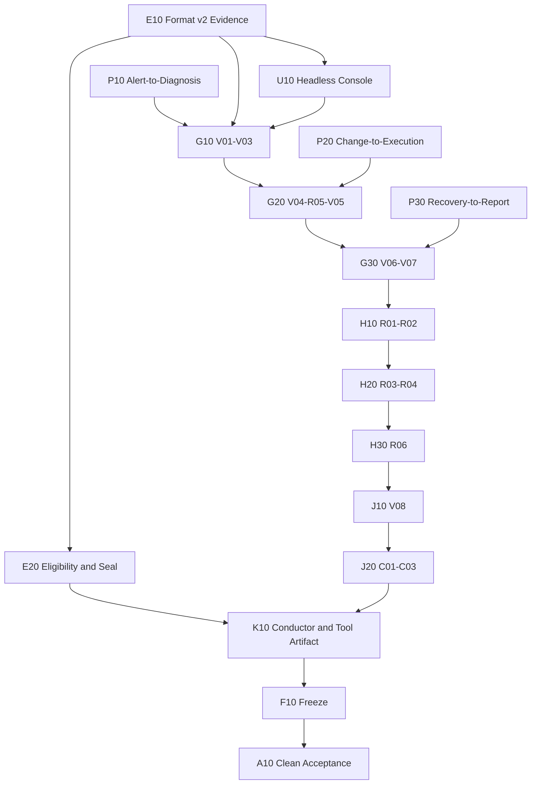

Type: tickets
Status: ready-for-agent

# Tickets: 可信 Alert-to-Report 收口与单次 Clean Acceptance

依据 `acceptance-remediation-spec.md`，先离线收口 Product、Acceptance Runner 与 Promotion Contract，冻结产品和验收工具两个 artifact，最后只执行一次 Clean Acceptance Run。

本图取代旧 `A02 -> A03 -> A04` 的后续执行顺序，但不覆盖其历史记录。现有 format v1 evidence 只作为 Diagnostic Evidence Bundle，不能满足本图 blocker。

Work the **frontier**: any ticket whose blockers are all done. 每张票使用全新上下文，通过自己的公开 Interface、直接消费者和 fixed-point review 后才清除 blocker。

## E10 建立 format v2 Acceptance Evidence

**What to build:** Platform Operator 可以创建并验证一个只属于 exact product/tool/Cluster identity 的 Clean Acceptance ledger；它只开放唯一 frontier，effect 前保存 durable intent，并在失败或中断时 fail closed。

**Blocked by:** None — can start immediately.

**Status:** done

**Implementation record:** Acceptance Evidence Module；公开 Interface 为 `AcceptanceEvidence`。任务开始时 `aiops/acceptance/evidence.py` 为 635 行，完成时 799 行；定向 selector 为 `tests/test_pilot_acceptance_evidence.py`，直接 consumers 为 `tests/test_pilot_acceptance_{package,cluster,web,platform_status,integrations,run_one}.py`。离线验证通过定向/consumer tests、Python 静态编译，以及相对 E10 前固定点的 Standards/Spec 双轴复审（PASS/PASS）；未执行任何 Cluster、provider、Notification Delivery、部署或 live acceptance。

- [x] Evidence format 冻结 Pilot Release Bundle SHA、acceptance-tool SHA、gate contract revision、Cluster identity 和 access profile；任一 identity drift 使 run ineligible。
- [x] Acceptance Evidence Module 单独拥有完整 DAG，包括 `V04 -> R05 -> V05`、`V07 -> R01 -> R02 -> R03 -> R04 -> R06 -> V08` 和 conditional I04。
- [x] 同时最多一个 open gate；每个 gate 最多一个 terminal attempt；外部 effect 前必须 durable 绑定 request/operation identity。
- [x] `status` 从 ledger fact 派生 active/open、active/ready、ineligible、eligible 或 sealed，不持久化第二套 run state machine。
- [x] 任一 mandatory gate failed 后禁止后续 gate；继续排障只能创建引用原 run 的独立 Diagnostic Evidence Bundle。
- [x] format v1 明确返回 `unsupported_evidence_format`，不 migration、不双读、不推断历史 frontier。
- [x] Artifact 只接受 bounded/redacted regular file，写入与 hash index 原子一致；tamper、duplicate path、越界 path 和 identity mismatch fail closed。
- [x] 公开 Interface 定向测试覆盖完整 DAG、durable intent、中断 reconciliation、duplicate effect 拒绝、failure terminal 和旧格式拒绝。

## E20 交付 Eligibility、Promotion Decision 与 Seal

**What to build:** Release owner 在 C03 后得到确定性的 eligibility，签署与之相容的 Promotion Decision，并把完整证据永久 seal；P/I/S 中途不再产生 accepted/finalized 结论。

**Blocked by:** E10 建立 format v2 Acceptance Evidence.

**Status:** done

**Implementation record:** Acceptance Evidence Module 内由 `evidence.py`、`promotion.py`、`human_attestation.py` 与 `evidence_files.py` 共同拥有 eligibility、签名事实与 seal invariant；公开 Interface 为 `AcceptanceEvidence.evaluate/seal` 和独立 `PromotionDecision` action。任务开始时 `aiops/acceptance/evidence.py` 为 799 行，完成时 795 行；新增 `promotion.py` 为 353 行。定向 selectors 为 `tests/test_pilot_acceptance_evidence.py`、`tests/test_pilot_acceptance_promotion.py`，提交内直接 consumers 为 `tests/test_pilot_acceptance_{package,cluster,web,platform_status,integrations,run_one,adapters}.py`。隔离提交态共 58 个 owner/consumer tests 通过；当前脏工作区另有未提交的 `test_pilot_acceptance_run_one_recovery.py` consumer，合计 63 tests 也通过。Python 静态编译及 E20 精确文件集 `diff --check` 通过；相对固定点 `a1228d0` 的 Standards/Spec fixed-point review 为 PASS/PASS。全工作区 `diff --check` 仍仅报告任务开始前、未纳入 E20 的 `docs/research/openobserve-replacement-evaluation.md` 尾随空格；未修改该用户 WIP。未执行部署、Cluster preflight、真实 provider probe、Notification Delivery 或任何 live acceptance。

- [x] 删除 A01 等中途 finalize/checkpoint seal；中途只允许 read-only status/verify。
- [x] `evaluate` 重验完整 mandatory DAG、conditional I04、acceptance identity、artifact hash 和每个必需 role attestation，输出 `eligible|ineligible` 与 bounded reasons。
- [x] Release owner 签署独立 `promote|no_promote`；ineligible ledger 拒绝 `promote`，eligible 不触发自动发布或部署。
- [x] `seal` 验证 eligibility、decision 和签名一致，生成覆盖 manifest、eligibility、attestations 与 decision 的最终 checksum，并拒绝 seal 后任何写入。
- [x] 同一自然人可签署多个实际角色，但每份 statement 必须绑定 exact actor role、gate、candidate 和 conclusion。
- [x] 定向测试覆盖 incomplete matrix、retained failure、错误/缺失签名、ineligible promote、artifact mutation、重复 decision 和 seal 后写入。

## P10 补齐 Alert-to-Diagnosis 公开关联

**What to build:** SRE 只通过公开产品 projection 就能证明真实 Alertmanager request、Alert Signal、Incident、accepted Diagnosis、frozen Model revision 和 fresh Evidence 属于同一 controlled run。

**Blocked by:** None — can start immediately.

**Status:** done

**Implementation record:** Alert ingress/Signal correlation 归属 Incident Module，公开 Interface 为 `IncidentService.ingest/workbench`；Evidence Gate 归属 Evidence Decision Module，公开 Interface 为 `record_diagnosis_facts/project`；Diagnosis Kubernetes payload 与同步 read workflow 分别由 `gateway_read_payload`、`run_diagnosis_read` 拥有，HTTP Adapter 只做鉴权、输入验证和序列化。P10 开始时 `incident.py` 为 798 行、完成时 800 行；`service_main.py` 与 `tests/test_diagnosis_service.py` 均为 546 行，`tests/test_gateway_diagnosis_delivery.py` 完成时 712 行；定向 selectors 为 `tests/test_gateway_{alertmanager_webhook,diagnosis_delivery,diagnosis_k8s_read,v1_incident_contract}.py` 与 `tests/test_diagnosis_service.py`。隔离提交态 37 个 owner/HTTP/OpenAPI tests 与 37 个提交内 Incident/Change/Diagnosis/Acceptance 直接 consumers 通过；包含未提交 recovery consumer 的当前脏工作区另有 42 个直接 consumer tests 通过。Python 静态编译、OpenAPI JSON 校验、generated Console contract build 与 commit `diff-tree --check` 通过；相对固定点 `8b71ef7` 的 Standards/Spec fixed-point review 为 PASS/PASS。未执行部署、Cluster preflight、真实 provider probe、Notification Delivery 或任何 live acceptance。

- [x] Alertmanager ingress 生成或保留 bounded request identity，并由 Incident owner 持久关联 firing/recovered Alert Signal。
- [x] Workbench 投影 accepted Diagnosis result 的 exact frozen Model revision，不使用当前配置 revision 代替历史事实。
- [x] Diagnosis Kubernetes read 只经 Gateway authorization 与 Connector Command；timeout、failed、truncated 和 invalid JSON 都返回 bounded public outcome。
- [x] Evidence Gate 只接受 exact verification scope、fresh Prometheus/Loki/Kubernetes Evidence Step 和完整 reference；Human Input 与 legacy alias 不补 gate。
- [x] Legacy Evidence alias 只保留既定 T24 退出条件，不扩展兼容范围。
- [x] owner、HTTP/OpenAPI、Workbench 和直接消费者测试覆盖 correlation success、request/revision mismatch、stale evidence 与 Connector read failure。

## P20 补齐 Change-to-Execution 公开关联

**What to build:** V04 的 immutable Kubernetes Change 可以先被无 Authority User安全拒绝，再由有 Authority User审批并只执行一次；expired、stale、Notification 与 post-check 都由 owning Module 提供可信事实。

**Blocked by:** None — can start immediately.

- [ ] 仅 expired 且尚无 Approval 的 dry-run Phase 可通过公开 retry 回到 planning 并生成新 immutable revision。
- [ ] Change Request 通过 Approval owner 的窄 Interface 判断 retry eligibility，不读取 Approval 私有 SQL。
- [ ] Approved、started、terminal 或已存在 Approval 的 Phase 不能通过 expired retry 重开。
- [ ] Awaiting-approval Notification identity 包含 immutable plan revision，旧 revision 不吞掉新事件。
- [ ] 无 Authority User 在 exact diff read、Approval 和 Execution Grant 处 fail closed，并留下不泄露 diff 的 audit。
- [ ] Connector execution projection 公开 declared typed post-check；不要求 Acceptance Runner 解析私有 stdout convention。
- [ ] owner、HTTP/OpenAPI、Console 和直接消费者测试覆盖 expired、unauthorized、single execution、stale、revision event 和 typed post-check。

## P30 补齐 Recovery-to-Report 公开关联

**What to build:** SRE 可通过公开 projection 把真实 recovery、resolved webhook、Recovery Observation、Incident resolution、immutable Report、Notification Request 和 provider Delivery 关联成一条不可变链。

**Blocked by:** None — can start immediately.

- [ ] Recovered Alert Signal 保留 exact resolved webhook request identity；全部当前 Signal recovered 才创建 Recovery Observation。
- [ ] Recovery Observation、Alert Signal 和 Incident timestamps 可证明完整 300 秒 stabilization，提前 resolution fail closed。
- [ ] Report v1 从 frozen Incident/Investigation/decision/action/recovery facts 生成，发布后 content/version 不可更新或删除。
- [ ] Notification Delivery 在 list、by-event 和 redelivery projection 中一致公开 Notification Request identity、typed Request、exact Destination revision 和 provider identity。
- [ ] `incident.resolved` subject、Report publication、Delivery 和 S04 exact Destination evidence 可通过公开 actor-scoped projection 关联。
- [ ] owner、HTTP/OpenAPI、Console 和直接消费者测试覆盖正常链路、短 stabilization、错误 revision、缺 request/provider identity 与 provider false-success。

## U10 交付无头 Console 与 Credential Boundary

**What to build:** Platform Operator 不需要重复输入动态密码；Acceptance Runner 在严格 secret boundary 内驱动真实无头 Console，并在所有 Authority/HITL 点停下等待真实 User 检查与签署。

**Blocked by:** E10 建立 format v2 Acceptance Evidence.

- [ ] Bootstrap password 按需从 exact Kubernetes Secret 读取；acceptance-created User password 使用 CSPRNG 生成一次。
- [ ] Console User password 与 Model/Notification secret 只进入 evidence/workspace 外的 mode-0600 input 和 run-scoped tmpfs store；目录 0700、文件 0600。
- [ ] 每个 gate 使用独立 role browser context 重新登录；cookie/profile 不持久化；credential loss 使 gate failed，不 reset password 继续。
- [ ] Headless Browser Adapter 只通过真实 Console UI完成产品 mutation，不绕过 UI 直调业务 mutation。
- [ ] Browser Adapter 在发送 mutation 前拦截并 durable 绑定 client request identity，随后绑定 response object/revision；中断时只接受唯一公开 audit/projection match。
- [ ] S04、S05、V04、V05、V07/V08、C03 和 Promotion Decision 输出 bounded/no-secret evidence 并暂停，自动化不能生成 attestation 或自行批准。
- [ ] Password、secret、session、cookie 不进入 CLI 参数、environment、PTY、普通配置、日志、截图、trace、audit 或 evidence；failed/sealed run 删除 tmpfs store。
- [ ] Credential Source、Browser Adapter、masked screenshot、role isolation、HITL pause、correlation recovery 和 secret non-disclosure 有公开 Interface 测试。

## G10 交付 V01-V03 First Run

**What to build:** Platform Operator/SRE 通过真实 Console 与 fixture 完成第一段 Alert-to-Diagnosis，得到 exact run、Alert、Incident、Investigation、Model revision 和 fresh Evidence chain。

**Blocked by:** E10 建立 format v2 Acceptance Evidence; P10 补齐 Alert-to-Diagnosis 公开关联; U10 交付无头 Console 与 Credential Boundary.

- [ ] V01 通过 Console 创建 Team、Service、Binding、Authority，通过 fixed verification overlay 触发唯一 Job controller run identity。
- [ ] V02 用 Acceptance Runner monotonic clock 分别执行 120 秒 telemetry 与 180 秒 Alert Signal/Incident deadline，并绑定 webhook request identity。
- [ ] V03 绑定 accepted Diagnosis 的 frozen Model revision、exact Investigation 和 fresh Prometheus/Loki/Kubernetes Evidence。
- [ ] 每个 gate 只消费公开 product/Kubernetes/backend facts，不访问 product database 或私有 repository。
- [ ] Timed open gate 中断后只有能证明原 deadline 内 terminal 的 reconciliation 才可完成，否则 failed。
- [ ] First Run Module 公开 Interface 测试覆盖正常路径、deadline、错误 fingerprint/run、Model revision drift、stale/missing Evidence 和中断。

## G20 交付 V04-R05-V05 Governed Change

**What to build:** SRE 通过无头 Console 创建 exact Change Request，无 Authority User 在 R05 被安全拒绝，随后 authorized User 检查并批准只执行一次的 Kubernetes Change。

**Blocked by:** G10 交付 V01-V03 First Run; P20 补齐 Change-to-Execution 公开关联.

- [ ] V04 从 V03 Recommendation 经 Console 创建 Change Request，绑定 latest non-expired immutable revision、live preconditions、API Server dry-run diff、post-check 和 rollback status。
- [ ] Expired unapproved Phase 只通过产品公开 retry恢复；不允许 Acceptance Runner 私改状态或隐藏旧 expired revision。
- [ ] R05 使用独立无 Authority User browser context，证明 exact diff read、Approval 和 Grant 均拒绝且 grant inventory 不变。
- [ ] V05 在 bounded/no-secret exact diff summary 和签名确认后通过 Console Approval；Gateway 产生 exact Authority/Approval/single-use Grant/Command chain。
- [ ] Connector 只执行一次 mutation，并由可信 terminal result 与 typed post-check证明；duplicate、automatic retry、rebase 或 untrusted effect 均阻塞。
- [ ] First Run Module 和直接产品 contract 测试覆盖 V04-R05-V05 frontier、HITL pause、expired retry、unauthorized denial、single execution、stale 与 interruption reconciliation。

## G30 交付 V06-V07 Recovery and Report

**What to build:** 第一轮 mutation 后，SRE 证明真实 workload recovery、完整 stabilization、Incident resolution、Report v1 publication 和 resolved Notification Delivery。

**Blocked by:** G20 交付 V04-R05-V05 Governed Change; P30 补齐 Recovery-to-Report 公开关联.

- [ ] V06 同时绑定 recovery metric/log、resolved webhook request、相同 Alert fingerprint、Recovery Observation 和至少 300 秒 stabilization。
- [ ] Prometheus/Alertmanager 不再 firing/active，且 Incident/Recovery resolved timestamp 不早于 stabilizes_at。
- [ ] V07 在 bounded/no-secret Report summary 获 User 确认后经 Console 发布 immutable Report v1。
- [ ] Resolved Delivery 必须关联 typed Notification Request、Incident subject、request ID、provider identity 和 S04 hash-verified exact Destination revision/attestation。
- [ ] Product failure、dead-letter、suppressed、错误 revision 或缺 provider correlation 直接 failed，不轮询成假成功。
- [ ] First Run Module 测试覆盖 recovery timing、Report immutable、S04 artifact tamper、Delivery terminal failure、HITL 和中断恢复。

## H10 交付 R01-R02 Stateful Recovery

**What to build:** Platform Operator 逐个 crash/rollout AIOps workload并 reapply 同一 candidate，证明 durable owner state、configuration、governance、journal、Delivery 和 observability retention。

**Blocked by:** G30 交付 V06-V07 Recovery and Report.

- [ ] R01 只删除 exact current Gateway、Diagnosis、Connector、Notification、Prometheus、Loki Pod，每次等待 owner Available/Ready 后才继续。
- [ ] R01 before/during/after evidence 证明 PVC UID、configuration revision、Incident/governance history、journal、Delivery、metrics/log retention。
- [ ] R02 只对 candidate Deployment/Alloy 执行固定 annotation rollout，逐个收敛后 reapply同一 bundle。
- [ ] R02 证明 image digest、Secret identity、credential 和 durable state 不漂移；不声称 HA 或跨版本 upgrade。
- [ ] Recovery Gate Module 只接受 frozen structured target/effect，并在操作前取得 Platform Operator 确认和 durable operation identity。
- [ ] 定向测试覆盖精确顺序、owner readiness、partial failure、state loss、digest drift、reapply failure 和 interruption reconciliation。

## H20 交付 R03-R04 Dependency Degradation

**What to build:** Platform Operator 分别停用 Connector 与 Loki，证明依赖能力 truthful unavailable、受影响操作 fail closed，并以同一 candidate 恢复且不伪造 Evidence。

**Blocked by:** H10 交付 R01-R02 Stateful Recovery.

- [ ] R03 将 exact Connector workload scale-to-zero 后，availability 降级且新 live Evidence、dry-run、Grant、dispatch 均拒绝。
- [ ] R03 reapply 同一 candidate 后 heartbeat 和 read verification 恢复 ready，不依赖数据库 patch 或 credential rotation。
- [ ] R04 将 exact Loki workload scale-to-zero 后，Platform Status 降级，MCP 返回 bounded unavailable，且不能形成 verified log Evidence。
- [ ] R04 恢复后第一轮 retained log 与新 probe log 都可真实查询，不注入 fake log。
- [ ] R03 完全恢复后才允许 R04；不能并行制造两个 unavailable owner。
- [ ] Recovery Gate Module 测试覆盖 before/during/after projection、blocked operations、truthful error、same-candidate recovery 和顺序约束。

## H30 交付 R06 Stale Change

**What to build:** SRE 创建并审批一个 verification metadata Change 后，Platform Operator 制造 exact resourceVersion drift，Connector 返回 Stale Change 且 AIOps 零 mutation、零 retry。

**Blocked by:** H20 交付 R03-R04 Dependency Degradation.

- [ ] User 经 Console 创建并审阅 exact metadata Change，审批前事实、dry-run diff 和 hash 可关联。
- [ ] Recovery Gate Module 只对 exact verification object 执行 fixed-format out-of-band metadata drift，不改变 pod template。
- [ ] Operator drift 与 approved change 的 UID/resourceVersion、before/after 和 Kubernetes identity 有完整 evidence。
- [ ] Connector 返回 `stale`，Gateway 不签发替代 Grant、不 rebase、不 retry，也不把 Operator effect 归因给 AIOps。
- [ ] R06 完成前不存在 active mutation、Unknown Outcome 或 unfinished rollback。
- [ ] 定向测试覆盖 exact drift、wrong-target rejection、stale result、zero mutation/grant retry 和 interruption。

## J10 交付 V08 第二轮治理链

**What to build:** Recovery gates 后，SRE 用新 Job controller identity reopen 同一 Incident，并完成完全独立的第二轮 Investigation、Change、Approval、execution、Report v2 和 resolved Delivery。

**Blocked by:** H30 交付 R06 Stale Change.

- [ ] 新 verification run 在既定 reopen window 内关联同一 Incident，创建新 Investigation，不复用 V01-V07 run identity。
- [ ] 第二轮重复 V02-V07 的真实 signal、Diagnosis、Evidence、Change、R05 authorization、Approval、execution、recovery 和 Notification semantics。
- [ ] 第二轮不复用旧 Evidence、plan revision、Approval、Grant、Command 或 execution result。
- [ ] Report v2 经 Console确认并发布，Report v1 hash/content 保持不变。
- [ ] 第二条 resolved Delivery 绑定同一已验证 Destination revision；revision 变化则先重新完成 S04 receipt evidence。
- [ ] Rerun and Cleanup Module 测试覆盖 same Incident/new chain、错误新 Incident、旧 identity reuse、v1 mutation 和 second Delivery failure。

## J20 交付 C01-C03 Cleanup and Evidence

**What to build:** Platform Operator 只删除 verification fixture，随后所有角色通过公开 projection确认两轮治理历史完整，并为最终 eligibility 准备完整 manifest 和 attestations。

**Blocked by:** J10 交付 V08 第二轮治理链.

- [ ] C01 依次删除 verification run/base，fixture namespace消失且 `aiops-system` 不受影响。
- [ ] C02 只通过公开 actor-scoped projection读取两轮 Incident/Investigation/Evidence/Change/Approval/Grant/Command/outcome/Recovery/Report/Delivery。
- [ ] Resource Catalog 将已删除 Deployment Target 投影 unavailable，不伪装资源仍在线。
- [ ] C03 生成完整 artifact index；bounded/no-secret manifest summary 由 Platform Operator、Platform Administrator 和 SRE 按实际角色检查并签署。
- [ ] Cleanup 不访问 SQLite、不删除治理历史、不修改 published Report 或 terminal Delivery。
- [ ] Rerun and Cleanup Module 测试覆盖 fixture-only delete、产品误删保护、public history、unavailable target、缺 gate/role 和 secret exposure。

## K10 交付单 gate Conductor 与 Acceptance Tool Artifact

**What to build:** Platform Operator 使用一个冻结的 Acceptance Runner artifact，以 `status/advance/resume/evaluate/decide/seal` 驱动完整 DAG；A10/P02 只验证 F10 admission evidence，不在 live window重跑仓库测试。

**Blocked by:** E20 交付 Eligibility、Promotion Decision 与 Seal; J20 交付 C01-C03 Cleanup and Evidence.

- [ ] Conductor 只从 Acceptance Evidence Interface 读取 current frontier并分发到现有 P/I/S、First Run、Recovery、Rerun and Cleanup Module。
- [ ] 每次 `advance` 最多执行一个 gate；`resume` 只处理 open gate；不提供 `run-all`、第二套 sequence、plugin Interface 或 factory。
- [ ] CLI status read-only，且进程/PTY状态不能覆盖 ledger frontier。
- [ ] Acceptance-tool artifact 固定 tool source、evidence format、gate contract revision、测试 admission report 和 self-check identity。
- [ ] P02 验证 F10 report 与 product/tool artifact identity、contract revision 完全匹配，只运行最小 tool self-check，并声明 fake-backed evidence 不计 live gate。
- [ ] 完整 DAG contract simulation 通过现有测试替身/in-memory Adapter覆盖 success、每个 gate failure、interruption/resume、duplicate effect、tamper、wrong signature、ineligible promote 和 old format rejection。
- [ ] CLI、Conductor、artifact packaging、P02 admission 和全 DAG simulation 可通过各自公开 selector独立运行。

## F10 一次性收口并冻结两个 Artifact

**What to build:** Release maintainer 在不接触真实 Cluster/provider 的前提下，审清全部 WIP、关闭所有 Standards/Spec blocker，并一次性冻结可进入唯一 live run 的 product/tool artifacts。

**Blocked by:** K10 交付单 gate Conductor 与 Acceptance Tool Artifact.

- [ ] 当前工作树全部保留并按本 spec审计；有效实现迁入 owning Module，旧实现同变更删除，不 reset、不双写/双读、不自动视为完成。
- [ ] 行为不变迁移与行为变化分开提交；每个 500+ 行文件记录所属 Module、公开 Interface 和定向 selector，新增文件不超过 800 行。
- [ ] 依次通过受影响 owner tests、直接 contract consumers、受影响 workspace静态检查和完整 DAG simulation。
- [ ] 以固定点运行 Standards/Spec 双轴 review，关闭所有 blocker 后才构建 final artifacts。
- [ ] Pilot Release Bundle、acceptance-tool artifact、OpenAPI/Console contract revision、image digest、test/review report 和 checksum 完全一致。
- [ ] Freeze record 声明其后任何 source、manifest、image、default 或 artifact变化都会撤销 A10 blocker 完成。
- [ ] 本票禁止 Kubernetes apply、Cluster preflight、真实 provider probe、Notification Delivery 和任何 live acceptance rehearsal。

## A10 执行唯一 Clean Acceptance Run

**What to build:** 新 Platform Operator 在 exact clean non-production Cluster 上使用 F10 的 immutable product/tool artifacts，连续完成唯一 P01-C03 path，并由发布负责人签署最终 Promotion Decision。

**Blocked by:** F10 一次性收口并冻结两个 Artifact.

- [ ] A10 前只允许普通基础设施准备和旧资源清理；P03 是 exact Cluster 的唯一自动 baseline check，不先运行 acceptance rehearsal。
- [ ] Acceptance identity 与 F10 product/tool SHA、gate revision、Cluster identity 和 access profile 完全一致。
- [ ] P01-C03 每个 gate只执行唯一 legal frontier和一个 terminal attempt；product-owned bounded retry 不产生新 gate attempt。
- [ ] 所有 User mutation 经无头 Console UI，所有 Operator mutation经 frozen structured action；不 seed state、不改数据库、不手工 webhook、不 fake provider。
- [ ] Required HITL review/attestation 绑定 exact actor role、gate、candidate 和 bounded/no-secret evidence。
- [ ] 任一 mandatory failure 立即 ineligible并停止后续 gate；诊断写独立 bundle，本图不允许边修边跑或第二次 Clean Acceptance Run。
- [ ] C03 后 `evaluate`、release-owner `decide` 和 `seal` 顺序完成；只有 eligible 才允许签 `promote`，且签名不自动发布或部署。
- [ ] 最终 sealed bundle 通过 checksum、secret non-disclosure 和 permanent read-only verification。
