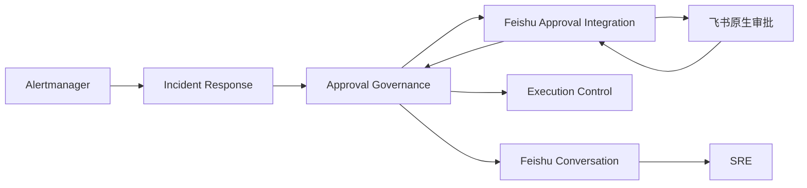

# DDD：领域模型

## 建模范围

本模型覆盖告警响应、人工审批、外部飞书审批同步和受控执行之间的领域关系。CR-2026-05-15-001 后，飞书原生审批是主人工审批入口，但不是执行权威；AIOps 本地 approval 状态机、operation lock、安全门禁、审计和执行 worker 才决定动作是否可以落地。

## 子域

| 子域 | 类型 | 分类理由 | 负责人 |
| --- | --- | --- | --- |
| 告警响应与修复编排 | Core | 将告警转化为 Incident、诊断结论和修复建议，是 AIOps 的核心价值 | AIOps Agent |
| 人工审批与执行授权 | Core | 决定高风险修复动作是否具备本地执行资格，必须强一致维护审批状态和终态保护 | AIOps Agent |
| 飞书审批集成 | Supporting | 承接企业审批人、审批链和审批记录，但只提供人类审批结果输入 | Feishu Adapter |
| 执行安全与恢复 | Core | 在本地 `approved` 后执行安全门禁、operation lock、健康检查和回滚 | AIOps Agent |
| 身份与协作通知 | Generic | 用户身份、飞书 Thread 通知和卡片展示属于通用协作能力 | Feishu Platform |

## 限界上下文

| 上下文 | 职责 | 非职责 | 拥有数据 | 主要事件 |
| --- | --- | --- | --- | --- |
| Incident Response | 接收告警、维护 Incident、生成诊断摘要和修复建议 | 不判断外部审批终态，不直接绕过审批执行高风险动作 | Incident、告警事件、诊断摘要、修复建议 | Incident 已创建、修复建议已生成 |
| Approval Governance | 创建本地 approval、维护审批状态机、同步人类审批结果、保护终态、决定是否具备执行资格 | 不调用具体飞书 OpenAPI，不直接执行命令 | Approval、外部审批引用、审批状态、审批审计 | 审批已请求、外部审批已创建、外部审批创建失败、人类审批结果已记录、审批已过期 |
| Feishu Approval Integration | 创建飞书原生审批实例，接收 webhook，polling 补偿，翻译飞书状态 | 不拥有 AIOps 执行资格，不把 webhook 直接变成执行命令 | 飞书实例引用、外部状态快照、回调元数据 | 飞书审批事件已接收、飞书审批状态已查询 |
| Execution Control | 在本地 approval 为 `approved` 后执行安全门禁、operation lock、命令执行、健康检查和回滚 | 不解释飞书审批链，不修改审批终态为已批准 | 执行任务、锁、执行结果、回滚记录 | 执行已授权、执行已完成、执行失败 |
| Feishu Conversation | 在 incident thread 中展示审批链接、风险摘要、操作摘要和通知卡片 | 不作为主审批事实，不决定执行资格 | Thread 绑定、消息投递记录、通知展示状态 | 审批通知已展示、消息投递失败 |

## 上下文映射

| 上游 | 下游 | 模式 | 数据/事件 | 风险 |
| --- | --- | --- | --- | --- |
| Incident Response | Approval Governance | Customer-Supplier | 修复建议、风险摘要、需要审批标记 | 修复建议语义不清会导致审批内容不可审 |
| Approval Governance | Feishu Approval Integration | ACL + Published Language | `approval_id`、审批表单、外部实例状态 | 外部状态字段变化不得污染本地审批语义 |
| Feishu Approval Integration | Approval Governance | ACL | `APPROVED` / `REJECTED` / `CANCELED` / 过期结果翻译为本地状态 | 重复、乱序、未知事件可能试图覆盖终态 |
| Approval Governance | Execution Control | Published Language | 本地 `approved` 状态和执行授权事件 | 不能让外部 webhook 绕过 execution worker |
| Approval Governance | Feishu Conversation | Published Language | 审批链接、风险摘要、操作摘要、失败提示 | 通知展示不得被误解为主审批事实 |

## 聚合

| 聚合 | 聚合根 | 实体 | 值对象 | 不变量 |
| --- | --- | --- | --- | --- |
| Incident | Incident | 告警事件、诊断摘要、修复建议 | fingerprint、风险等级、操作摘要 | 相同 fingerprint 的未关闭告警归并到同一 Incident；高风险修复建议必须先请求 approval |
| 审批请求 | Approval | 外部审批引用、审批审计记录 | 审批状态、审批人类结果、审批有效期、外部状态快照 | 飞书只决定人类是否批准；只有本地 `approved` 可进入 execution worker；`external_pending`、`approval_create_failed`、`denied`、`canceled`、`expired` 不得执行；`executed`、`failed`、`denied`、`canceled`、`expired` 不能被外部事件回滚 |
| 执行任务 | Execution | 执行步骤、健康检查、回滚动作 | operation lock、执行结果 | 执行必须引用本地已批准 approval；一个锁范围内不得并发执行冲突动作 |
| 通知投递 | MessageDelivery | 飞书 Thread 消息、自定义审批卡片展示 | 投递状态、消息标识 | 自定义审批卡片只表示通知展示/回退，不是主审批事实，不改变 Approval 的人类审批结果，不作为可批准事实来源 |

### Approval 状态语义

| 本地状态 | 类型 | 进入条件 | 可执行 | 终态 | 说明 |
| --- | --- | --- | --- | --- | --- |
| `external_pending` | 中间态 | 本地 approval 已创建，飞书原生审批实例已创建并可在审批中心处理 | 否 | 否 | 有效待审批状态；等待飞书审批结果或 polling 补偿，通知卡片展示不构成进入条件 |
| `approval_create_failed` | 异常态 | 飞书原生审批实例创建失败、token/HTTP/非 JSON/飞书错误导致无法发起审批 | 否 | 否 | 需要重试、补偿或人工介入；不得静默执行 |
| `approved` | 可执行资格态 | 飞书 `APPROVED` 经 ACL 同步到本地，且本地状态机接受该转换 | 是，仍需 execution worker 和安全门禁 | 否 | webhook 本身不执行命令 |
| `denied` | 人类拒绝终态 | 飞书 `REJECTED` 经 ACL 同步到本地 | 否 | 是 | 拒绝后不得被重复批准事件回滚 |
| `canceled` | 人类取消终态 | 飞书 `CANCELED` 经 ACL 同步到本地 | 否 | 是 | 取消后不得执行 |
| `expired` | 超时终态 | 本地有效期到期或补偿查询确认外部审批过期 | 否 | 是 | 过期后需重新发起审批 |
| `executed` | 执行终态 | execution worker 在本地 `approved` 后完成动作 | 否 | 是 | 外部事件不得改回 `approved` |
| `failed` | 执行终态 | 已批准动作执行失败或回滚失败 | 否 | 是 | 外部事件不得改写执行失败事实 |

## 领域事件

| 事件 | 来源聚合 | 触发条件 | 发布对象 | 说明 |
| --- | --- | --- | --- | --- |
| 审批已请求 | Approval | 修复建议需要人工审批，本地 approval 已创建 | Feishu Approval Integration、Feishu Conversation | 发起飞书原生审批和 thread 通知的前置事件 |
| 外部审批已创建 | Approval | 飞书原生审批实例创建成功、写回 `external_instance_code` / `external_uuid`，并可在审批中心处理 | Feishu Conversation、审批恢复 | 本地进入 `external_pending`，等待人类审批；通知卡片不是进入条件 |
| 外部审批创建失败 | Approval | 飞书实例创建失败或无法确认创建成功 | Feishu Conversation、审批恢复、审计 | 本地进入 `approval_create_failed`，动作不得执行 |
| 人类审批已批准 | Approval | 飞书 `APPROVED` 经 ACL 校验并幂等同步成功 | Execution Control、审计 | 只表示本地具备执行资格，不表示 webhook 已执行 |
| 人类审批已拒绝 | Approval | 飞书 `REJECTED` 经 ACL 校验并幂等同步成功 | Incident Response、Feishu Conversation、审计 | 本地进入 `denied` 终态 |
| 人类审批已取消 | Approval | 飞书 `CANCELED` 经 ACL 校验并幂等同步成功 | Incident Response、Feishu Conversation、审计 | 本地进入 `canceled` 终态 |
| 审批已过期 | Approval | 本地有效期到期或补偿查询确认外部审批过期 | Incident Response、Feishu Conversation、审计 | 本地进入 `expired` 终态 |
| 审批事件被忽略 | Approval | 收到重复、未知、乱序或试图回滚终态的外部事件 | 审计、可观测性 | 不改变执行资格，不触发命令 |
| 审批通知已展示 | MessageDelivery | incident thread 已展示审批链接、风险摘要或自定义通知卡片 | SRE、审计 | 只代表通知展示/回退事实，不代表主审批事实，不作为可批准事实来源 |

## 领域服务

| 服务 | 职责 | 输入 | 输出 | 不应包含的逻辑 |
| --- | --- | --- | --- | --- |
| 审批状态同步 | 校验外部事件归属，翻译飞书状态，并按本地状态机幂等转换 | `uuid`、`instance_code`、外部状态、本地 Approval | 本地状态转换、忽略原因或异常审计 | 不直接执行修复命令，不绕过终态保护 |
| 执行资格判定 | 判断 approval 是否可以交给 execution worker | 本地 Approval 状态、终态标记、operation lock 前置条件 | 可执行 / 不可执行及原因 | 不调用飞书 API，不解释审批链 |
| 外部审批补偿 | 对长期 `external_pending` 的 approval 查询飞书实例状态并请求同步 | 本地 Approval、外部实例引用、补偿策略 | 同步请求、退避或人工介入结论 | 不直接修改为已执行，不绕过状态同步服务 |
| 审批通知编排 | 组织审批链接、风险摘要、操作摘要和通知展示 | Approval、Incident、飞书 Thread 绑定 | thread 通知内容、投递请求 | 不把卡片点击当作主审批事实，不与原生审批并列为可批准事实来源 |

## 模型评审发现

- CR-2026-05-11-002 明确了审批可见性不是单纯 `status=pending`。在 CR-2026-05-15-001 后，领域模型必须将有效待审批限定为“本地 approval 为 `external_pending`，且飞书原生审批实例已创建并可在审批中心处理”；自定义审批卡片和消息标识只属于通知展示/回退事实，不构成可批准事实来源。
- CR-2026-05-15-001 改变了人工审批主入口：飞书原生审批承载审批人、审批链和审批记录，自定义审批卡片降级为通知展示/回退。
- 模型就绪判定：Ready for architect-agent 继续细化 SDD。阻塞项不是产品语义，而是技术侧需确认飞书过期状态字段、webhook 安全校验和 polling 配置契约。
- 质量评分：术语一致性 9/10，边界合理性 9/10，不变量表达率 9/10，事件完整性 8/10，耦合度 8/10。主要扣分项是外部“过期”状态的飞书字段仍需架构确认。
