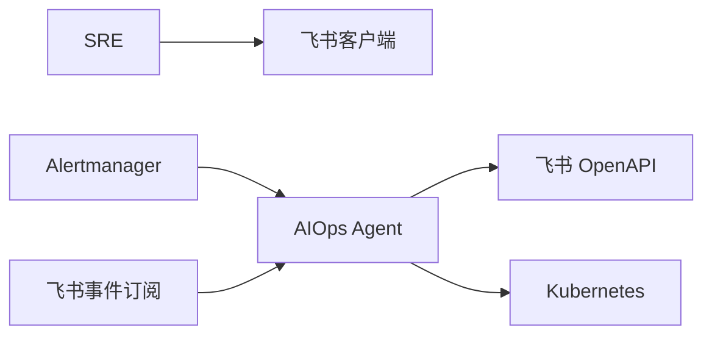
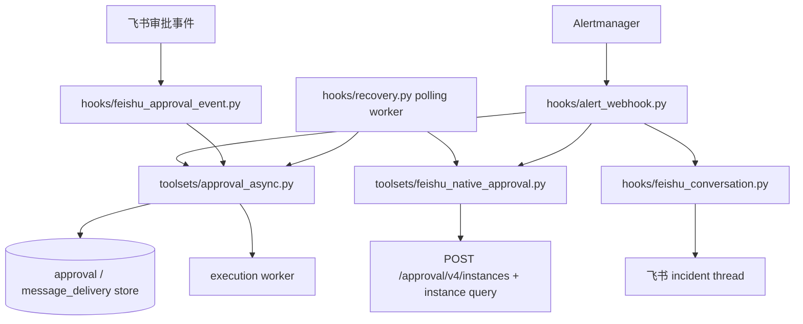
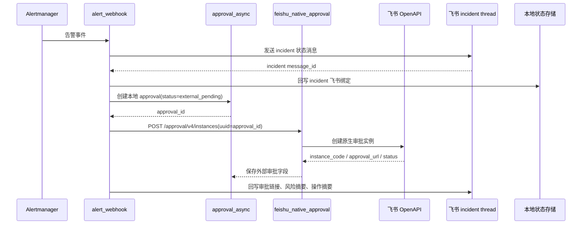
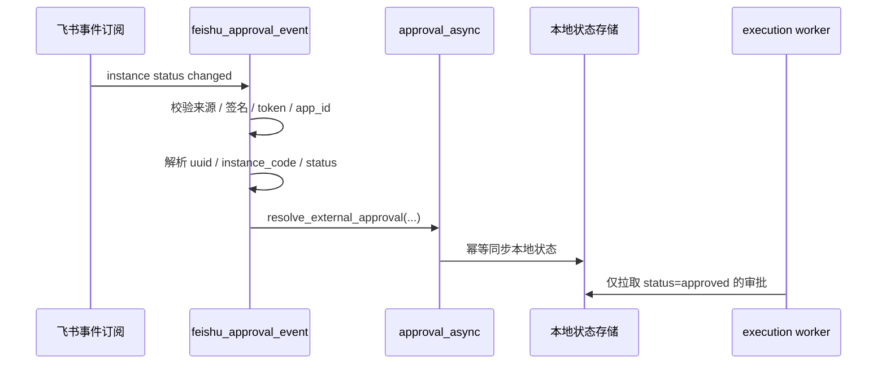
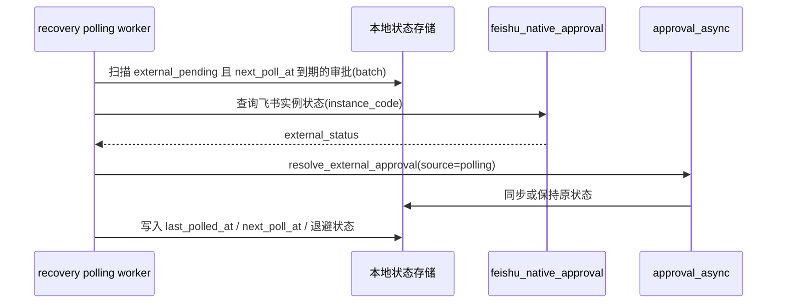
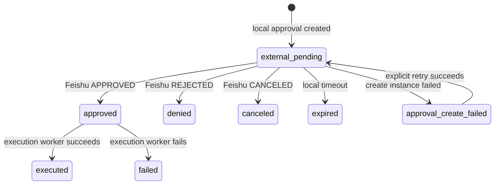

# SDD：系统设计

## 来源输入

- `docs/00-PDD.md`
- `docs/01-BDD.md`
- `docs/02-DDD.md`
- `docs/CHANGE-REQUESTS.md`：CR-2026-05-15-001「接入飞书原生审批」

## 系统上下文

AIOps Agent 是本地审批状态的唯一权威来源。飞书原生审批只提供外部人工决策界面和事件来源；任何飞书 webhook、polling 结果或降级卡片都只能同步本地审批状态，不能直接触发执行。

## 容器 / 模块架构

模块边界：

- `toolsets/approval_async.py` 负责本地审批状态机、外部审批字段写回、`resolve_external_approval(...)` 幂等同步和执行门禁。
- `toolsets/feishu_native_approval.py` 负责飞书 OpenAPI 客户端能力，生产路径直接调用飞书 HTTP API，不依赖 `lark-cli`。
- `hooks/feishu_approval_event.py` 负责飞书事件入口鉴权、事件解析和状态同步调用，不包含修复动作执行逻辑。
- `hooks/alert_webhook.py` 负责告警入口编排：先绑定 incident，再创建本地 approval，再创建飞书原生审批实例，最后向飞书 thread 回写审批链接和摘要。
- `hooks/feishu_conversation.py` 保留 incident thread 通知；自定义审批卡片降级为可选通知或显式 fallback，不再是默认审批主入口。
- `hooks/recovery.py` 承载 `external_pending` polling 补偿 worker，处理 webhook 丢失、事件延迟和外部状态回写失败。

## 核心数据流

### Alertmanager 触发飞书原生审批

本路径的成功语义是“飞书原生审批实例已创建并可由 SRE 在飞书处理”，不是旧路径中的“自定义审批卡片已投递”。`uuid` 必须使用本地 `approval_id`，用于飞书侧幂等创建和本地回查关联。

如果飞书原生审批创建失败，本地审批进入 `approval_create_failed`，执行 worker 不得执行该审批关联动作。只有配置显式允许卡片 fallback 时，系统才可以发送旧自定义审批卡片；fallback 仍必须走本地审批状态机，且不得与已创建的原生审批实例同时提供两个可批准入口。

### 飞书审批事件同步

`hooks/feishu_approval_event.py` 不直接执行命令，也不信任事件载荷中的操作内容。事件只允许携带外部审批标识和状态，具体执行动作必须从本地审批记录读取。

### polling 补偿

polling worker 是 webhook 的补偿路径，不是第二套审批执行路径。它按配置控制开关、间隔和 batch size；失败时使用指数退避和上限，避免飞书 API 故障时放大重试流量。

## API / 事件契约

| 契约 | 生产者 | 消费者 | 载荷 | 版本策略 |
| --- | --- | --- | --- | --- |
| `sre_request_approval(...)` | SRE 工具层 | 审批服务 / 飞书投递层 | `approval_id`、`approval_message_id`、`delivery_status`、`ok`、失败原因 | 保持字段向后兼容；新增状态必须可被旧调用方识别为未完成 |
| `message_delivery` outbox 任务 | 审批服务 / recovery | 飞书投递层 | 稳定 `uuid`、目标会话或线程、卡片载荷、重试状态、关联 `approval_id` | `uuid` 幂等；重复投递必须收敛到同一审批记录 |
| `create_feishu_approval_instance(...)` | `alert_webhook` / recovery | `feishu_native_approval` | `approval_code`、`requester_open_id`、`uuid=approval_id`、审批表单 JSON、超时配置 | 生产依赖直接调用飞书 OpenAPI；`lark-cli` 仅可用于人工调试 |
| `resolve_external_approval(...)` | `feishu_approval_event` / polling worker | `approval_async` | `approval_id` 或 `uuid`、`instance_code`、`external_status`、`source`、`event_id`、`observed_at` | 幂等；重复、乱序、未知外部事件只记录审计，不改变终态 |
| 飞书审批事件 webhook | 飞书事件订阅 | `hooks/feishu_approval_event.py` | 事件挑战、来源校验字段、`uuid`、`instance_code`、`status` | 仅同步本地状态；事件结构变化必须先兼容旧字段再切换 |

飞书外部状态到本地状态的最小映射：

| 飞书状态 | 本地状态 | 说明 |
| --- | --- | --- |
| `PENDING` / `STARTED` / `RUNNING` | `external_pending` | 已创建原生审批，等待 SRE 处理 |
| `APPROVED` | `approved` | 允许 execution worker 后续按本地记录执行 |
| `REJECTED` | `denied` | 人工拒绝，不执行 |
| `CANCELED` | `canceled` | 外部审批撤销，不执行 |

## 数据模型

审批记录必须继续保存旧卡片字段 `approval_message_id`，用于兼容 CR-2026-05-11-002 的投递补偿；飞书原生审批新增字段与旧字段并存，不互相覆盖。

新增或迁移字段建议：

- `external_provider`：当前为 `feishu`。
- `external_uuid`：飞书创建审批实例时传入的 `uuid`，必须等于本地 `approval_id`。
- `external_approval_code`：飞书审批定义 code。
- `external_instance_code`：飞书审批实例 code，用于 webhook 和 polling 关联。
- `external_status`：飞书原始状态。
- `external_url`：飞书审批链接或移动端/桌面端跳转信息。
- `external_created_at`、`external_updated_at`、`external_last_synced_at`、`external_last_polled_at`。
- `external_sync_source`：`webhook`、`polling`、`manual_retry` 等。
- `external_sync_attempts`、`external_next_poll_at`、`external_error_code`、`external_error_message`。

本地审批状态机：

终态保护：`executed`、`failed`、`denied`、`canceled`、`expired` 不能被 webhook、polling 或 fallback 卡片事件覆盖。`approved` 只能由本地 execution worker 推进到 `executed` 或 `failed`。

## 安全与权限

- 飞书审批事件入口必须校验来源：`verification_token` / 签名 / 时间戳 / nonce / app_id，按飞书事件订阅配置取可用校验项；非法、过期或重放请求直接拒绝并记录审计。
- webhook 只接受 `uuid`、`instance_code`、`status` 等外部状态字段，不接受命令、namespace、资源名、风险等级等执行参数；执行参数只从本地 approval 记录读取。
- 飞书 OpenAPI token、app secret、event secret、approval code 均由部署密钥或配置注入，日志不得输出 secret、access token 或完整用户敏感字段。
- `lark-cli` 不进入生产依赖链；生产容器只依赖 HTTP 客户端和本服务配置。
- fallback 卡片若启用，必须带明确配置开关，并与原生审批实例互斥，避免双入口审批造成重复批准。

## 可观测性

新增结构化日志字段：`approval_id`、`incident_id`、`external_provider`、`external_instance_code`、`external_status`、`sync_source`、`event_id`、`poll_attempt`。

建议指标：

- `feishu_approval_create_total{result}`：原生审批创建成功、失败、超时、飞书错误。
- `feishu_approval_sync_total{source,result,status}`：webhook / polling 同步结果。
- `feishu_approval_webhook_rejected_total{reason}`：非法来源、签名失败、重放、未知实例。
- `feishu_approval_external_pending_age_seconds`：仍处于 `external_pending` 的审批年龄。
- `feishu_approval_polling_batch_total{result}` 和 `feishu_approval_polling_backoff_seconds`。

告警建议：`approval_create_failed` 非零、`external_pending` 超过业务 SLA、webhook 拒绝量异常、polling 连续失败、飞书 OpenAPI 创建错误率升高。

## 部署拓扑

需要新增配置命名空间 `platforms.feishu.approval.*`：

| 配置 | 说明 |
| --- | --- |
| `enabled` | 是否启用飞书原生审批主路径 |
| `approval_code` | 飞书审批定义 code |
| `requester_open_id` / `requester_source` | 发起人 open_id 获取方式；无法解析时使用受控默认值 |
| `openapi_base_url` | 飞书 OpenAPI base URL，默认生产地址 |
| `timeout_seconds` | 创建 / 查询审批实例请求超时 |
| `webhook.enabled`、`webhook.path`、`webhook.verification_token`、`webhook.encrypt_key`、`webhook.replay_window_seconds` | 飞书事件订阅入口与校验配置 |
| `polling.enabled`、`polling.interval_seconds`、`polling.batch_size`、`polling.max_backoff_seconds`、`polling.stale_after_seconds` | 补偿 worker 控制参数 |
| `card_fallback.enabled` | 原生审批不可用时是否允许旧自定义卡片审批 |

部署注意事项：

- 网关必须暴露飞书事件 webhook HTTPS 路由，并限制只进入 `hooks/feishu_approval_event.py` 的校验路径。
- polling worker 可以复用现有 recovery 进程，但必须避免多副本重复扫描；多副本部署时需使用 DB claim、锁或单副本 worker。
- 数据库迁移需要先添加外部审批字段，再启用 `enabled=true`，保证旧审批记录可读、旧卡片补偿逻辑仍可运行。
- 灰度顺序：先部署代码和字段迁移，再配置飞书事件订阅，再启用 polling，最后开启原生审批主路径；回滚时关闭 `platforms.feishu.approval.enabled`，保留字段不删除。

## 失败模式

| 失败 | 影响 | 检测方式 | 缓解措施 |
| --- | --- | --- | --- |
| 无飞书绑定目标 | incident thread 不可回写，用户不可见 | 审批请求缺少会话、线程或 incident 绑定 | 返回 `pending_retry` 或 `failed`；不得返回可见成功语义 |
| 飞书原生审批创建失败 | 本地 approval 存在但无外部审批入口 | `approval_create_failed`、OpenAPI 错误、超时 | 不执行；记录错误；允许显式 retry；配置允许时才走卡片 fallback |
| 飞书事件 webhook 丢失或延迟 | 外部审批已决策但本地仍 `external_pending` | `external_pending` age 超 SLA、polling 命中 | polling worker 查询实例状态并调用 `resolve_external_approval(...)` |
| 重复或乱序事件 | 可能重复同步或试图回滚终态 | 相同 `event_id`、状态版本较旧、终态记录已存在 | 幂等处理；终态保护；重复事件只记审计 |
| 非法 webhook 来源 | 伪造审批状态可能绕过人工审批 | 签名、token、时间戳、app_id 校验失败 | 拒绝请求；增加安全告警；不调用同步入口 |
| polling 连续失败 | webhook 丢失时无法最终一致 | polling 错误率、退避次数、pending age | 指数退避带上限；告警；人工补偿或临时重放事件 |
| 原生审批和 fallback 卡片双入口 | 两个入口可能产生冲突决策 | 同一 approval 同时存在 `external_instance_code` 和可批准卡片 | 互斥创建；已有原生实例时卡片只做通知，不带批准动作 |
| 已执行后收到拒绝 / 取消事件 | 外部乱序事件试图覆盖执行结果 | 本地状态为 `executed` / `failed` 后收到外部终态 | `resolve_external_approval(...)` 不覆盖本地终态，只记录审计 |

## 架构决策

- ADR-0001：飞书原生审批作为审批主路径，事件和 polling 只同步本地状态。
- 持久化 ADR 放在 `docs/adr/`。
