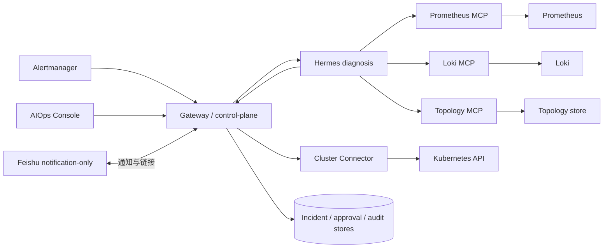
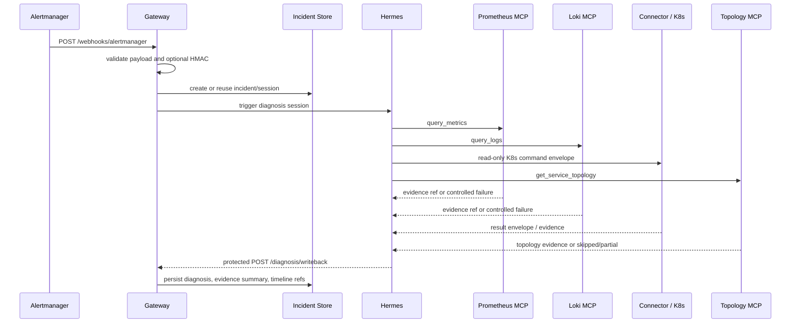
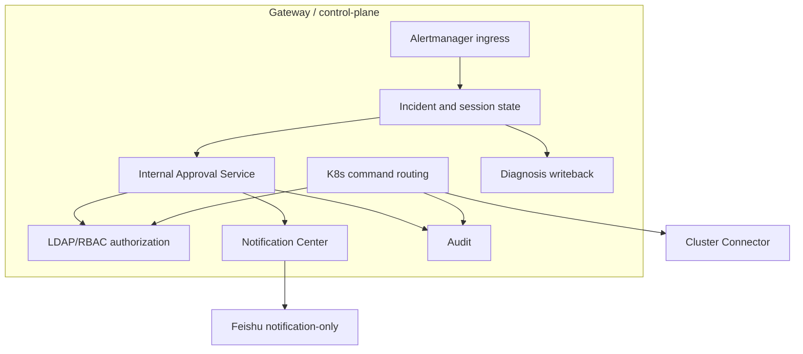
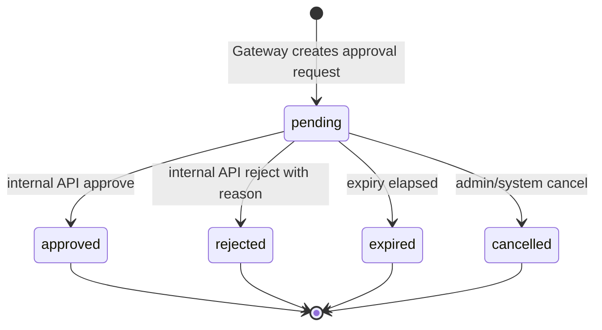
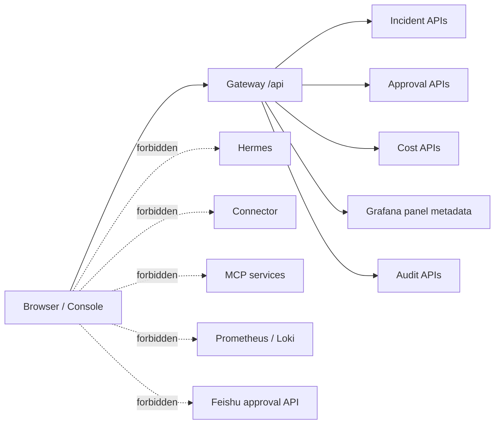
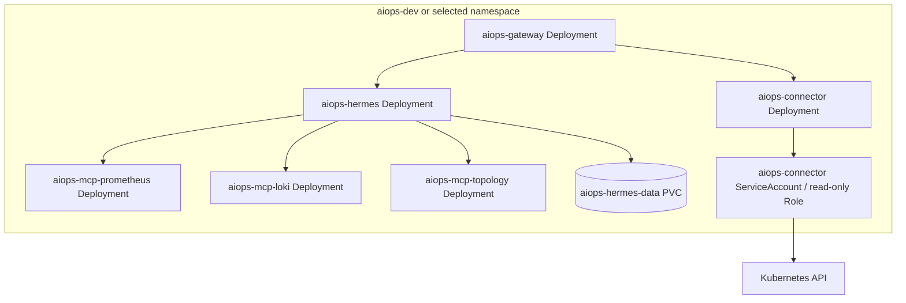
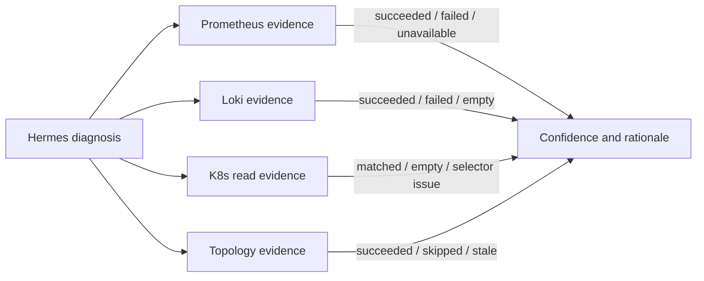

# 架构图集

最后对齐日期：2026-06-17

这些图整理自 AIO-73、AIO-80、AIO-86、AIO-87、AIO-95 和当前代码。

## 系统上下文

## P0 告警到诊断流程

## Control-Plane 边界

## 内部审批状态

关键边界：Feishu notification 不推动这个状态机。

## Console V1 边界

## Kubernetes 部署形态

## Evidence 完整度

