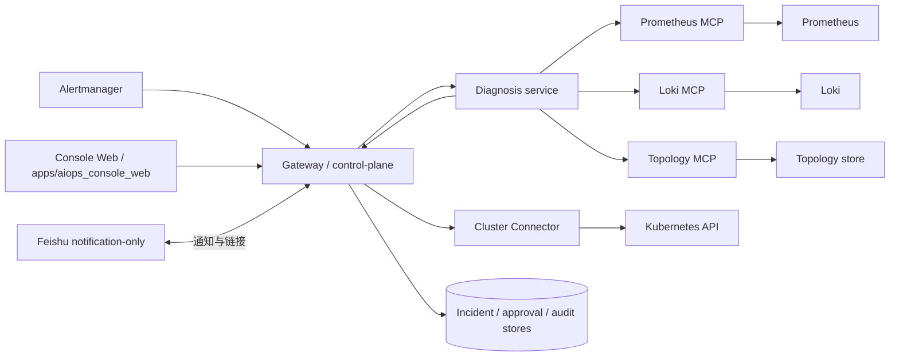
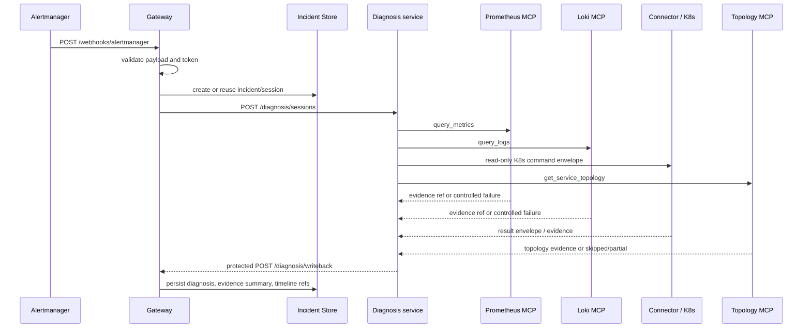
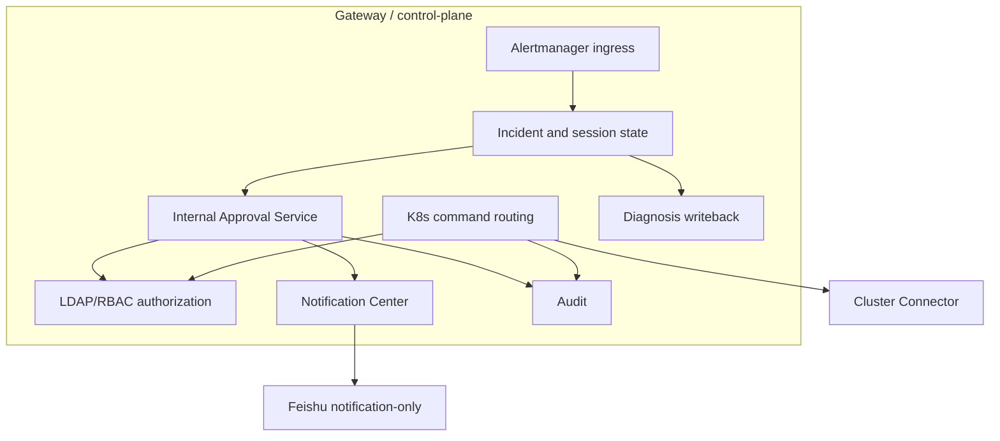
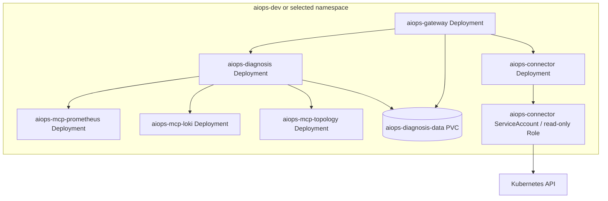
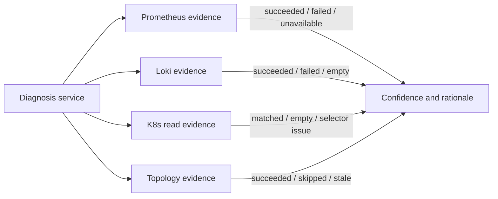

# 架构图集

最后对齐日期：2026-07-10

## 系统上下文

```mermaid
flowchart LR
    Alertmanager[Alertmanager] --> Gateway[Gateway / control-plane]
    Console[Console Web / apps/aiops_console_web] --> Gateway
    Feishu[Feishu notification-only] <-->|通知与链接| Gateway

    Gateway --> Diagnosis[Diagnosis service]
    Gateway --> Connector[Cluster Connector]
    Diagnosis --> Gateway
    Diagnosis --> PromMCP[Prometheus MCP]
    Diagnosis --> LokiMCP[Loki MCP]
    Diagnosis --> TopologyMCP[Topology MCP]

    Connector --> K8s[Kubernetes API]
    PromMCP --> Prometheus[Prometheus]
    LokiMCP --> Loki[Loki]
    TopologyMCP --> TopologyStore[Topology store]
    Gateway --> Stores[(Incident / approval / audit stores)]
```

## 告警到诊断流程

```mermaid
sequenceDiagram
    participant AM as Alertmanager
    participant GW as Gateway
    participant Store as Incident Store
    participant D as Diagnosis service
    participant PM as Prometheus MCP
    participant LM as Loki MCP
    participant KM as Connector / K8s
    participant TM as Topology MCP

    AM->>GW: POST /webhooks/alertmanager
    GW->>GW: validate payload and token
    GW->>Store: create or reuse incident/session
    GW->>D: POST /diagnosis/sessions
    D->>PM: query_metrics
    D->>LM: query_logs
    D->>KM: read-only K8s command envelope
    D->>TM: get_service_topology
    PM-->>D: evidence ref or controlled failure
    LM-->>D: evidence ref or controlled failure
    KM-->>D: result envelope / evidence
    TM-->>D: topology evidence or skipped/partial
    D-->>GW: protected POST /diagnosis/writeback
    GW->>Store: persist diagnosis, evidence summary, timeline refs
```

## Control-Plane 边界

```mermaid
flowchart TB
    subgraph Gateway["Gateway / control-plane"]
        Ingress[Alertmanager ingress]
        Incident[Incident and session state]
        Approval[Internal Approval Service]
        RBAC[LDAP/RBAC authorization]
        Notify[Notification Center]
        Audit[Audit]
        Routing[K8s command routing]
        Writeback[Diagnosis writeback]
    end

    Ingress --> Incident
    Incident --> Writeback
    Incident --> Approval
    Approval --> RBAC
    Approval --> Audit
    Approval --> Notify
    Routing --> RBAC
    Routing --> Audit

    Notify --> Feishu[Feishu notification-only]
    Routing --> Connector[Cluster Connector]
```

## Kubernetes 部署形态

```mermaid
flowchart TB
    subgraph Namespace["aiops-dev or selected namespace"]
        GWPod[aiops-gateway Deployment]
        DPod[aiops-diagnosis Deployment]
        CPod[aiops-connector Deployment]
        PPod[aiops-mcp-prometheus Deployment]
        LPod[aiops-mcp-loki Deployment]
        TPod[aiops-mcp-topology Deployment]
        PVC[(aiops-diagnosis-data PVC)]
        SA[aiops-connector ServiceAccount / read-only Role]
    end

    GWPod --> CPod
    GWPod --> DPod
    DPod --> PPod
    DPod --> LPod
    DPod --> TPod
    DPod --> PVC
    GWPod --> PVC
    CPod --> SA
    SA --> K8sAPI[Kubernetes API]
```

## Evidence 完整度

```mermaid
flowchart LR
    Diagnosis[Diagnosis service] --> Prom[Prometheus evidence]
    Diagnosis --> Loki[Loki evidence]
    Diagnosis --> K8s[K8s read evidence]
    Diagnosis --> Topology[Topology evidence]

    Prom -->|succeeded / failed / unavailable| Confidence[Confidence and rationale]
    Loki -->|succeeded / failed / empty| Confidence
    K8s -->|matched / empty / selector issue| Confidence
    Topology -->|succeeded / skipped / stale| Confidence
```
